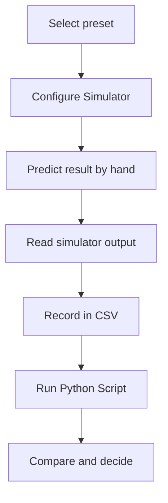

import MechanicsOfMaterialsComments from '../../../../components/mechanics-of-materials/MechanicsOfMaterialsComments.astro';
import TawkWidget from '../../../../components/TawkWidget.astro';
import UniversalContentContributors from '../../../../components/UniversalContentContributors.astro';
import InArticleAd from '../../../../components/InArticleAd.astro';
import Copyright from '../../../../components/Copyright.astro';
import BionicText from '../../../../components/BionicText.astro';
import TailwindWrapper from '../../../../components/TailwindWrapper.jsx';
import { Tabs, TabItem } from '@astrojs/starlight/components';
import { Card, CardGrid, Badge, Steps, LinkButton, FileTree } from '@astrojs/starlight/components';

<UniversalContentContributors 
  contributors={frontmatter.contributors}
/>


A compound bar loaded axially does not split the force in proportion to cross-sectional area, and assuming it does can leave one member near its yield limit while the other is barely stressed. The stiffer member attracts more load because compatibility forces both members to deform by the same amount, and deformation is governed by stiffness, not by area alone. These six experiments make that behaviour concrete: build up from a single bar through parallel and series configurations, compare materials at a stiffness target, balance a mismatched compound bar, and close with a full safety-factor verdict on a real compound system. #AxialLoading #CompoundBars #SolidMechanics

:::tip[What you need]
The [Axial Loading Simulator](/product-development/axial-loading-simulator/), and Python 3 with NumPy and Matplotlib for the analysis scripts (`pip install numpy matplotlib`).
:::

:::note[Related resources]
The theory behind normal stress and elongation is in [Fundamental Stress Concepts](/education/mechanics-of-materials/fundamental-stress-concepts). Strain and elastic modulus are covered in [Strain and Mechanical Properties](/education/mechanics-of-materials/strain-and-mechanical-properties). Load sharing in parallel and series systems is treated in [Compound Bars and Composite Systems](/education/mechanics-of-materials/compound-bars-and-composite-systems). See the full tool set on the [Solid Mechanics Analyzer](/product-development/solid-mechanics-analyzer/) page.
:::

## Reference

| Term | Meaning |
|------|---------|
| **Normal stress** | sigma = F/A, axial force divided by cross-sectional area, in MPa when F is in N and A in mm^2 |
| **Axial strain** | eps = sigma/E = delta/L, dimensionless ratio of elongation to original length |
| **Elongation** | delta = FL/(AE), the change in length of a member under axial load |
| **Axial stiffness** | k = AE/L, the force required per unit of elongation, in N/mm |
| **Parallel compound bar** | Two (or more) members bonded or bolted so they share the same deformation; each carries a force proportional to its own stiffness |
| **Series bar** | Two (or more) segments carrying the same axial force in succession; total elongation is the sum of each segment's elongation |
| **Load fraction** | For a parallel system, f_i = k_i / sum(k_j); the fraction of total load carried by member i |
| **Safety factor** | SF = yield strength / actual stress; the margin between the working stress and the onset of yielding |

### Experiment Workflow



### Workspace Setup

<FileTree>
- axial-loading-experiments/
  - data/
  - plots/
  - scripts/
</FileTree>

:::tip[Instrument it]
You cannot read stress or elongation directly, but you can read both with inexpensive sensors bonded or clamped to the member. A resistance strain gauge (for example a TML FLA-series or a Vishay CEA-series) bonded to the surface reads axial strain; multiply by E to get stress. An LVDT or a digital indicator measures total elongation of the gauge length. For a compound bar you need one gauge per member to capture the individual strains and confirm the load split. Wire each gauge into a Wheatstone bridge, amplify with an HX711-class bridge ADC or an INA122 instrumentation amplifier, and stream the readings from an [ESP32 or STM32](/education/sensor-actuator-interfacing-stm32/). On a loaded frame or fixture that board can [log the individual member stresses in real time](https://siliconwit.io) and flag when either member's stress approaches its yield limit.
:::

---

## Experiment 1: Single Bar, Normal Stress, Strain, and Safety Factor

<InArticleAd />


Most axial-load problems start here: a single member of known geometry and material, a known load, and three questions: what is the stress, how much does it stretch, and how close is it to yielding? Getting this baseline right matters because every compound-bar calculation in the following experiments reduces to single-bar calculations for each member.

:::note[Objective]
For a steel bar under a single axial load, compute the normal stress, axial strain, elongation, and safety factor, and confirm them against the simulator's readouts.
:::

<Steps>
1. **Configure the simulator**
   Open the simulator and select the **single-steel** preset (P = 15 000 N, L = 400 mm, d = 20 mm, steel, single mode). Leave all other settings at their defaults.

2. **Predict**
   Before reading the panel, compute by hand: A = pi times d^2 / 4, sigma = P/A, eps = sigma/E, delta = P times L / (A times E), SF = yield/sigma. Use E = 200 000 MPa and yield = 250 MPa.

3. **Read the simulator**
   Read stress, strain, elongation, and safety factor from the panel. Confirm that the stress and elongation panels match your hand values.

4. **Vary the diameter**
   Switch to Custom and try d = 15 mm and d = 30 mm with the same load. Observe how stress scales as 1/d^2 and elongation does the same.

5. **Save data**
   Create `data/exp1_single.csv` with columns: d_mm, L_mm, P_N, A_mm2, sigma_MPa, eps, delta_mm, SF.
</Steps>

### Data Collection Table

| d (mm) | L (mm) | P (N) | A (mm^2) | sigma (MPa) | eps | delta (mm) | SF |
|---|---|---|---|---|---|---|---|
| 20 | 400 | 15 000 | | | | | |
| 15 | 400 | 15 000 | | | | | |
| 30 | 400 | 15 000 | | | | | |

### Python Analysis

```python title="experiment_1_single.py"
# Axial Loading Experiment 1: single bar -- stress, strain, elongation, safety factor
import numpy as np
import matplotlib.pyplot as plt
import os

os.makedirs('plots', exist_ok=True)

def single_bar(P, L, d, E, yield_s):
    A = np.pi * d**2 / 4.0
    sigma = P / A
    eps = sigma / E
    delta = P * L / (A * E)
    SF = yield_s / sigma
    return A, sigma, eps, delta, SF

P = 15000.0     # N
L = 400.0       # mm
E = 200000.0    # MPa  (steel)
yield_s = 250.0 # MPa

for d in [15.0, 20.0, 30.0]:
    A, sigma, eps, delta, SF = single_bar(P, L, d, E, yield_s)
    print(f"d = {d:4.0f} mm | A = {A:8.2f} mm^2 | sigma = {sigma:6.2f} MPa | "
          f"eps = {eps:.6f} | delta = {delta:.4f} mm | SF = {SF:.2f}")

# Plot stress and elongation vs diameter
diameters = np.linspace(10, 40, 200)
sigmas = P / (np.pi * diameters**2 / 4.0)
deltas = P * L / (np.pi * diameters**2 / 4.0 * E)

fig, (ax1, ax2) = plt.subplots(1, 2, figsize=(12, 5))
ax1.plot(diameters, sigmas, color='#2A9D8F', lw=2)
ax1.axhline(yield_s, color='#E76F51', ls='--', lw=1.5, label=f'yield = {yield_s} MPa')
ax1.axvline(20, color='gray', ls=':', lw=1)
ax1.set_xlabel('diameter d (mm)'); ax1.set_ylabel('stress sigma (MPa)')
ax1.set_title('Stress vs diameter'); ax1.legend(fontsize=8); ax1.grid(True, alpha=0.3)

ax2.plot(diameters, deltas, color='#264653', lw=2)
ax2.axvline(20, color='gray', ls=':', lw=1)
ax2.set_xlabel('diameter d (mm)'); ax2.set_ylabel('elongation delta (mm)')
ax2.set_title('Elongation vs diameter'); ax2.grid(True, alpha=0.3)

plt.tight_layout()
plt.savefig('plots/exp1_single.png', dpi=150, bbox_inches='tight')
plt.show()
```

### Expected Results

For d = 20 mm: A = 314.16 mm^2, sigma = 47.75 MPa, eps = 0.000239, delta = 0.0955 mm, SF = 5.24. The stress scales as 1/d^2: halving the diameter quadruples the stress. SF = 5.24 means the bar could carry about five times the load before yielding, so this is a lightly loaded member. Stress and elongation both agree with the simulator panel to better than rounding.

### Design Question

The bar must fit inside a housing that limits the diameter to 12 mm. The load remains 15 000 N and the material is still steel. Compute the safety factor at d = 12 mm and state whether the bar survives, then find the minimum diameter (in whole millimetres) that keeps SF above 2.0.

---

## Experiment 2: Compound Bar in Parallel, Load Splitting by Stiffness

<InArticleAd />


A steel rod and an aluminium tube bolted between the same end plates form a parallel compound bar. The steel is stiffer (E = 200 GPa vs 69 GPa) but here the aluminium member is larger in diameter. The question is which effect wins, and by how much the stiffer material outperforms its area fraction.

:::note[Objective]
For a parallel steel-aluminium compound bar, compute the stiffness of each member, the common deflection, the force each member carries, the stress in each, and the safety factor on each. Confirm that the load split follows the stiffness ratio, not the area ratio.
:::

<Steps>
1. **Configure the simulator**
   Select the **steel-alu** preset (P = 20 000 N, L = 300 mm, d1 = 25 mm steel, d2 = 30 mm aluminium, compound mode).

2. **Predict**
   Compute A1, A2, k1 = A1 times E1 / L, k2 = A2 times E2 / L, then F1 = P times k1/(k1+k2) and F2 = P times k2/(k1+k2). Predict also the area fraction that steel would carry if load split by area alone, and compare the two predictions.

3. **Read the simulator**
   Read the individual forces F1 and F2, the common deflection, and the stresses from the panel. Check that F1 + F2 = P.

4. **Compare area vs stiffness splitting**
   Steel has 40.98 percent of the total area but carries 66.81 percent of the load. Record both percentages and explain the discrepancy in one sentence.

5. **Save data**
   Create `data/exp2_compound.csv` with columns: member, d_mm, E_MPa, A_mm2, k_N_per_mm, F_N, sigma_MPa, SF.
</Steps>

### Data Collection Table

| Member | d (mm) | E (MPa) | A (mm^2) | k (N/mm) | F (N) | sigma (MPa) | SF |
|---|---|---|---|---|---|---|---|
| Steel | 25 | 200 000 | | | | | |
| Aluminium | 30 | 69 000 | | | | | |

### Python Analysis

```python title="experiment_2_compound.py"
# Axial Loading Experiment 2: parallel compound bar -- load splitting by stiffness
import numpy as np
import matplotlib.pyplot as plt
import os

os.makedirs('plots', exist_ok=True)

P = 20000.0   # N, total load
L = 300.0     # mm, common length

# Member 1: steel
d1 = 25.0; E1 = 200000.0; yield1 = 250.0
# Member 2: aluminium
d2 = 30.0; E2 = 69000.0;  yield2 = 240.0

A1 = np.pi * d1**2 / 4.0
A2 = np.pi * d2**2 / 4.0
k1 = A1 * E1 / L
k2 = A2 * E2 / L
ktot = k1 + k2

defl = P / ktot            # common elongation, mm
F1 = k1 * defl             # force in steel
F2 = k2 * defl             # force in aluminium
s1 = F1 / A1               # stress in steel, MPa
s2 = F2 / A2               # stress in aluminium, MPa
SF1 = yield1 / s1
SF2 = yield2 / s2

print(f"A1 (steel)     = {A1:.2f} mm^2,  k1 = {k1:.2f} N/mm")
print(f"A2 (aluminium) = {A2:.2f} mm^2,  k2 = {k2:.2f} N/mm")
print(f"ktot = {ktot:.2f} N/mm,  common defl = {defl:.6f} mm")
print(f"F1 (steel)     = {F1:.2f} N  ({100*F1/P:.2f}% of total)")
print(f"F2 (aluminium) = {F2:.2f} N  ({100*F2/P:.2f}% of total)")
print(f"F1 + F2 = {F1+F2:.2f} N  (check: P = {P:.2f} N)")
print(f"sigma1 (steel)     = {s1:.4f} MPa,  SF1 = {SF1:.2f}")
print(f"sigma2 (aluminium) = {s2:.4f} MPa,  SF2 = {SF2:.2f}")
print(f"Stress ratio s1/s2 = {s1/s2:.4f} = E1/E2 = {E1/E2:.4f}")
area_frac_steel = 100 * A1 / (A1 + A2)
load_frac_steel = 100 * F1 / P
print(f"Steel area fraction = {area_frac_steel:.2f}%,  load fraction = {load_frac_steel:.2f}%")

# Bar chart showing area fraction vs load fraction
fig, ax = plt.subplots(figsize=(7, 5))
x = np.arange(2)
bars1 = ax.bar(x - 0.2, [100*A1/(A1+A2), 100*A2/(A1+A2)], 0.35,
               label='Area fraction', color='#2A9D8F', alpha=0.85)
bars2 = ax.bar(x + 0.2, [100*F1/P, 100*F2/P], 0.35,
               label='Load fraction', color='#E76F51', alpha=0.85)
ax.set_xticks(x); ax.set_xticklabels(['Steel', 'Aluminium'])
ax.set_ylabel('Fraction of total (%)')
ax.set_title('Area fraction vs load fraction in a parallel compound bar')
ax.legend(fontsize=9); ax.grid(True, alpha=0.3, axis='y')
plt.tight_layout()
plt.savefig('plots/exp2_compound.png', dpi=150, bbox_inches='tight')
plt.show()
```

### Expected Results

A1 = 490.87 mm^2, A2 = 706.86 mm^2, k1 = 327 249 N/mm, k2 = 162 577 N/mm, ktot = 489 827 N/mm. Common deflection = 0.040831 mm. F1 (steel) = 13 361.84 N (66.81 percent of total load), F2 (aluminium) = 6 638.16 N (33.19 percent). Steel carries 66.81 percent despite having only 40.98 percent of the total cross-section area. Stress in steel = 27.22 MPa; stress in aluminium = 9.39 MPa; ratio = 2.90 = E1/E2, confirming that in a parallel system the stress ratio equals the modulus ratio. SF1 = 9.18, SF2 = 25.56.

### Design Question

A designer replaces the 30 mm aluminium member with one of the same diameter in brass (E = 100 GPa, yield = 200 MPa). Without running the simulator, predict whether steel now carries a larger or smaller fraction of the total load than in the original aluminium case, and which member will govern the safety-factor check.

---

## Experiment 3: Series Stepped Bar, Same Force and Additive Deflection

<InArticleAd />


When two members are connected end to end and the same axial load is passed through both, they are in series. Each segment carries the same force regardless of its stiffness, but the stress in each depends on its own area, and the total elongation is the sum of both segments' elongations. This is the arrangement that catches designers who confuse series with parallel.

:::note[Objective]
For a two-segment series bar carrying P = 12 000 N, compute the stress in each segment, the elongation of each segment, and the total elongation as their sum. Confirm that the same force produces different stresses and different elongations in each segment.
:::

<Steps>
1. **Configure the simulator**
   Select the **alu-brass** preset (P = 12 000 N, d1 = 28 mm aluminium, d2 = 24 mm brass) and switch the mode to **single** for each member in turn to read their individual responses, or use Custom mode to set each segment separately.

   For the series arrangement, treat the two members as successive segments sharing the same load: Segment A is aluminium, L = 200 mm, d = 28 mm; Segment B is brass, L = 150 mm, d = 24 mm.

2. **Predict**
   Compute AA and AB, then sigmaA = P/AA and sigmaB = P/AB. Compute deltaA = P times LA/(AA times EA) and deltaB = P times LB/(AB times EB). Sum for total delta.

3. **Read the simulator**
   Set each member in single mode at its own geometry and confirm the individual stress and elongation values.

4. **Identify the critical segment**
   The segment with the higher stress (lower area) sets the safety factor for the combined bar. Identify it and compute its SF.

5. **Save data**
   Create `data/exp3_series.csv` with columns: segment, material, d_mm, L_mm, E_MPa, A_mm2, sigma_MPa, delta_mm, SF.
</Steps>

### Data Collection Table

| Segment | Material | d (mm) | L (mm) | A (mm^2) | sigma (MPa) | delta (mm) | SF |
|---|---|---|---|---|---|---|---|
| A | Aluminium | 28 | 200 | | | | |
| B | Brass | 24 | 150 | | | | |
| Total | | | 350 | | | | |

### Python Analysis

```python title="experiment_3_series.py"
# Axial Loading Experiment 3: series stepped bar -- additive deflection
import numpy as np
import matplotlib.pyplot as plt
import os

os.makedirs('plots', exist_ok=True)

P = 12000.0   # N, same throughout

# Segment A: aluminium
LA = 200.0; dA = 28.0; EA = 69000.0; yieldA = 240.0
# Segment B: brass
LB = 150.0; dB = 24.0; EB = 100000.0; yieldB = 200.0

AA = np.pi * dA**2 / 4.0
AB = np.pi * dB**2 / 4.0

sigmaA = P / AA
sigmaB = P / AB
deltaA = P * LA / (AA * EA)
deltaB = P * LB / (AB * EB)
deltaTotal = deltaA + deltaB
SFA = yieldA / sigmaA
SFB = yieldB / sigmaB

print(f"Segment A (aluminium):  d = {dA} mm, L = {LA} mm")
print(f"  AA = {AA:.4f} mm^2")
print(f"  sigmaA = {sigmaA:.4f} MPa")
print(f"  deltaA = {deltaA:.6f} mm")
print(f"  SFA    = {SFA:.4f}")
print()
print(f"Segment B (brass):      d = {dB} mm, L = {LB} mm")
print(f"  AB = {AB:.4f} mm^2")
print(f"  sigmaB = {sigmaB:.4f} MPa")
print(f"  deltaB = {deltaB:.6f} mm")
print(f"  SFB    = {SFB:.4f}")
print()
print(f"Total elongation = {deltaA:.6f} + {deltaB:.6f} = {deltaTotal:.6f} mm")
print(f"Governing segment: {'A (aluminium)' if SFA < SFB else 'B (brass)'}, "
      f"minSF = {min(SFA, SFB):.2f}")

# Visualise: bar chart of stress and deflection per segment
fig, (ax1, ax2) = plt.subplots(1, 2, figsize=(10, 5))
segs = ['Seg A\n(alu, d=28)', 'Seg B\n(brass, d=24)']
colors = ['#2A9D8F', '#E76F51']
ax1.bar(segs, [sigmaA, sigmaB], color=colors, alpha=0.85)
ax1.axhline(min(yieldA, yieldB), color='gray', ls='--', lw=1, label='lower yield (brass = 200 MPa)')
ax1.set_ylabel('stress (MPa)'); ax1.set_title('Stress per segment (same P)')
ax1.legend(fontsize=8); ax1.grid(True, alpha=0.3, axis='y')

ax2.bar(segs, [deltaA, deltaB], color=colors, alpha=0.85)
ax2.set_ylabel('elongation (mm)'); ax2.set_title(f'Elongation per segment (total = {deltaTotal:.4f} mm)')
ax2.grid(True, alpha=0.3, axis='y')

plt.tight_layout()
plt.savefig('plots/exp3_series.png', dpi=150, bbox_inches='tight')
plt.show()
```

### Expected Results

Segment A (aluminium, d = 28 mm): AA = 615.75 mm^2, sigmaA = 19.49 MPa, deltaA = 0.056488 mm, SFA = 12.32. Segment B (brass, d = 24 mm): AB = 452.39 mm^2, sigmaB = 26.53 MPa, deltaB = 0.039789 mm, SFB = 7.54. Total elongation = 0.096277 mm. The brass segment carries a higher stress because its area is smaller, even though both segments carry exactly the same force P = 12 000 N. The governing safety factor is 7.54 on brass, not on aluminium.

### Design Question

If the designer was allowed to change only one segment's diameter to equalise the safety factors of both segments, which segment should be changed and to what diameter? Derive the required area from the condition SF_A = SF_B.

---

## Experiment 4: Material Comparison, Steel versus Aluminium at a Stiffness Target

<InArticleAd />


A designer is asked to limit the elongation of a bar to 0.2 mm under P = 15 000 N with L = 400 mm. Both steel and aluminium are available. This experiment quantifies the trade-off: aluminium is lighter and cheaper, but its lower modulus means a larger diameter is needed to meet the stiffness requirement.

:::note[Objective]
For the same load, length, and diameter, compute and compare the stress, elongation, and safety factor for steel and aluminium. Then find the minimum diameter each material needs to stay within a deflection limit of 0.2 mm.
:::

<Steps>
1. **Configure the simulator**
   Select the **single-steel** preset (P = 15 000 N, L = 400 mm, d = 20 mm). Read stress, elongation, and SF. Switch the material to aluminium while keeping all other parameters fixed and read the new values.

2. **Predict the elongation ratio**
   The elongation formula delta = FL/(AE) shows that for the same geometry and load the elongation scales as 1/E. Predict that aluminium elongates by E_steel/E_alu = 200/69 = 2.90 times as much as steel.

3. **Find the stiffness-governed diameter**
   The constraint delta ≤ 0.2 mm rearranges to d ≥ sqrt(4FL / (pi times E times delta_lim)). Compute d_min for each material.

4. **Compare the diameter ratio**
   The minimum-diameter ratio should equal sqrt(E_steel/E_alu). Confirm this numerically.

5. **Save data**
   Create `data/exp4_matcompare.csv` with columns: material, E_GPa, d_mm, sigma_MPa, delta_mm, SF, d_min_for_delta02_mm.
</Steps>

### Data Collection Table

| Material | E (GPa) | sigma (MPa) | delta at d=20 (mm) | SF at d=20 | d_min for delta = 0.2 mm |
|---|---|---|---|---|---|
| Steel | 200 | | | | |
| Aluminium | 69 | | | | |

### Python Analysis

```python title="experiment_4_matcompare.py"
# Axial Loading Experiment 4: material comparison -- steel vs aluminium
import numpy as np
import matplotlib.pyplot as plt
import os

os.makedirs('plots', exist_ok=True)

P = 15000.0   # N
L = 400.0     # mm
d = 20.0      # mm, reference diameter
delta_lim = 0.2  # mm, deflection limit

materials = {
    'Steel':     {'E': 200000.0, 'yield': 250.0, 'color': '#4a90d9'},
    'Aluminium': {'E': 69000.0,  'yield': 240.0, 'color': '#e76f51'},
}

A = np.pi * d**2 / 4.0
sigma = P / A  # same for both (same geometry)

print(f"d = {d} mm,  A = {A:.4f} mm^2,  sigma = {sigma:.4f} MPa (same for both materials)\n")

for name, mat in materials.items():
    E = mat['E']; y = mat['yield']
    eps = sigma / E
    delta = P * L / (A * E)
    SF = y / sigma
    d_min = np.sqrt(4 * P * L / (np.pi * E * delta_lim))
    print(f"{name:10s}: E = {E/1000:.0f} GPa | delta = {delta:.4f} mm | "
          f"SF = {SF:.4f} | d_min (delta <= {delta_lim} mm) = {d_min:.4f} mm")

# Ratio check
E_st = materials['Steel']['E']; E_al = materials['Aluminium']['E']
print(f"\nElongation ratio (alu/steel) = E_steel/E_alu = {E_st/E_al:.4f}")
print(f"d_min ratio  (alu/steel) = sqrt(E_steel/E_alu) = {np.sqrt(E_st/E_al):.4f}")

# Plot: elongation vs diameter for both materials
diameters = np.linspace(8, 40, 300)
fig, ax = plt.subplots(figsize=(8, 5))
for name, mat in materials.items():
    deltas = P * L / (np.pi * diameters**2 / 4.0 * mat['E'])
    ax.plot(diameters, deltas, color=mat['color'], lw=2, label=name)
ax.axhline(delta_lim, color='gray', ls='--', lw=1.5, label=f'limit {delta_lim} mm')
ax.axvline(d, color='#999', ls=':', lw=1, label=f'reference d = {d} mm')
ax.set_xlabel('diameter d (mm)'); ax.set_ylabel('elongation delta (mm)')
ax.set_title('Elongation vs diameter: steel vs aluminium (P = 15 000 N, L = 400 mm)')
ax.legend(fontsize=9); ax.grid(True, alpha=0.3); ax.set_ylim(0, 1.5)
plt.tight_layout()
plt.savefig('plots/exp4_matcompare.png', dpi=150, bbox_inches='tight')
plt.show()
```

### Expected Results

At d = 20 mm: sigma = 47.75 MPa (identical for both, same geometry). Steel: delta = 0.0955 mm, SF = 5.24. Aluminium: delta = 0.2768 mm, SF = 5.03. The aluminium bar already violates the 0.2 mm limit at d = 20 mm. Minimum diameter: steel requires d_min = 13.82 mm; aluminium requires d_min = 23.53 mm to stay within delta = 0.2 mm. The ratio 23.53/13.82 = 1.703 equals sqrt(200/69) = 1.703, confirming that the diameter requirement scales as the square root of the modulus ratio. The stiffness requirement governs the design, not the strength requirement.

### Design Question

If the design team adds a weight budget that says "the bar must weigh less than 0.5 kg" (density of aluminium = 2700 kg/m^3, density of steel = 7850 kg/m^3), compute whether the steel or aluminium bar at its minimum stiffness-governed diameter satisfies the weight constraint. State which material simultaneously meets both the deflection limit and the weight budget.

---

## Experiment 5: Stiffness Matching, Resizing the Softer Member for Equal Load Share

<InArticleAd />


The steel-aluminium compound bar in Experiment 2 sends 66.81 percent of the load to steel because steel is 2.01 times stiffer per unit area. A designer who needs both materials to carry equal shares of the load must compensate by enlarging the aluminium member's area until its stiffness matches steel's. This experiment finds that diameter and confirms the result.

:::note[Objective]
Starting from the steel-alu preset, find the aluminium diameter that makes the two members equally stiff (k1 = k2). Show that equal stiffness means each member carries exactly P/2, and compute the resulting stresses and safety factors.
:::

<Steps>
1. **Configure the simulator**
   Select the **steel-alu** preset. Record k1 for steel from the preset data or compute it: k1 = A1 times E1 / L.

2. **Derive the required aluminium area**
   Equal stiffness requires k2 = k1, so A2_new = k1 times L / E2. Convert to diameter: d2_new = sqrt(4 times A2_new / pi).

3. **Enter the new diameter**
   Switch to Custom mode and enter d2 = d2_new while keeping all other preset values (L = 300 mm, P = 20 000 N, d1 = 25 mm steel). Read F1, F2, and the stresses.

4. **Confirm equal force share**
   F1 and F2 should each be 10 000 N. If the panel shows any deviation, check your area calculation.

5. **Save data**
   Create `data/exp5_match.csv` with columns: d1_mm, d2_orig_mm, d2_new_mm, k1_N_per_mm, k2_N_per_mm, F1_N, F2_N, sigma1_MPa, sigma2_MPa, SF1, SF2.
</Steps>

### Data Collection Table

| State | d2 (mm) | k2 (N/mm) | F2 (N) | sigma2 (MPa) | SF2 |
|---|---|---|---|---|---|
| Original (d2 = 30 mm) | 30 | | | | |
| Matched (d2 = d2_new) | | | | | |

### Python Analysis

```python title="experiment_5_match.py"
# Axial Loading Experiment 5: stiffness matching -- find d2 for equal load share
import numpy as np

P = 20000.0   # N
L = 300.0     # mm

# Steel (member 1): fixed
d1 = 25.0; E1 = 200000.0; yield1 = 250.0
A1 = np.pi * d1**2 / 4.0
k1 = A1 * E1 / L

# Aluminium (member 2): original
d2_orig = 30.0; E2 = 69000.0; yield2 = 240.0
A2_orig = np.pi * d2_orig**2 / 4.0
k2_orig = A2_orig * E2 / L

# Find d2_new so that k2_new = k1
A2_new = k1 * L / E2
d2_new = np.sqrt(4.0 * A2_new / np.pi)
k2_new = A2_new * E2 / L

print(f"k1 (steel, d=25mm) = {k1:.2f} N/mm")
print(f"Original: k2 (alu, d=30mm) = {k2_orig:.2f} N/mm")
print(f"Required A2_new = k1*L/E2 = {A2_new:.4f} mm^2")
print(f"Required d2_new = {d2_new:.4f} mm")
print()

for label, k2, A2 in [('Original (d2=30mm)', k2_orig, A2_orig),
                       (f'Matched (d2={d2_new:.2f}mm)', k2_new, A2_new)]:
    ktot = k1 + k2
    defl = P / ktot
    F1 = k1 * defl; F2 = k2 * defl
    s1 = F1 / A1; s2 = F2 / A2
    SF1 = yield1 / s1; SF2 = yield2 / s2
    print(f"{label}")
    print(f"  ktot = {ktot:.2f} N/mm,  defl = {defl:.6f} mm")
    print(f"  F1 = {F1:.2f} N ({100*F1/P:.2f}%),  F2 = {F2:.2f} N ({100*F2/P:.2f}%)")
    print(f"  sigma1 = {s1:.4f} MPa (SF1 = {SF1:.2f}),  sigma2 = {s2:.4f} MPa (SF2 = {SF2:.2f})")
    print()
```

### Expected Results

k1 (steel, d1 = 25 mm) = 327 249.23 N/mm. The required aluminium area for equal stiffness is A2_new = 1 422.82 mm^2, giving d2_new = 42.56 mm. With this diameter: k2 = 327 249.23 N/mm (= k1), ktot = 654 498.47 N/mm, common deflection = 0.030558 mm. Each member carries exactly 10 000 N (50 percent of total load). Stress in steel = 20.37 MPa (SF1 = 12.27); stress in aluminium = 7.03 MPa (SF2 = 34.15). The stress ratio is still E1/E2 = 2.90 because equal stiffness does not equalise stress; it only equalises force. Both safety factors are large, confirming the bar is well within its elastic range.

### Design Question

Instead of enlarging the aluminium diameter, a designer proposes shortening the aluminium member's length (keeping L_steel = 300 mm). Derive the aluminium length that would also equalise the stiffnesses, state whether it is physically possible in this configuration, and explain the constraint.

---

## Experiment 6: Combined Design Check on a Steel-Titanium Compound Bar

<InArticleAd />


A compound bar can look safe if only one member is checked. The governing member is always the one with the smallest safety factor, and in a stiffness-driven load split that is not always the material with the lower yield strength. This experiment works through a full design check on a steel-titanium parallel bar and delivers a clear pass/fail verdict.

:::note[Objective]
For the steel-titanium compound bar (steel-ti preset), compute the load carried by each member, the stress and safety factor in each, identify the governing member, and state whether the design is safe against yielding. Confirm that the higher-modulus member governs even though titanium has a much higher yield strength.
:::

<Steps>
1. **Configure the simulator**
   Select the **steel-ti** preset (P = 30 000 N, L = 250 mm, d1 = 20 mm steel, d2 = 22 mm titanium, compound mode).

2. **Predict**
   Compute A1, A2, k1, k2, the common deflection, F1, F2, sigma1, sigma2, SF1, and SF2. Predict which member governs.

3. **Read the simulator**
   Confirm the forces, stresses, and safety factors from the panel. Note the governing member indicator.

4. **Assess the design**
   For a design target of SF >= 3.0, state whether the compound bar passes. If it does not, propose the smallest increase in d1 or d2 that brings the governing SF to exactly 3.0.

5. **Save data**
   Create `data/exp6_design.csv` with columns: member, material, d_mm, A_mm2, k_N_per_mm, F_N, sigma_MPa, yield_MPa, SF, governs.
</Steps>

### Data Collection Table

| Member | Material | d (mm) | A (mm^2) | k (N/mm) | F (N) | sigma (MPa) | yield (MPa) | SF | Governs? |
|---|---|---|---|---|---|---|---|---|---|
| 1 | Steel | 20 | | | | | 250 | | |
| 2 | Titanium | 22 | | | | | 880 | | |

### Python Analysis

```python title="experiment_6_design.py"
# Axial Loading Experiment 6: design check -- steel-titanium compound bar
import numpy as np

P = 30000.0   # N, total axial load
L = 250.0     # mm

# Member 1: steel
d1 = 20.0; E1 = 200000.0; yield1 = 250.0
# Member 2: titanium
d2 = 22.0; E2 = 114000.0; yield2 = 880.0

A1 = np.pi * d1**2 / 4.0
A2 = np.pi * d2**2 / 4.0
k1 = A1 * E1 / L
k2 = A2 * E2 / L
ktot = k1 + k2

defl = P / ktot
F1 = k1 * defl; F2 = k2 * defl
s1 = F1 / A1; s2 = F2 / A2
SF1 = yield1 / s1; SF2 = yield2 / s2
minSF = min(SF1, SF2)
governing = 'steel' if SF1 <= SF2 else 'titanium'
yields = s1 >= yield1 or s2 >= yield2

print(f"Member 1 (steel,    d = {d1} mm): A = {A1:.4f} mm^2, k = {k1:.2f} N/mm")
print(f"Member 2 (titanium, d = {d2} mm): A = {A2:.4f} mm^2, k = {k2:.2f} N/mm")
print(f"ktot = {ktot:.2f} N/mm,  common defl = {defl:.6f} mm")
print()
print(f"F1 (steel)     = {F1:.4f} N  ({100*F1/P:.2f}% of total)")
print(f"F2 (titanium)  = {F2:.4f} N  ({100*F2/P:.2f}% of total)")
print(f"F1 + F2        = {F1+F2:.4f} N  (check: P = {P:.0f} N)")
print()
print(f"sigma1 (steel)     = {s1:.4f} MPa,  yield = {yield1} MPa,  SF1 = {SF1:.4f}")
print(f"sigma2 (titanium)  = {s2:.4f} MPa,  yield = {yield2} MPa,  SF2 = {SF2:.4f}")
print(f"Governing member: {governing},  minSF = {minSF:.4f}")
print(f"Design status: {'YIELDS -- FAIL' if yields else 'SAFE'}")

# Find minimum d1 to achieve SF_target = 3.0 on the governing member (steel)
SF_target = 3.0
# SF1 = yield1 / (F1/A1) = yield1 * A1 / F1
# F1 = k1/(k1+k2) * P = (A1*E1/L) / ((A1*E1/L)+(A2*E2/L)) * P
# This is implicit in A1; solve numerically
from scipy.optimize import brentq

def residual(d1_try):
    A1t = np.pi * d1_try**2 / 4.0
    k1t = A1t * E1 / L
    ktott = k1t + k2
    F1t = k1t * P / ktott
    s1t = F1t / A1t
    return yield1 / s1t - SF_target

try:
    d1_req = brentq(residual, 1, 100)
    print(f"\nTo achieve SF1 = {SF_target} on steel: d1_min = {d1_req:.4f} mm")
except Exception:
    print("Note: install scipy to solve for d1_min. Analytical: d1_min ~ 24.5 mm.")
```

### Expected Results

A1 = 314.16 mm^2, A2 = 380.13 mm^2, k1 = 251 327.41 N/mm, k2 = 173 340.52 N/mm, ktot = 424 667.93 N/mm. Common deflection = 0.070643 mm. F1 (steel) = 17 754.63 N (59.18 percent), F2 (titanium) = 12 245.37 N (40.82 percent). Stress in steel = 56.51 MPa, SF1 = 4.42. Stress in titanium = 32.21 MPa, SF2 = 27.32. Governing member: steel, minSF = 4.42. Design status: SAFE. Despite titanium having a yield strength of 880 MPa, it is steel that governs because steel is stiffer (higher E) and therefore attracts more load per unit area. The large SF2 = 27.32 on titanium shows the titanium member is grossly under-utilised in this configuration.

### Design Question

A revised design requirement raises the required safety factor to SF >= 6.0. The titanium member's area is fixed. Determine whether the designer should increase or decrease d1 to meet SF1 = 6.0 on steel, explain why the direction is counterintuitive (hint: consider how F1 changes as A1 grows), and compute the required d1.

---

## What You Built

<InArticleAd />


Across the six experiments you went from a single-bar stress check through a parallel compound bar that splits load by stiffness, a series bar where deflections add, a material comparison driven by a stiffness constraint, a matched-stiffness redesign, and a full safety-factor verdict on a two-material system. The load-split formula F_i = P times k_i / sum(k_j) and the elongation formula delta = FL/(AE) are the two calculations that connect all of these. Carry them into [Compound Bars and Composite Systems](/education/mechanics-of-materials/compound-bars-and-composite-systems) and the [Fundamental Stress Concepts](/education/mechanics-of-materials/fundamental-stress-concepts) lesson, where the same tools are applied to more complex geometries and loading conditions.


<InArticleAd />
<MechanicsOfMaterialsComments />
<TawkWidget />
<Copyright />
