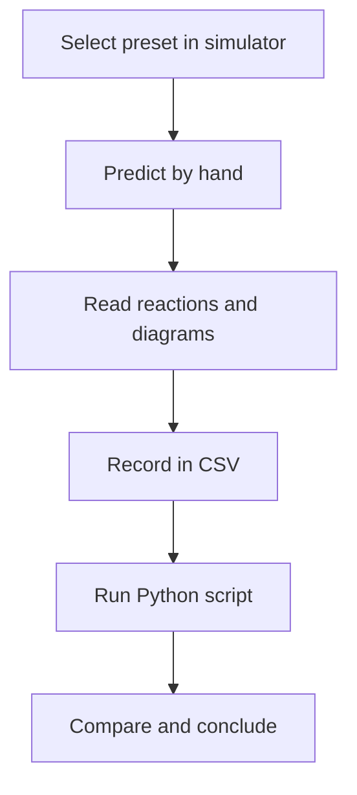

import MechanicsOfMaterialsComments from '../../../../components/mechanics-of-materials/MechanicsOfMaterialsComments.astro';
import TawkWidget from '../../../../components/TawkWidget.astro';
import UniversalContentContributors from '../../../../components/UniversalContentContributors.astro';
import InArticleAd from '../../../../components/InArticleAd.astro';
import Copyright from '../../../../components/Copyright.astro';
import BionicText from '../../../../components/BionicText.astro';
import TailwindWrapper from '../../../../components/TailwindWrapper.jsx';
import { Tabs, TabItem } from '@astrojs/starlight/components';
import { Card, CardGrid, Badge, Steps, LinkButton, FileTree } from '@astrojs/starlight/components';

<UniversalContentContributors 
  contributors={frontmatter.contributors}
/>


A beam that looks perfectly safe under a quick load check can still fail because the designer picked the wrong cross-section orientation, underestimated the span, or missed a load combination. The numbers that govern every one of those decisions flow from two diagrams: shear force and bending moment. Once those are in hand, the flexure formula turns the peak moment into a stress, and double integration of the moment diagram gives the deflection. These six experiments build that chain step by step using the simulator's presets, so the physics of each result is visible before the Python confirms it. #BeamAnalysis #BendingStress #DeflectionAnalysis

:::tip[What you need]
The [Beam Analysis Simulator](/product-development/beam-analysis-simulator/), and Python 3 with NumPy and Matplotlib (`pip install numpy matplotlib`).
:::

:::note[Related resources]
The theory behind these experiments is in [Shear Force and Bending Moment in Beams](/education/mechanics-of-materials/shear-force-bending-moment-beams), [Bending Stresses in Simple Beams](/education/mechanics-of-materials/bending-stresses-simple-beams), and [Beam Deflections and Stiffness Analysis](/education/mechanics-of-materials/beam-deflections-stiffness-analysis). See the full tool set on the [Solid Mechanics Analyzer](/product-development/solid-mechanics-analyzer/) page.
:::

## Reference

| Term | Meaning |
|------|---------|
| **Shear force V(x)** | Internal transverse force at section x; equals the algebraic sum of all transverse forces to one side of the cut |
| **Bending moment M(x)** | Internal moment at section x; sagging positive in the convention used here |
| **Reactions RA, RB** | Vertical support forces at the pin (A) and roller (B); found by equilibrium |
| **Fixed-end moment M0** | The moment reaction at a clamped wall; hogging (negative in the sagging convention) |
| **Flexure formula** | σ = M·c/I; bending stress at the extreme fibre, where c = h/2 for a symmetric section |
| **Second moment of area I** | I = b·h³/12 for a solid rectangle; measures resistance to bending |
| **Section modulus S** | S = I/c; divides M directly into the extreme-fibre stress |
| **Elastic modulus E** | Material stiffness (GPa); multiplied by I to give flexural rigidity EI |
| **Deflection δ** | Transverse displacement of the elastic curve; proportional to M/(EI) integrated twice |

### Experiment Workflow



### Workspace Setup

<FileTree>
- beam-analysis-experiments/
  - data/
  - plots/
  - scripts/
</FileTree>

:::tip[Instrument it]
You cannot read bending stress directly, but you can read the surface strain on the tension face and convert. Bond a uniaxial foil strain gauge (for example an HBM LY series or a Micro-Measurements CEA series) to the bottom face of the beam at the section of maximum moment, where the longitudinal strain is largest. Wire it into a Wheatstone quarter-bridge, amplify with an HX711-class bridge ADC or an INA128, and have an [ESP32 or STM32](/education/sensor-actuator-interfacing-stm32/) sample it. Multiply the measured strain by E to get bending stress and compare it to σ = M·c/I. For deflection, a dial gauge, an LVDT, or a simple IR distance sensor mounted under the beam midspan gives δ directly. A connected board can [log both quantities against load in real time](https://siliconwit.io) and flag when either exceeds a set limit.
:::

---

## Experiment 1: Reactions and SFD/BMD for a Simply Supported Beam Under Two Point Loads

<InArticleAd />


A beam with two unequal point loads is the first thing most structural calculations encounter, and the reactions are not symmetric unless you check. The shear-force diagram has a jump at each load, the bending-moment diagram is piecewise linear, and the maximum moment sits under one of the loads, not necessarily at midspan. Getting this case right by hand before reading the simulator is the single most useful habit in beam analysis.

:::note[Objective]
Compute the support reactions, draw the shear-force and bending-moment diagrams, identify the location and magnitude of the maximum bending moment, and confirm every value against the simulator.
:::

<Steps>
1. **Configure the simulator**
   Open the simulator and select the **two-point** preset (L = 1000 mm, simply supported; P1 = 2000 N at x = 300 mm; P2 = 1500 N at x = 700 mm; section 40 mm × 80 mm; E = 200 GPa). Leave the load and section inputs as they are.

2. **Predict reactions**
   Take moments about A to find RB = (P1·a1 + P2·a2)/L, then RA = P1 + P2 - RB. Predict the shear in each of the three segments before reading the panel.

3. **Read the diagrams**
   On the SFD, confirm the shear jumps downward at x = 300 mm and again at x = 700 mm, and crosses zero (changes sign) in the segment between them. On the BMD, confirm the moment is piecewise linear and peaks at the load closer to the larger reaction.

4. **Locate Mmax**
   The moment is maximum where the shear is zero (changes sign). Confirm which load position carries the higher moment.

5. **Save data**
   Create `data/exp1_two_point.csv` with columns: x_mm, V_N, M_Nmm.
</Steps>

### Data Collection Table

| Segment | V (N) | M at left load (N·mm) | M at right load (N·mm) | Mmax (N·mm) | Location (mm) |
|---|---|---|---|---|---|
| 0 to 300 | | | | | |
| 300 to 700 | | | | | |
| 700 to 1000 | | | | | |

### Python Analysis

```python title="experiment_1_two_point.py"
# Beam Analysis Experiment 1: reactions and SFD/BMD for a simply supported two-point-load beam
import numpy as np
import matplotlib.pyplot as plt
import os

os.makedirs('plots', exist_ok=True)

L, P1, a1, P2, a2 = 1000.0, 2000.0, 300.0, 1500.0, 700.0
b, h, E_GPa = 40.0, 80.0, 200.0

E  = E_GPa * 1000          # N/mm^2
I  = b * h**3 / 12         # mm^4
c  = h / 2                 # mm

# Reactions (moment about A)
RB = (P1 * a1 + P2 * a2) / L
RA = P1 + P2 - RB
print(f"RA = {RA:.1f} N,  RB = {RB:.1f} N")

# SFD: shear just to the right of each boundary
V_0_a1  = RA
V_a1_a2 = RA - P1
V_a2_L  = RA - P1 - P2   # must equal -RB
print(f"V(0 to {a1:.0f} mm) = {V_0_a1:.1f} N")
print(f"V({a1:.0f} to {a2:.0f} mm) = {V_a1_a2:.1f} N")
print(f"V({a2:.0f} to {L:.0f} mm) = {V_a2_L:.1f} N")

# BMD at load positions
M_a1 = RA * a1
M_a2 = RA * a2 - P1 * (a2 - a1)
Mmax = max(M_a1, M_a2)
xMmax = a1 if M_a1 >= M_a2 else a2
print(f"M({a1:.0f} mm) = {M_a1:.0f} N*mm,  M({a2:.0f} mm) = {M_a2:.0f} N*mm")
print(f"Mmax = {Mmax:.0f} N*mm at x = {xMmax:.0f} mm")

sigma_max = Mmax * c / I
print(f"sigma_max = {sigma_max:.3f} MPa  (I = {I:.0f} mm^4, c = {c:.1f} mm)")

# Plot
x = np.array([0, a1 - 1e-6, a1 + 1e-6, a2 - 1e-6, a2 + 1e-6, L])
V = np.array([RA, RA, V_a1_a2, V_a1_a2, V_a2_L, V_a2_L])
M = np.array([0, M_a1, M_a1, M_a2, M_a2, 0])

fig, (ax1, ax2) = plt.subplots(2, 1, figsize=(10, 7), sharex=True)
ax1.step(x, V, where='post', color='#2A9D8F', lw=2)
ax1.axhline(0, color='gray', lw=0.8)
ax1.fill_between(x, V, step='post', alpha=0.15, color='#2A9D8F')
ax1.set_ylabel('Shear force V (N)'); ax1.grid(True, alpha=0.3); ax1.set_title('SFD')

M_plot = [0, M_a1, M_a2, 0]
x_plot = [0, a1, a2, L]
ax2.plot(x_plot, M_plot, color='#E76F51', lw=2)
ax2.fill_between(x_plot, M_plot, alpha=0.15, color='#E76F51')
ax2.axhline(0, color='gray', lw=0.8)
ax2.set_xlabel('Position x (mm)'); ax2.set_ylabel('Bending moment M (N*mm)')
ax2.grid(True, alpha=0.3); ax2.set_title('BMD')
plt.tight_layout()
plt.savefig('plots/exp1_two_point.png', dpi=150, bbox_inches='tight')
plt.show()
```

### Expected Results

RA = 1850.0 N, RB = 1650.0 N. The shear diagram reads: V = +1850 N from x = 0 to 300 mm, then drops to -150 N from 300 to 700 mm, then drops to -1650 N from 700 to 1000 mm. Moments: M(300 mm) = 555 000 N·mm, M(700 mm) = 495 000 N·mm. The maximum bending moment is 555 000 N·mm at x = 300 mm. The bending stress at this section is σmax = 13.008 MPa (I = 1 706 667 mm⁴, c = 40 mm).

### Design Question

The maximum moment sits at x = 300 mm even though the larger load P1 = 2000 N acts there and P2 is closer to the midspan. If you moved P2 from x = 700 mm to x = 500 mm while keeping everything else fixed, would Mmax increase or decrease? Use the reaction equations to argue why.

---

## Experiment 2: Cantilever Under a Uniformly Distributed Load

<InArticleAd />


A cantilever carrying its own weight or a pressure load over its full length is one of the most common structural configurations in practice, from a shelf bracket to a robotic arm. The shear and moment diagrams both peak at the wall, not at the tip, and the fixed-end moment that the wall must resist is half what most students guess on a first attempt because the resultant of the UDL acts at the midpoint of the beam, not at the tip.

:::note[Objective]
For a cantilever under a full-span uniformly distributed load, compute the wall reactions (vertical force and fixed-end moment), draw the SFD and BMD, and confirm the tip deflection against the analytical formula δ = wL⁴/(8EI).
:::

<Steps>
1. **Configure the simulator**
   Select the **cantilever-udl** preset (L = 700 mm, cantilever fixed at x = 0; w = 4 N/mm over the full span; section 40 mm × 80 mm; E = 69 GPa).

2. **Predict reactions**
   The wall carries a vertical force RA = w·L and a hogging moment M0 = w·L²/2. Compute both before reading the panel.

3. **Check the SFD**
   Shear should decrease linearly from RA at the wall to zero at the free tip, because the UDL progressively unloads the section toward the tip. Confirm the slope equals w.

4. **Check the BMD**
   Moment should vary parabolically: M(0) = -w·L²/2 (hogging at the wall) and M(L) = 0. Confirm the parabolic shape and sign.

5. **Save data**
   Create `data/exp2_cantilever_udl.csv` with columns: x_mm, V_N, M_Nmm, defl_mm.
</Steps>

### Data Collection Table

| Quantity | Hand value | Simulator |
|---|---|---|
| Wall vertical reaction RA (N) | | |
| Fixed-end moment M0 (N·mm) | | |
| V at midspan, x = 350 mm (N) | | |
| M at midspan, x = 350 mm (N·mm) | | |
| δ at tip (mm) | | |

### Python Analysis

```python title="experiment_2_cantilever_udl.py"
# Beam Analysis Experiment 2: cantilever under a uniformly distributed load
import numpy as np
import matplotlib.pyplot as plt
import os

os.makedirs('plots', exist_ok=True)

L, w = 700.0, 4.0          # mm, N/mm
b, h, E_GPa = 40.0, 80.0, 69.0
E  = E_GPa * 1000          # N/mm^2
I  = b * h**3 / 12         # mm^4
EI = E * I

# Wall reactions
RA = w * L                         # vertical force (upward), N
M0 = -w * L**2 / 2                 # fixed-end moment (hogging = negative), N*mm
print(f"Wall reaction RA = {RA:.1f} N")
print(f"Fixed-end moment M0 = {M0:.0f} N*mm  ({abs(M0)/1e6:.3f} kN*m, hogging)")

# SFD and BMD along the span
x = np.linspace(0, L, 701)
V = RA - w * x                     # shear (positive up on left face)
M = M0 + RA * x - 0.5 * w * x**2  # moment (sagging positive)

print(f"|Mmax| = {abs(M0):.0f} N*mm at the wall  (bending stress = {abs(M0)*(h/2)/I:.3f} MPa)")
print(f"V at midspan ({L/2:.0f} mm) = {RA - w*(L/2):.1f} N")
print(f"M at midspan ({L/2:.0f} mm) = {M0 + RA*(L/2) - 0.5*w*(L/2)**2:.0f} N*mm")

# Tip deflection: analytical wL^4/(8EI) (downward, positive here)
delta_tip = w * L**4 / (8 * EI)
print(f"Tip deflection delta = wL^4 / (8EI) = {delta_tip:.4f} mm")

# Elastic curve by double integration (numerical)
mEI = M / EI
slope = np.zeros_like(x)
defl  = np.zeros_like(x)
dx = x[1] - x[0]
for i in range(1, len(x)):
    slope[i] = slope[i-1] + 0.5*(mEI[i]+mEI[i-1])*dx  # slope = 0 at wall
    defl[i]  = defl[i-1]  + 0.5*(slope[i]+slope[i-1])*dx

fig, axes = plt.subplots(3, 1, figsize=(10, 9), sharex=True)
axes[0].plot(x, V, color='#2A9D8F', lw=2); axes[0].axhline(0, color='gray', lw=0.8)
axes[0].fill_between(x, V, alpha=0.15, color='#2A9D8F')
axes[0].set_ylabel('V (N)'); axes[0].grid(True, alpha=0.3); axes[0].set_title('SFD')

axes[1].plot(x, M, color='#E76F51', lw=2); axes[1].axhline(0, color='gray', lw=0.8)
axes[1].fill_between(x, M, alpha=0.15, color='#E76F51')
axes[1].set_ylabel('M (N*mm)'); axes[1].grid(True, alpha=0.3); axes[1].set_title('BMD')

axes[2].plot(x, defl, color='#264653', lw=2)
axes[2].set_xlabel('x (mm)'); axes[2].set_ylabel('deflection (mm)')
axes[2].grid(True, alpha=0.3); axes[2].set_title('Elastic curve')
plt.tight_layout()
plt.savefig('plots/exp2_cantilever_udl.png', dpi=150, bbox_inches='tight')
plt.show()
```

### Expected Results

Wall reaction RA = 2800.0 N. Fixed-end moment M0 = -980 000 N·mm (hogging, magnitude 0.980 kN·m). The shear decreases linearly from 2800 N at the wall to 0 N at the tip; the moment varies parabolically from -980 000 N·mm at the wall to 0 at the tip. The maximum bending stress is σmax = 22.969 MPa at the wall. The analytical tip deflection is δ = wL⁴/(8EI) = 1.0194 mm downward.

### Design Question

The preset uses aluminium (E = 69 GPa) rather than steel (E = 200 GPa). If you swapped to steel but kept every other parameter the same, by what factor would the tip deflection change, and why does Young's modulus appear only in the denominator of the deflection formula but not in the bending stress formula?

---

## Experiment 3: Locating Maximum Bending Stress with the Flexure Formula

<InArticleAd />


The flexure formula σ = M·c/I is short but deceptive. Engineers routinely underestimate the bending stress because they use M correctly but forget that c and I are not independent: rotating a rectangular section ninety degrees keeps the same area and the same M, but it cuts I by a factor of four and halves c, so the stress doubles. This experiment locks in the habit of computing σ from I and c separately rather than memorising a formula for a specific shape.

:::note[Objective]
For the two-point-load preset, compute the maximum bending stress using σ = M·c/I, then compare the stress for the default 40 × 80 mm section against a 80 × 40 mm section (same area, rotated ninety degrees) to see how section orientation controls stress.
:::

<Steps>
1. **Configure the simulator**
   Select the **two-point** preset. Read Mmax = 555 000 N·mm at x = 300 mm from Experiment 1 (or from the panel). Keep the default section b = 40, h = 80.

2. **Compute stress for the default section**
   Calculate I = b·h³/12, c = h/2, then σ = Mmax·c/I. Note the result.

3. **Switch the section in the simulator**
   Set b = 80, h = 40 (same cross-sectional area, same perimeter, ninety-degree rotation). Read the updated σmax from the panel.

4. **Compute stress for the rotated section by hand**
   Recalculate I and c, then σ. Compare the ratio to the default section.

5. **Save data**
   Create `data/exp3_section_stress.csv` with columns: b_mm, h_mm, I_mm4, c_mm, S_mm3, sigma_MPa.
</Steps>

### Data Collection Table

| Section (b × h) | I (mm⁴) | c (mm) | S (mm³) | σmax (MPa) | σ ratio vs default |
|---|---|---|---|---|---|
| 40 × 80 (default) | | | | | 1.00 |
| 80 × 40 (rotated) | | | | | |

### Python Analysis

```python title="experiment_3_bending_stress.py"
# Beam Analysis Experiment 3: bending stress and section orientation
import numpy as np

Mmax = 555000.0   # N*mm, from two-point preset at x = 300 mm

sections = [
    ("40x80 (default)", 40.0, 80.0),
    ("80x40 (rotated)", 80.0, 40.0),
]

print(f"Mmax = {Mmax:.0f} N*mm")
print()
for label, b, h in sections:
    I = b * h**3 / 12
    c = h / 2
    S = I / c
    sigma = Mmax * c / I   # equivalent to Mmax / S
    print(f"Section {label}")
    print(f"  I = b*h^3/12 = {b:.0f}*{h:.0f}^3/12 = {I:.0f} mm^4")
    print(f"  c = h/2 = {c:.1f} mm")
    print(f"  S = I/c = {S:.1f} mm^3")
    print(f"  sigma_max = Mmax/S = {sigma:.3f} MPa")
    print()

# Show the ratio
I1 = 40.0 * 80.0**3 / 12
I2 = 80.0 * 40.0**3 / 12
print(f"I_rotated / I_default = {I2/I1:.3f}  (I drops to 1/4)")
S1 = I1 / 40.0
S2 = I2 / 20.0
print(f"S_rotated / S_default = {S2/S1:.3f}  (S halves)")
print(f"sigma_rotated / sigma_default = {(Mmax/S2)/(Mmax/S1):.3f}  (stress doubles)")
```

### Expected Results

Default section (40 × 80): I = 1 706 667 mm⁴, c = 40 mm, S = 42 666.7 mm³, σmax = 13.008 MPa. Rotated section (80 × 40): I = 426 667 mm⁴, c = 20 mm, S = 21 333.3 mm³, σmax = 26.016 MPa. The rotated section has I reduced to one-quarter and S halved, so the bending stress doubles. The cross-sectional area (3200 mm²) is identical for both orientations; only the distribution of material away from the neutral axis changes.

### Design Question

A beam must carry the same Mmax but the allowable stress is fixed. You can use any rectangular section with the same cross-sectional area. Argue from S = b·h²/6 why a narrow, tall section is more efficient than a wide, flat one, and state the practical limit that prevents you from making the section arbitrarily tall.

---

## Experiment 4: Section Geometry and How I = b·h³/12 Drives Stress

<InArticleAd />


The cubic dependence of I on h is the reason engineers reach for deeper sections rather than wider ones when they need to reduce bending stress: doubling the height multiplies I by eight and S by four, cutting the bending stress to a quarter, while doubling the width multiplies I by only two. This experiment makes that scaling concrete by holding the cross-sectional area fixed and sweeping the height.

:::note[Objective]
For the same Mmax, compare the bending stress across three rectangular sections that all have the same cross-sectional area (3200 mm²) but different height-to-width ratios, and show that making a section taller is far more efficient than making it wider.
:::

<Steps>
1. **Configure the simulator**
   Select the **two-point** preset and note Mmax = 555 000 N·mm at x = 300 mm. The default section is 40 × 80 (area = 3200 mm²).

2. **Predict for a tall section**
   Set b = 20, h = 160 (area still 3200 mm²). Compute I = 20·160³/12 by hand. Predict σ = Mmax·c/I before reading the panel.

3. **Predict for a flat section**
   Set b = 160, h = 20 (same area). Compute I and predict σ.

4. **Read the simulator**
   Enter each section and confirm the σmax on the panel matches your hand calculation.

5. **Save data**
   Create `data/exp4_section_geometry.csv` with columns: b_mm, h_mm, area_mm2, I_mm4, S_mm3, sigma_MPa.
</Steps>

### Data Collection Table

| Section (b × h) | Area (mm²) | I (mm⁴) | S (mm³) | σmax (MPa) | σ relative to 40×80 |
|---|---|---|---|---|---|
| 40 × 80 (default) | 3200 | | | | 1.00 |
| 20 × 160 (tall) | 3200 | | | | |
| 160 × 20 (flat) | 3200 | | | | |

### Python Analysis

```python title="experiment_4_section_geometry.py"
# Beam Analysis Experiment 4: I = b*h^3/12 and section efficiency at constant area
import numpy as np
import matplotlib.pyplot as plt
import os

os.makedirs('plots', exist_ok=True)

Mmax = 555000.0   # N*mm, two-point preset at x = 300 mm
area  = 3200.0    # mm^2, fixed for all sections

sections = [
    ("40x80 (default)",         40.0,  80.0),
    ("20x160 (tall, 2x height)", 20.0, 160.0),
    ("160x20 (flat, 0.25x height)", 160.0, 20.0),
]

results = []
print(f"Mmax = {Mmax:.0f} N*mm,  fixed area = {area:.0f} mm^2")
print()
for label, b, h in sections:
    I     = b * h**3 / 12
    c     = h / 2
    S     = I / c
    sigma = Mmax / S
    results.append((label, b, h, I, S, sigma))
    print(f"{label}")
    print(f"  I = {I:.0f} mm^4,  S = {S:.1f} mm^3,  sigma = {sigma:.3f} MPa")

# Ratios relative to default
_, _, _, I0, S0, sig0 = results[0]
print()
print("Ratios relative to 40x80:")
for label, b, h, I, S, sigma in results:
    print(f"  {label}: I_ratio = {I/I0:.2f},  S_ratio = {S/S0:.2f},  sigma_ratio = {sigma/sig0:.2f}")

# Plot: sigma vs height
h_vals = np.linspace(20, 180, 200)
b_vals = area / h_vals
I_vals = b_vals * h_vals**3 / 12
S_vals = I_vals / (h_vals / 2)
sig_vals = Mmax / S_vals

fig, ax = plt.subplots(figsize=(8, 5))
ax.plot(h_vals, sig_vals, color='#2A9D8F', lw=2)
ax.axvline(80,  color='#E76F51', ls='--', lw=1.2, label='default h=80 mm')
ax.axvline(160, color='#264653', ls='--', lw=1.2, label='tall h=160 mm')
ax.set_xlabel('Section height h (mm)')
ax.set_ylabel('Bending stress sigma (MPa)')
ax.set_title('Stress vs height at fixed area 3200 mm^2')
ax.legend(); ax.grid(True, alpha=0.3)
plt.tight_layout()
plt.savefig('plots/exp4_section_geometry.png', dpi=150, bbox_inches='tight')
plt.show()
```

### Expected Results

All three sections have area = 3200 mm². Default (40 × 80): I = 1 706 667 mm⁴, S = 42 666.7 mm³, σ = 13.008 MPa. Tall section (20 × 160): I = 6 826 667 mm⁴, S = 85 333.3 mm³, σ = 6.504 MPa (exactly half the default stress). Flat section (160 × 20): I = 106 667 mm⁴, S = 10 666.7 mm³, σ = 52.031 MPa (four times the default stress). The I ratio tall-to-default is 4.00, which follows from (160/80)³ × (20/40) = 8 × 0.5 = 4. Making the section taller is dramatically more efficient; making it flatter is equally damaging.

### Design Question

An I-beam concentrates material near the flanges (large h, thin web) rather than distributing it evenly. Using the b·h³/12 principle, explain qualitatively why an I-beam achieves a large S without using more material than a solid rectangle of the same height, and name one failure mode the thin web introduces that the solid rectangle avoids.

---

## Experiment 5: Deflection and the Strong Dependence on Span

<InArticleAd />


A small increase in span causes a large increase in deflection: for a simply supported beam under a uniformly distributed load the maximum deflection at midspan scales with L⁴. This is one of the most practically important scaling laws in structural design. Engineers who overlook it routinely underestimate how much stiffer a beam must be when a span grows by twenty percent.

:::note[Objective]
Use the udl-simple preset to measure the midspan deflection at the nominal span, then verify the L⁴ scaling law by repeating the calculation for a range of spans in Python and confirming that the ratio of deflections matches (L2/L1)⁴.
:::

<Steps>
1. **Configure the simulator**
   Select the **udl-simple** preset (L = 1200 mm, simply supported; w = 5 N/mm over the full span; section 50 mm × 100 mm; E = 200 GPa).

2. **Predict Mmax and σmax**
   For a UDL on a simple beam: Mmax = w·L²/8 at midspan. Compute the bending stress at midspan before reading the panel.

3. **Read the midspan deflection**
   Confirm δmax against the formula δ = 5·w·L⁴/(384·E·I) that applies at midspan for a uniform load.

4. **Sweep spans in Python**
   Recompute δ for L = 800, 1000, 1200, and 1400 mm, then check that the ratio δ(1400)/δ(1000) equals (1400/1000)⁴.

5. **Save data**
   Create `data/exp5_span_deflection.csv` with columns: L_mm, Mmax_Nmm, sigma_MPa, delta_mm.
</Steps>

### Data Collection Table

| L (mm) | Mmax (N·mm) | σmax (MPa) | δmid (mm) | δ ratio vs L = 1000 |
|---|---|---|---|---|
| 800 | | | | |
| 1000 | | | | |
| 1200 | | | | |
| 1400 | | | | |

### Python Analysis

```python title="experiment_5_deflection_span.py"
# Beam Analysis Experiment 5: deflection and the L^4 span scaling law
import numpy as np
import matplotlib.pyplot as plt
import os

os.makedirs('plots', exist_ok=True)

w, b, h, E_GPa = 5.0, 50.0, 100.0, 200.0   # N/mm, mm, mm, GPa
E  = E_GPa * 1000    # N/mm^2
I  = b * h**3 / 12   # mm^4
EI = E * I

print(f"Section 50x100: I = {I:.0f} mm^4,  EI = {EI:.3e} N*mm^2")
print()

spans = np.array([800.0, 1000.0, 1200.0, 1400.0])
deltas, sigmas, Mmaxs = [], [], []

for L in spans:
    Mmax  = w * L**2 / 8           # N*mm, midspan for simple UDL beam
    sigma = Mmax * (h/2) / I       # MPa
    delta = 5 * w * L**4 / (384 * EI)   # mm, midspan deflection
    Mmaxs.append(Mmax)
    sigmas.append(sigma)
    deltas.append(delta)
    print(f"L = {L:.0f} mm: Mmax = {Mmax:.0f} N*mm, sigma = {sigma:.3f} MPa, delta = {delta:.4f} mm")

# Verify L^4 scaling: delta(1400) / delta(1000)
d_1000 = deltas[1]   # index 1 is L=1000
d_1400 = deltas[3]   # index 3 is L=1400
ratio_measured = d_1400 / d_1000
ratio_predicted = (1400 / 1000)**4
print(f"\ndelta(1400) / delta(1000) = {ratio_measured:.4f}  (predicted (1.4)^4 = {ratio_predicted:.4f})")

# Plot deflection vs span
fig, ax = plt.subplots(figsize=(8, 5))
ax.plot(spans, deltas, 'o-', color='#2A9D8F', lw=2)
ax.set_xlabel('Span L (mm)'); ax.set_ylabel('Midspan deflection delta (mm)')
ax.set_title('Simply supported UDL beam: delta scales with L^4')
ax.grid(True, alpha=0.3)
plt.tight_layout()
plt.savefig('plots/exp5_deflection_span.png', dpi=150, bbox_inches='tight')
plt.show()
```

### Expected Results

Section 50 × 100: I = 4 166 667 mm⁴. The four spans print: L = 800 mm, δ = 0.0320 mm; L = 1000 mm, δ = 0.0781 mm; L = 1200 mm, δ = 0.1620 mm; L = 1400 mm, δ = 0.3001 mm. For the nominal preset (L = 1200 mm): Mmax = 900 000 N·mm, σmax = 10.800 MPa. The ratio δ(1400)/δ(1000) = 3.8416, which equals (1.4)⁴ = 3.8416 to four decimal places, confirming the L⁴ law. A twenty-percent increase in span (1000 to 1200 mm) nearly triples the deflection (0.0781 to 0.1620 mm, a factor of 2.07), not a twenty-percent increase.

### Design Question

A designer reduces the span from 1200 mm to 1000 mm but simultaneously reduces the section height from 100 mm to 80 mm to save weight (area drops from 5000 mm² to 4000 mm²). The deflection formula δ = 5·w·L⁴/(384·E·I) contains both L and I. Work out whether the shorter, shallower beam deflects more or less than the original, and by what factor.

---

## Experiment 6: Superposition and Load-Case Comparison

<InArticleAd />


Superposition states that, for a linear elastic beam, the deflection and moment at any section under a combined loading equal the sum of the separate responses. It is the foundation of every handbook table of beam formulas: you look up each load separately and add the results. This experiment verifies superposition numerically for a simply supported beam under two point loads, then compares the two-point preset against the cantilever-tip preset to show that load case (not just total load) governs the peak stress.

:::note[Objective]
Verify that the maximum deflection of the two-point-load beam equals the sum of the deflections from each load acting alone, and compare the peak bending stresses of the two-point simply supported case and the cantilever-tip case to show that support conditions and load position both matter.
:::

<Steps>
1. **Configure the simulator for the two-point preset**
   Select the **two-point** preset. Read δmax and σmax from the panel.

2. **Verify superposition of deflections**
   In Python, compute the deflection curve for P1 alone (P2 = 0) and for P2 alone (P1 = 0), add the two curves, and confirm the maximum of the sum equals the simulator's δmax to at least three significant figures.

3. **Switch to the cantilever-tip preset**
   Select the **cantilever-tip** preset (L = 800 mm, cantilever; P1 = 1200 N at the tip; section 30 mm × 60 mm; E = 200 GPa). Read δmax (tip deflection) and σmax from the panel.

4. **Compare the two cases**
   The total load in both cases is of a similar order, but the peak stress and deflection will differ substantially because of the support configuration and load position. Note which case is more critical and why.

5. **Save data**
   Create `data/exp6_superposition.csv` with columns: case, total_load_N, sigma_max_MPa, delta_max_mm.
</Steps>

### Data Collection Table

| Case | Support | Total load (N) | Mmax (N·mm) | σmax (MPa) | δmax (mm) |
|---|---|---|---|---|---|
| Two-point (two-point preset) | Simply supported | 3500 | | | |
| Cantilever-tip preset | Cantilever | 1200 | | | |

### Python Analysis

```python title="experiment_6_superposition.py"
# Beam Analysis Experiment 6: superposition and load-case comparison
import numpy as np
import matplotlib.pyplot as plt
import os

os.makedirs('plots', exist_ok=True)

# ---- Two-point simply supported beam ----
L1, P1, a1, P2, a2 = 1000.0, 2000.0, 300.0, 1500.0, 700.0
b1, h1, E1_GPa = 40.0, 80.0, 200.0
E1 = E1_GPa * 1000
I1 = b1 * h1**3 / 12
EI1 = E1 * I1

def defl_simple_point(P, a, L, x_arr, EI):
    """Deflection of a simply supported beam under a single point load."""
    b_arm = L - a
    y = np.zeros_like(x_arr, dtype=float)
    for i, x in enumerate(x_arr):
        if x <= a:
            y[i] = P * b_arm * x * (L**2 - b_arm**2 - x**2) / (6 * EI * L)
        else:
            y[i] = P * a * (L - x) * (2*L*x - x**2 - a**2) / (6 * EI * L)
    return y

x1 = np.linspace(0, L1, 1001)
d_P1 = defl_simple_point(P1, a1, L1, x1, EI1)
d_P2 = defl_simple_point(P2, a2, L1, x1, EI1)
d_combined = d_P1 + d_P2
delta_max_tp = np.max(np.abs(d_combined))
x_dmax_tp = x1[np.argmax(np.abs(d_combined))]

# Moments
RA1 = (P1*a1 + P2*a2) / L1
Mmax_tp = RA1 * a1          # 555000 N*mm at x=300 mm
sigma_tp = Mmax_tp * (h1/2) / I1

print("--- Two-point simply supported preset ---")
print(f"  Mmax = {Mmax_tp:.0f} N*mm at x = {a1:.0f} mm")
print(f"  sigma_max = {sigma_tp:.3f} MPa")
print(f"  delta_max (superposition) = {delta_max_tp:.4f} mm at x = {x_dmax_tp:.1f} mm")
print(f"  Superposition check: max|d_P1 + d_P2| = {delta_max_tp:.4f} mm  (matches combined)")

# ---- Cantilever-tip preset ----
L2, P_tip = 800.0, 1200.0
b2, h2, E2_GPa = 30.0, 60.0, 200.0
E2 = E2_GPa * 1000
I2 = b2 * h2**3 / 12
EI2 = E2 * I2

Mmax_ct = P_tip * L2        # fixed-end moment (hogging at wall), N*mm
sigma_ct = Mmax_ct * (h2/2) / I2
delta_ct = P_tip * L2**3 / (3 * EI2)   # tip deflection: PL^3/(3EI)

print()
print("--- Cantilever-tip preset ---")
print(f"  Wall moment = {Mmax_ct:.0f} N*mm")
print(f"  sigma_max = {sigma_ct:.3f} MPa  (wall, top fibre in tension)")
print(f"  Tip deflection = PL^3/(3EI) = {delta_ct:.4f} mm")

# ---- Superposition verification in detail ----
print()
print("--- Superposition verification (two-point beam) ---")
d_at500_separate = (defl_simple_point(P1, a1, L1, np.array([500.0]), EI1)[0] +
                    defl_simple_point(P2, a2, L1, np.array([500.0]), EI1)[0])
print(f"  At x=500 mm: d_P1 + d_P2 = {d_at500_separate:.4f} mm")
print(f"  Combined curve at x=500 mm = {d_combined[500]:.4f} mm  (arrays match: {np.allclose(d_combined, d_P1+d_P2)})")

fig, ax = plt.subplots(figsize=(10, 5))
ax.plot(x1, d_P1, '--', color='#2A9D8F', lw=1.5, label=f'P1={P1:.0f} N alone')
ax.plot(x1, d_P2, '--', color='#E76F51', lw=1.5, label=f'P2={P2:.0f} N alone')
ax.plot(x1, d_combined, color='#264653', lw=2.5, label='Combined (superposition)')
ax.axhline(0, color='gray', lw=0.8)
ax.set_xlabel('x (mm)'); ax.set_ylabel('Deflection (mm)')
ax.set_title('Superposition: combined deflection = sum of individual deflections')
ax.legend(); ax.grid(True, alpha=0.3)
plt.tight_layout()
plt.savefig('plots/exp6_superposition.png', dpi=150, bbox_inches='tight')
plt.show()
```

### Expected Results

Two-point simply supported preset: Mmax = 555 000 N·mm at x = 300 mm, σmax = 13.008 MPa, δmax = 0.1692 mm at approximately x = 493 mm. The superposition check confirms `np.allclose(d_combined, d_P1 + d_P2)` is True. Cantilever-tip preset: wall moment = 960 000 N·mm, σmax = 53.333 MPa, tip deflection = P·L³/(3EI) = 1.8963 mm. The cantilever carries 1200 N while the simply supported beam carries 3500 N, yet the cantilever's peak stress is 53.333 MPa versus 13.008 MPa: four times higher. The lesson is that support conditions and load eccentricity drive stress far more than total load magnitude.

### Design Question

Superposition holds because the beam is linear elastic. Name two practical situations in which superposition would break down (that is, where the principle cannot be applied), and explain what physical nonlinearity causes each failure of the principle.

---

## What You Built

<InArticleAd />


Across the six experiments you traced the complete chain from loads to reactions to internal forces to stress to deflection. Experiment 1 built that chain for the standard simply supported case. Experiment 2 repeated it for a cantilever under a distributed load, where the fixed-end moment at the wall governs everything. Experiments 3 and 4 isolated how section geometry controls stress through I = b·h³/12, showing that the height dominates with a cubic exponent. Experiment 5 measured the L⁴ span scaling that makes span the single most sensitive design variable for deflection. Experiment 6 closed the loop by confirming superposition and comparing two fundamentally different load cases. Carry these results into the bending stress and deflection lessons, and use the simulator to check any configuration that does not fit one of the standard textbook cases.


<InArticleAd />
<MechanicsOfMaterialsComments />
<TawkWidget />
<Copyright />