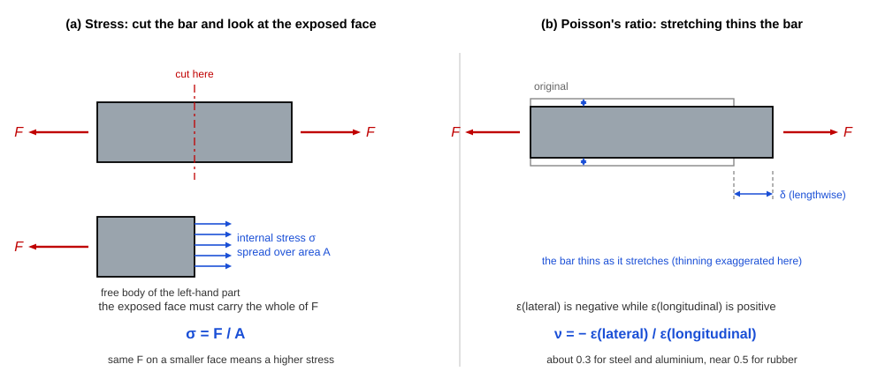
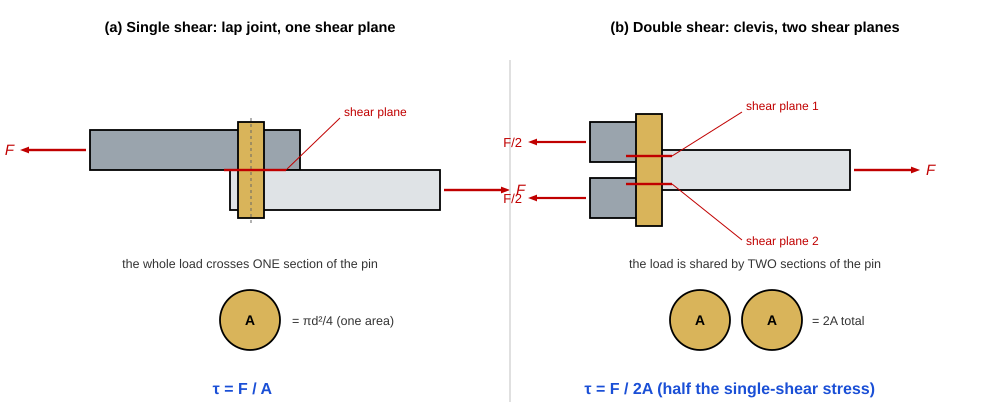

import MechanicsOfMaterialsComments from '../../../../components/mechanics-of-materials/MechanicsOfMaterialsComments.astro';
import TawkWidget from '../../../../components/TawkWidget.astro';
import UniversalContentContributors from '../../../../components/UniversalContentContributors.astro';
import InArticleAd from '../../../../components/InArticleAd.astro';
import Copyright from '../../../../components/Copyright.astro';
import BionicText from '../../../../components/BionicText.astro';
import TailwindWrapper from '../../../../components/TailwindWrapper.jsx';
import { Tabs, TabItem } from '@astrojs/starlight/components';
import { Card, CardGrid, Badge, Steps, LinkButton, FileTree } from '@astrojs/starlight/components';

<UniversalContentContributors 
  contributors={frontmatter.contributors}
/>

A connecting rod that looks strong enough can fail in service if the designer did not account for the stress concentration at a fillet, the fatigue limit of the material, or the difference between tensile and compressive loading. Predicting whether a part will survive requires more than intuition: it requires stress analysis. In this lesson you will learn the fundamental quantities (stress, strain, Young's modulus, Poisson's ratio) and put them to work on three real parts, the connecting rod in a crank-slider mechanism, a precision tie rod in tension, and a clevis pin in double shear. #StressAnalysis #MechanicsOfMaterials #ConnectingRod

## Learning Objectives

By the end of this lesson, you will be able to:

1. **Analyze** real mechatronic systems to identify the components that carry critical loads
2. **Calculate** normal stress, shear stress, strain, and the material properties that link them (Young's modulus, Poisson's ratio)
3. **Apply** Hooke's law to predict elastic deformation under tension, compression, and shear
4. **Evaluate** a design against yield strength with a safety factor, and read the lateral contraction that Poisson's ratio predicts

:::tip[Try it as you read]
This lesson pairs with the [Axial Loading Simulator](/product-development/axial-loading-simulator/): load a single bar in tension and watch the stress, strain, and elongation update as you change the force, diameter, and material. The [Axial Loading Experiments](/education/mechanics-of-materials/axial-loading-experiments) reproduce the worked examples below step by step with Python.
:::

## Real-World System Problem: The Crank-Slider Mechanism

<InArticleAd />

Consider an internal combustion engine or a reciprocating compressor. At the heart of these systems lies the crank-slider mechanism, one of the most fundamental motion conversion systems in mechanical engineering. The connecting rod ties the rotating crank to the sliding piston, and on every compression stroke it carries a large axial load that switches between compression and tension thousands of times a minute.

  <TailwindWrapper>
	
  </TailwindWrapper>

### The Stress Problem

> **Engineering Question:** During the compression stroke, enormous forces act on the connecting rod. How do we know the rod will not buckle, yield, or break, and how much will it deform under load?

Answering that needs more than a feel for "strong enough." Without stress and strain we cannot predict whether the rod will fail, choose between steel, aluminum, and titanium, optimize the cross-section, or guarantee reliable operation over millions of cycles.

### Why Stress Analysis Matters

<CardGrid>
  <Card title="Predicting failure" icon="warning">
  Stress compared against the material's strength tells you whether a part survives its worst load, before it is ever built.
  </Card>
  <Card title="Material selection" icon="setting">
  Young's modulus and yield strength let you trade steel against aluminum or titanium on stiffness, weight, and cost.
  </Card>
  <Card title="Sizing the section" icon="puzzle">
  Because stress is force over area, the analysis sets the smallest cross-section that is still safe, which controls weight.
  </Card>
  <Card title="System reliability" icon="rocket">
  In a mechatronic system a single mechanical failure stops everything, so the load-bearing parts decide overall reliability.
  </Card>
</CardGrid>

:::caution[Critical Design Insight]
In mechatronic systems, mechanical failure modes often dominate over electrical or software failures. A single broken connecting rod or sheared pin can render the entire system inoperable, no matter how sophisticated the control electronics are. This is why mechanics of materials analysis sits at the foundation of reliable design.
:::

## Fundamental Theory: Stress, Strain, and Material Properties

<InArticleAd />

With the reason for the analysis clear, we can build the four quantities that the rest of the chapter rests on.

### What is Stress?

Stress is the internal resistance of a material to applied force, measured as force per unit area:

<Card title="Normal Stress" icon="document">
$$\sigma = \frac{F}{A}$$

Where:
- $\sigma$ = normal stress (Pa, or N/m²)
- $F$ = applied force (N)
- $A$ = cross-sectional area (m²)

The same force over a smaller area gives a higher stress. This single idea, force spread over area, is the most-used relation in the whole subject.
</Card>

Panel (a) is worth dwelling on: stress is not something the load "has", it is what the *cut face* must carry. Take any section, draw the part on one side of it as a free body, and the stress on the exposed face is whatever it takes to balance the external force. Panel (b) previews Poisson's ratio, covered below.

<Tabs>
  <TabItem label="Types of Stress">
    
    **Normal stress ($\sigma$)** acts perpendicular to the cut surface:
    - Tensile: the material is stretched (taken as positive)
    - Compressive: the material is squeezed (taken as negative)
    
    **Shear stress ($\tau$)** acts parallel to the surface and tends to slide one face past the other, causing angular distortion. A pin or bolt loaded across its axis carries shear.
    
</TabItem>
  <TabItem label="Engineering Units">
    
    Stress is measured in pascals:
    - 1 Pa = 1 N/m²
    - 1 kPa = 1,000 Pa
    - 1 MPa = 1,000,000 Pa = 1 N/mm²
    - 1 GPa = 1,000,000,000 Pa
    
    The relation 1 MPa = 1 N/mm² is worth memorizing: it lets you work in newtons and millimetres and read the answer straight off in MPa.
    
    Typical yield strengths: structural steel 250 to 400 MPa, aluminum alloys 70 to 500 MPa.
    
</TabItem>
</Tabs>

### What is Strain?

Strain measures deformation: how much a material changes length relative to its original size.

<Card title="Normal Strain" icon="document">
$$\epsilon = \frac{\delta_L}{L_0}$$

Where:
- $\epsilon$ = normal strain (dimensionless)
- $\delta_L$ = change in length (m)
- $L_0$ = original length (m)

Strain is a ratio, so it has no units. A strain of 0.001 means the part stretched by one part in a thousand, often written as 1000 microstrain.
</Card>

### Hooke's Law: The Foundation of Linear Elasticity

For most engineering materials, up to a limit, stress and strain are proportional:

<Card title="Hooke's Law" icon="document">
$$\sigma = E \cdot \epsilon$$

Where $E$ is Young's modulus (Pa), the slope of the stress-strain line. Combining it with the two definitions above gives the working form for axial deflection:

$$\delta_L = \frac{F \, L_0}{A \, E}$$

Young's modulus is a measure of stiffness: how much stress is needed to produce a given strain.
</Card>

:::tip[Material Selection Insight]
A higher $E$ means a stiffer material that deforms less under the same load. A lower $E$ means more flexibility, which can be useful for vibration damping or compliant mechanisms. Steel ($E \approx 200$ GPa) is about three times stiffer than aluminum ($E \approx 70$ GPa) for the same shape.
:::

### Poisson's Ratio: Lateral Strain

When a bar is stretched along its length, it gets thinner across its width. Poisson's ratio links the two:

<Card title="Poisson's Ratio" icon="document">
$$\nu = -\frac{\epsilon_{lateral}}{\epsilon_{longitudinal}}$$

Where:
- $\nu$ = Poisson's ratio (dimensionless)
- $\epsilon_{lateral}$ = strain across the load direction
- $\epsilon_{longitudinal}$ = strain along the load direction

The minus sign makes $\nu$ positive, because stretching lengthwise (positive longitudinal strain) gives a negative lateral strain. Typical values run from 0.25 to 0.35 for metals.
</Card>

:::note[Poisson's Ratio Values]
- $\nu \approx 0.3$ for most structural metals (steel, aluminum)
- $\nu \approx 0.5$ for nearly incompressible materials such as rubber
- $\nu \approx 0.2$ for concrete and many ceramics

Poisson's ratio becomes important wherever a part is loaded in more than one direction at once, which is the subject of the principal-stress analysis later in the course.
:::

Panel (b) of the figure in *What is Stress?* above shows the lateral contraction that this ratio measures.

## Application 1: Crank-Slider Connecting Rod in Compression

<InArticleAd />

Return to the crank-slider and put the theory to work on the rod itself.

  <LinkButton href="/product-development/crank-slider-mechanism-simulator/" target="_blank" variant="primary" icon="rocket" iconPlacement="start">Open the Crank-Slider Simulator</LinkButton>

:::note[System Problem Statement]
- **Component:** Steel connecting rod, the critical link between crank and piston
- **Peak compression force:** $F = 15{,}000$ N
- **Cross-sectional area:** $A = 500$ mm²
- **Length:** $L = 150$ mm
- **Material:** steel, $E = 200$ GPa, $\sigma_{yield} = 350$ MPa
- **Task:** find the peak compressive stress, the safety factor against yield, and the deflection under load

**Key Question:** Is this rod safe under peak compression, and how much does it shorten?
:::

### Step 1: Peak Compressive Stress

**Click to reveal the stress calculation**

<Steps>

1. **Apply the stress formula.** Work in newtons and square millimetres so the answer falls out in MPa:

   $$\sigma = \frac{F}{A} = \frac{15{,}000 \text{ N}}{500 \text{ mm}^2} = 30 \text{ N/mm}^2 = 30 \text{ MPa}$$ ✅

2. **Read the result.** The rod carries a peak compressive stress of **30 MPa**, well below the 350 MPa yield strength of steel. ✅

</Steps>

### Step 2: Safety Factor

**Click to reveal the safety-factor check**

<Steps>

1. **Compare the stress with the yield strength:**

   $$\text{SF} = \frac{\sigma_{yield}}{\sigma} = \frac{350 \text{ MPa}}{30 \text{ MPa}} = 11.7$$ ✅

2. **Interpret it.** A static safety factor of 11.7 looks generous, and against a single static load it is. A connecting rod is not sized by static yield, though: it is sized by fatigue (millions of load reversals) and by buckling under compression. The large static margin is what those other limits leave behind, not over-design. ✅

</Steps>

:::tip[Safety Factor Guidelines]
- SF 2 to 3: well-understood loads and materials
- SF 4 to 6: some uncertainty in loads or materials
- SF 8 to 12: high uncertainty, or a critical part also governed by fatigue or buckling
- SF above 15: usually genuine over-design, a weight and cost penalty
:::

### Step 3: Deflection Under Load

**Click to reveal the deflection calculation**

<Steps>

1. **Find the strain** from Hooke's law:

   $$\epsilon = \frac{\sigma}{E} = \frac{30 \times 10^6}{200 \times 10^9} = 1.5 \times 10^{-4}$$ ✅

2. **Find the shortening:**

   $$\delta_L = \epsilon \, L = (1.5 \times 10^{-4})(150 \text{ mm}) = 0.0225 \text{ mm}$$ ✅

   The rod shortens by about 23 micrometres under peak load, negligible for engine geometry but exactly the kind of number that matters in a precision positioning system, as the next application shows. ✅

</Steps>

:::note[Engineering Insight]
The static stress is small and the deflection tiny, yet the rod is still one of the most carefully designed parts in an engine. The governing loads are not the static peak but the millions of tension-compression reversals (fatigue) and the buckling tendency under compression. Static analysis is where you start, not where you stop.
:::

## Application 2: Precision Tie Rod in Tension

<InArticleAd />

A camera gantry, a CNC frame, and many robot structures use a thin steel tie rod (or turnbuckle) to hold two points at a fixed spacing under tension. Here both the stretch and the sideways contraction matter, because the tie rod also acts as a dimensional reference.

:::note[System Problem Statement]
- **Component:** steel tie rod, $d = 10$ mm diameter, $L = 600$ mm long
- **Tensile load:** $F = 8$ kN
- **Material:** steel, $E = 200$ GPa, $\sigma_{yield} = 350$ MPa, $\nu = 0.3$
- **Task:** find the tensile stress and safety factor, the elongation, and the lateral contraction of the rod diameter

**Key Question:** How far does the rod stretch, and by how much does its diameter shrink while loaded?
:::

Set a single steel bar to these values in the simulator and confirm the stress and elongation match the hand calculation below:

  <LinkButton href="/product-development/axial-loading-simulator/" target="_blank" variant="primary">Open the Axial Loading Simulator</LinkButton>

### Step 1: Tensile Stress and Safety Factor

**Click to reveal the stress and safety factor**

<Steps>

1. **Cross-sectional area** of the round rod:

   $$A = \frac{\pi d^2}{4} = \frac{\pi (10 \text{ mm})^2}{4} = 78.5 \text{ mm}^2$$ ✅

2. **Tensile stress:**

   $$\sigma = \frac{F}{A} = \frac{8{,}000 \text{ N}}{78.5 \text{ mm}^2} = 101.9 \text{ MPa}$$ ✅

3. **Safety factor against yield:**

   $$\text{SF} = \frac{350 \text{ MPa}}{101.9 \text{ MPa}} = 3.4$$ ✅

   A safety factor of 3.4 is sensible for a static structural tie with well-known loads. ✅

</Steps>

### Step 2: Elongation

**Click to reveal the elongation calculation**

<Steps>

1. **Longitudinal strain:**

   $$\epsilon = \frac{\sigma}{E} = \frac{101.9 \times 10^6}{200 \times 10^9} = 5.09 \times 10^{-4}$$ ✅

2. **Elongation:**

   $$\delta_L = \epsilon \, L = (5.09 \times 10^{-4})(600 \text{ mm}) = 0.306 \text{ mm}$$ ✅

   The rod stretches about 0.31 mm. On a gantry that positions a tool or camera, three tenths of a millimetre is the difference between in-tolerance and scrap, so this stretch must be designed in. ✅

</Steps>

### Step 3: Lateral Contraction from Poisson's Ratio

**Click to reveal the Poisson contraction**

<Steps>

1. **Lateral strain** follows from Poisson's ratio:

   $$\epsilon_{lateral} = -\nu \, \epsilon = -(0.3)(5.09 \times 10^{-4}) = -1.53 \times 10^{-4}$$ ✅

2. **Change in diameter:**

   $$\Delta d = \epsilon_{lateral} \, d = (-1.53 \times 10^{-4})(10 \text{ mm}) = -1.53 \times 10^{-3} \text{ mm} = -1.5 \text{ }\mu\text{m}$$ ✅

   The rod necks down by about 1.5 micrometres while loaded. It is tiny, but it is real, and in a press fit or a threaded joint that contraction can be enough to loosen a connection under load. ✅

</Steps>

:::note[Engineering Insight]
The same load produces three different effects worth tracking: a stress to check against strength, an elongation to check against tolerance, and a lateral contraction from Poisson's ratio. A part can pass the strength check and still fail the job if the elongation throws a precision dimension out of tolerance.
:::

## Application 3: Clevis Pin in Double Shear

<InArticleAd />

Counting shear planes is the whole difference between the two joints, and it is the most common slip in this calculation: the clevis pin below carries the load across **two** sections, so the shear area is 2A, not A.

Where one link of a robot or a linkage connects to another, the load usually passes through a pin. A clevis (a forked fitting) grips the pin on two sides, so the pin is cut across by two shear planes at once. This is double shear, and it is governed by shear stress rather than normal stress.

:::note[System Problem Statement]
- **Component:** steel clevis pin, $d = 8$ mm diameter, loaded in double shear
- **Load through the joint:** $F = 6$ kN
- **Material:** steel, $\sigma_{yield} = 350$ MPa
- **Task:** find the shear stress in the pin and the safety factor against shear yield

**Key Question:** Will the pin shear off, and how much margin does it have?
:::

### Step 1: Shear Stress in Double Shear

**Click to reveal the shear-stress calculation**

<Steps>

1. **Identify the shear planes.** In double shear the load is carried by two cross-sections of the pin, so the area resisting shear is twice the single area:

   $$A_{single} = \frac{\pi d^2}{4} = \frac{\pi (8 \text{ mm})^2}{4} = 50.3 \text{ mm}^2, \qquad A_{shear} = 2 A_{single} = 100.5 \text{ mm}^2$$ ✅

2. **Shear stress:**

   $$\tau = \frac{F}{A_{shear}} = \frac{6{,}000 \text{ N}}{100.5 \text{ mm}^2} = 59.7 \text{ MPa}$$ ✅

   If the same pin were in single shear, the stress would double to about 119 MPa. Putting the pin in double shear halves the shear stress, which is why clevis joints are used for higher loads. ✅

</Steps>

### Step 2: Safety Factor Against Shear Yield

**Click to reveal the shear safety factor**

<Steps>

1. **Estimate the shear yield strength.** A ductile metal yields in shear at roughly $0.577$ of its tensile yield (the von Mises relation):

   $$\tau_{yield} \approx 0.577 \, \sigma_{yield} = 0.577 (350 \text{ MPa}) = 202 \text{ MPa}$$ ✅

2. **Safety factor:**

   $$\text{SF} = \frac{\tau_{yield}}{\tau} = \frac{202 \text{ MPa}}{59.7 \text{ MPa}} = 3.4$$ ✅

   The pin has a comfortable margin. The more conservative maximum-shear-stress theory uses $\tau_{yield} = 0.5\,\sigma_{yield} = 175$ MPa, giving SF = 2.9, still safe. The choice between the two failure theories is the subject of the principal-stress lesson later in the course. ✅

</Steps>

:::note[Engineering Insight]
Normal stress and shear stress are different failure modes and must be checked separately. A pin that is perfectly safe in tension can still shear off, and the way a joint grips the pin (single versus double shear) changes the stress by a factor of two. Always ask which way the load actually cuts the material.
:::

## Key Material Properties for Mechatronics

<InArticleAd />

<CardGrid>
  <Card title="Steel (structural)" icon="document">
  $E = 200$ GPa. High stiffness, moderate weight. Common in frames, shafts, gears, and pins.
  </Card>
  <Card title="Aluminum (6061-T6)" icon="document">
  $E = 70$ GPa. Lower stiffness, light weight. Common in actuator housings and brackets.
  </Card>
  <Card title="Carbon fiber composite" icon="document">
  $E = 150$ GPa and up. High stiffness at very low weight. Common in drone frames and precision arms.
  </Card>
</CardGrid>

## Design Guidelines for Stress and Strain

<InArticleAd />

<CardGrid>
  <Card title="Start with force over area" icon="rocket">
  Most static checks reduce to $\sigma = F/A$ or $\tau = F/A_{shear}$. Get the area and the load path right and the stress follows.
  </Card>
  <Card title="Check strength and stiffness" icon="warning">
  A part must pass two tests: the stress stays below the allowable strength, and the deflection stays within tolerance. Either one can govern.
  </Card>
  <Card title="Know which stress acts" icon="setting">
  Normal stress and shear stress fail differently. Identify whether the load stretches, compresses, or cuts the section before choosing the formula.
  </Card>
  <Card title="Remember the side effects" icon="puzzle">
  Poisson contraction, fatigue, and buckling all hide behind a clean static number. A generous static safety factor does not excuse you from checking them.
  </Card>
</CardGrid>

:::tip[Instrument it]
Stress is invisible, but strain is not. Bond a foil strain gauge to the part along the load axis and you read strain directly; multiply by Young's modulus and you have the actual stress, the number your safety factor rests on. A quarter-bridge into an HX711 or an instrumentation amplifier, read by an [ESP32 or STM32](/education/sensor-actuator-interfacing-stm32/), turns a hand calculation into a measured value you can [trend on siliconwit.io](https://siliconwit.io) and check against the yield limit before anything breaks.
:::

## Summary and Next Steps

<InArticleAd />

### Key Concepts Mastered

1. **Stress** is force over area, $\sigma = F/A$ for normal stress and $\tau = F/A_{shear}$ for shear, with 1 MPa = 1 N/mm².
2. **Strain** is the dimensionless ratio $\epsilon = \delta_L / L_0$, linked to stress by Hooke's law $\sigma = E\epsilon$, which gives the deflection $\delta_L = FL_0/(AE)$.
3. **Poisson's ratio** ties lateral contraction to longitudinal stretch, $\epsilon_{lateral} = -\nu\,\epsilon_{longitudinal}$.
4. **A safe design** keeps the working stress below the allowable strength, and the deflection within tolerance, with a safety factor chosen for the uncertainty and the failure mode.

### Results at a Glance

| Application | Load type | Key result | Safety factor |
|------------|-----------|------------|:-------------:|
| Connecting rod | compression | $\sigma = 30$ MPa, $\delta = 0.023$ mm | 11.7 (static) |
| Tie rod | tension | $\sigma = 102$ MPa, $\delta = 0.31$ mm, $\Delta d = -1.5\,\mu$m | 3.4 |
| Clevis pin | double shear | $\tau = 59.7$ MPa | 3.4 |

### A Note on Tools

Every result here came from three formulas ($\sigma = F/A$, $\epsilon = \sigma/E$, $\nu = -\epsilon_{lat}/\epsilon_{long}$) and a calculator. No finite-element software is needed for axial and shear members; the hand calculation is the design, and software only confirms it for complex geometry.

Next, [Strain and Mechanical Properties](/education/mechanics-of-materials/strain-and-mechanical-properties) develops the full stress-strain curve, the difference between stiffness and strength, and how a material's behaviour past the elastic limit decides whether a part bends or breaks.

<InArticleAd />
<MechanicsOfMaterialsComments />
<TawkWidget />
<Copyright />