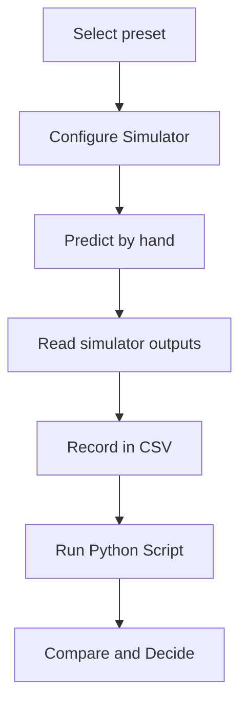

import MechanicsOfMaterialsComments from '../../../../components/mechanics-of-materials/MechanicsOfMaterialsComments.astro';
import TawkWidget from '../../../../components/TawkWidget.astro';
import UniversalContentContributors from '../../../../components/UniversalContentContributors.astro';
import InArticleAd from '../../../../components/InArticleAd.astro';
import Copyright from '../../../../components/Copyright.astro';
import BionicText from '../../../../components/BionicText.astro';
import TailwindWrapper from '../../../../components/TailwindWrapper.jsx';
import { Tabs, TabItem } from '@astrojs/starlight/components';
import { Card, CardGrid, Badge, Steps, LinkButton, FileTree } from '@astrojs/starlight/components';

<UniversalContentContributors 
  contributors={frontmatter.contributors}
/>


A pressurized cylinder carries two stresses at every point in its wall simultaneously: hoop stress around the circumference and longitudinal stress along the axis. The hoop stress is always exactly twice the longitudinal, which is why cylindrical vessels split lengthwise under overpressure rather than losing an end cap. A sphere avoids that imbalance entirely: its wall stress is the same in every meridional direction, equal to the cylinder longitudinal value, so it needs roughly half the wall material for the same duty. These six experiments turn those facts into numbers you can check yourself, using the Pressure Vessel Simulator and Python scripts whose outputs you can predict before running them. #PressureVessels #HoopStress #ThinWall

:::tip[What you need]
The [Pressure Vessel Simulator](/product-development/pressure-vessel-simulator/), and Python 3 with NumPy and Matplotlib (`pip install numpy matplotlib`).
:::

:::note[Related resources]
The theory behind these experiments is in [Thin-Walled Pressure Vessels](/education/mechanics-of-materials/thin-walled-pressure-vessels). For the stress-state view of the biaxial wall (including Mohr's circle for the hoop/longitudinal pair), see the [Solid Mechanics Analyzer](/product-development/solid-mechanics-analyzer/) page.
:::

## Reference

| Term | Meaning |
|------|---------|
| **Hoop stress (sigma_h)** | Circumferential wall stress in a cylinder, sigma_h = p r / t; governs the design because it is the larger principal stress |
| **Longitudinal stress (sigma_l)** | Axial wall stress in a cylinder, sigma_l = p r / (2t); exactly half the hoop stress |
| **Sphere membrane stress** | Wall stress in a spherical vessel, sigma = p r / (2t) in every direction; equal to the cylinder longitudinal stress |
| **Thin-wall assumption** | Valid when r/t >= 10; below that ratio the stress gradient across the thickness is significant and thick-wall (Lame) equations are needed |
| **von Mises equivalent stress** | The scalar svm = sqrt(s1^2 - s1 s2 + s2^2) that collapses the biaxial state to a single number for comparison with yield strength |
| **Safety factor (SF)** | SF = yield / svm; the margin between the operating stress and first yield |
| **t_req** | Minimum wall thickness for a given SF computed via the von Mises path: t_req = sqrt(0.75) * p * r / (yield / SF) for a cylinder |

### Experiment Workflow



### Workspace Setup

<FileTree>
- pressure-vessel-experiments/
  - data/
  - plots/
  - scripts/
</FileTree>

:::tip[Instrument it]
You cannot read a wall stress directly, but two inexpensive sensors together give you everything. A pressure transducer on the inlet reads the internal gauge pressure p. A foil strain gauge bonded circumferentially reads the hoop strain; dividing by Young's modulus gives the hoop stress, which should match p r / t from the formula. A second gauge oriented axially should read exactly half the hoop value, confirming the 2:1 prediction experimentally. Wire both gauges into a Wheatstone bridge and have an [ESP32 or STM32](/education/sensor-actuator-interfacing-stm32/) sample the channels continuously. That board can [stream the live stress state](https://siliconwit.io) and trigger an alert well before the von Mises equivalent stress reaches the yield limit.
:::

---

## Experiment 1: Hoop versus Longitudinal Stress

<InArticleAd />


A pressurized cylinder is in biaxial stress: hoop stress around the circumference and longitudinal stress along the axis. The formulas give a ratio of exactly 2:1, but until you check it against a real preset with real numbers the ratio is just a sentence on a page. This experiment makes it concrete.

:::note[Objective]
For the air-tank preset, compute the hoop and longitudinal stresses from the formulas, confirm the 2:1 ratio in the simulator readout, and record how the ratio is independent of the specific values of p, r, and t.
:::

<Steps>
1. **Configure the simulator**
   Open the simulator and select the **air-tank** preset (p = 1.0 MPa, d = 400 mm, t = 4 mm, yield = 250 MPa, cylinder). Confirm the vessel type shows "cylinder".

2. **Predict**
   Before reading the panel, calculate by hand: r = d/2 = 200 mm, sigma_hoop = p r / t, sigma_long = p r / (2t). Write down your predicted ratio.

3. **Read the simulator**
   Read sigma_hoop and sigma_long from the output panel. Confirm the ratio. Also note the von Mises equivalent stress and safety factor.

4. **Vary the thickness**
   Switch to Custom and change t to 8 mm (doubling it). Note that both stresses halve while the ratio stays at 2. Then try t = 2 mm and confirm both stresses double.

5. **Save data**
   Create `data/exp1_hoop_long.csv` with columns: p_MPa, d_mm, t_mm, r_mm, sigma_hoop, sigma_long, ratio.
</Steps>

### Data Collection Table

| p (MPa) | d (mm) | t (mm) | r (mm) | sigma_hoop (MPa) | sigma_long (MPa) | ratio |
|---|---|---|---|---|---|---|
| 1.0 | 400 | 4 | 200 | | | |
| 1.0 | 400 | 8 | 200 | | | |
| 1.0 | 400 | 2 | 200 | | | |

### Python Analysis

```python title="experiment_1_hoop_long.py"
# Pressure Vessel Experiment 1: hoop vs longitudinal stress
import numpy as np
import matplotlib.pyplot as plt
import os

os.makedirs('plots', exist_ok=True)

# air-tank preset
p, d, y = 1.0, 400.0, 250.0
r = d / 2.0

t_vals = np.array([2.0, 4.0, 8.0])
for t in t_vals:
    sh = p * r / t
    sl = p * r / (2.0 * t)
    svm = np.sqrt(sh**2 - sh * sl + sl**2)
    sf = y / svm
    print(f"t = {t:.0f} mm: sigma_hoop = {sh:.2f} MPa, sigma_long = {sl:.2f} MPa, "
          f"ratio = {sh/sl:.2f}, svm = {svm:.2f} MPa, SF = {sf:.2f}")

# Plot: both stresses vs wall thickness
t_sweep = np.linspace(1, 20, 200)
sh_sweep = p * r / t_sweep
sl_sweep = p * r / (2.0 * t_sweep)

fig, ax = plt.subplots(figsize=(8, 5))
ax.plot(t_sweep, sh_sweep, color='#2A9D8F', lw=2, label='sigma_hoop = p r / t')
ax.plot(t_sweep, sl_sweep, color='#E76F51', lw=2, label='sigma_long = p r / (2t)')
ax.axvline(4.0, color='gray', ls='--', lw=1, label='air-tank: t = 4 mm')
ax.set_xlabel('wall thickness t (mm)')
ax.set_ylabel('stress (MPa)')
ax.set_title('Hoop and longitudinal stress vs wall thickness (p = 1.0 MPa, r = 200 mm)')
ax.legend(fontsize=8)
ax.grid(True, alpha=0.3)
plt.tight_layout()
plt.savefig('plots/exp1_hoop_long.png', dpi=150, bbox_inches='tight')
plt.show()
```

### Expected Results

For the air-tank preset (p = 1.0 MPa, r = 200 mm, t = 4 mm):

```
t =  2 mm: sigma_hoop = 100.00 MPa, sigma_long = 50.00 MPa, ratio = 2.00, svm = 86.60 MPa, SF = 2.89
t =  4 mm: sigma_hoop =  50.00 MPa, sigma_long = 25.00 MPa, ratio = 2.00, svm = 43.30 MPa, SF = 5.77
t =  8 mm: sigma_hoop =  25.00 MPa, sigma_long = 12.50 MPa, ratio = 2.00, svm = 21.65 MPa, SF = 11.55
```

The ratio is exactly 2.00 for every wall thickness because sigma_hoop / sigma_long = (p r / t) / (p r / (2t)) = 2, with p, r, and t all cancelling. Changing only t scales both stresses together without touching the ratio. The von Mises equivalent at t = 4 mm is 43.30 MPa, giving a safety factor of 5.77 against a 250 MPa yield strength.

### Design Question

A cylinder and a sphere are both designed to hold the same internal pressure. The cylinder splits lengthwise under overpressure while the sphere does not split along any preferred line. What does the 2:1 ratio of hoop to longitudinal stress tell you about which seam orientation on a welded cylinder is the most critical to inspect?

---

## Experiment 2: Wall-Thickness Sizing for a Target Safety Factor

<InArticleAd />


Knowing the stresses is the first step; sizing the wall so the stresses stay within an acceptable safety margin is the design step. This experiment works from a target safety factor back to a minimum wall thickness, then checks the pipeline preset to see how the designed wall compares with the one that was actually built.

:::note[Objective]
For the pipeline preset, compute the actual von Mises safety factor of the existing wall, then find the minimum wall thickness that satisfies a required SF = 2.5, and confirm both values with the simulator.
:::

<Steps>
1. **Configure the simulator**
   Select the **pipeline** preset (p = 8 MPa, d = 600 mm, t = 10 mm, yield = 360 MPa, cylinder).

2. **Read the existing state**
   Record sigma_hoop, sigma_long, svm, and SF from the panel. Note whether the existing wall already meets SF = 2.5.

3. **Size for SF = 2.5**
   For a cylinder the von Mises equivalent is svm = sqrt(0.75) * p r / t. Setting svm = yield / SF and solving gives t_min = sqrt(0.75) * p * r / (yield / SF). Compute t_min for SF = 2.5.

4. **Confirm in the simulator**
   Switch to Custom, keep p, d, and yield at the pipeline values, and enter your computed t_min. The safety factor readout should be very close to 2.5.

5. **Save data**
   Create `data/exp2_sizing.csv` with columns: p_MPa, d_mm, t_mm, svm_MPa, SF_actual, SF_target, t_min_mm.
</Steps>

### Data Collection Table

| Quantity | Pipeline preset (t = 10 mm) | Target (SF = 2.5) |
|---|---|---|
| sigma_hoop (MPa) | | |
| sigma_long (MPa) | | |
| svm (MPa) | | |
| Safety factor | | 2.5 |
| t_min (mm) | N/A | |

### Python Analysis

```python title="experiment_2_sizing.py"
# Pressure Vessel Experiment 2: wall-thickness sizing for a target safety factor
import numpy as np

# pipeline preset
p, d, t_actual, y = 8.0, 600.0, 10.0, 360.0
r = d / 2.0

# Existing wall stresses
sh = p * r / t_actual
sl = p * r / (2.0 * t_actual)
svm = np.sqrt(sh**2 - sh * sl + sl**2)
sf_actual = y / svm

print(f"Pipeline preset: p = {p} MPa, r = {r:.0f} mm, t = {t_actual:.0f} mm, yield = {y} MPa")
print(f"  sigma_hoop = {sh:.2f} MPa, sigma_long = {sl:.2f} MPa")
print(f"  svm        = {svm:.2f} MPa")
print(f"  actual SF  = {sf_actual:.4f}")

# Minimum t for required safety factors
print()
for SF_req in [2.0, 2.5, 3.0]:
    sigma_allow_vm = y / SF_req
    t_min = np.sqrt(0.75) * p * r / sigma_allow_vm
    print(f"  t_min for SF = {SF_req}: sigma_allow_vm = {sigma_allow_vm:.2f} MPa, "
          f"t_min = {t_min:.4f} mm")
```

### Expected Results

```
Pipeline preset: p = 8 MPa, r = 300 mm, t = 10 mm, yield = 360 MPa
  sigma_hoop = 240.00 MPa, sigma_long = 120.00 MPa
  svm        = 207.85 MPa
  actual SF  = 1.7321

  t_min for SF = 2.0: sigma_allow_vm = 180.00 MPa, t_min = 11.5470 mm
  t_min for SF = 2.5: sigma_allow_vm = 144.00 MPa, t_min = 14.4338 mm
  t_min for SF = 3.0: sigma_allow_vm = 120.00 MPa, t_min = 17.3205 mm
```

The existing 10 mm wall gives a von Mises safety factor of only 1.73, which is below the target of 2.5. Achieving SF = 2.5 requires a minimum wall of 14.43 mm. The formula for t_min comes from setting svm = sqrt(0.75) * p r / t equal to yield / SF and solving: t_min = sqrt(0.75) * p * r * SF / yield. Note that t_min scales linearly with both p and r and inversely with yield strength, so the three levers for meeting a safety factor target are reducing pressure, reducing radius, or upgrading to a higher-yield material.

### Design Question

The pipeline is upgraded to a higher-grade steel with yield = 500 MPa. Keeping SF = 2.5, what is the new t_min, and by what percentage has the required wall thickness decreased compared with the 360 MPa grade?

---

## Experiment 3: Cylinder versus Sphere at the Same Conditions

<InArticleAd />


A sphere uses less wall material than a cylinder at the same pressure and radius. That is a known result, but the exact numbers from the simulator make the trade-off tangible and set up a comparison that engineers making a vessel shape decision actually do.

:::note[Objective]
Using the sphere-tank preset as the sphere case and an equivalent cylinder at the same p, r, t, and yield, compute both wall stresses and safety factors, confirm the 2:1 hoop-stress advantage of the sphere, and compare the minimum wall thickness each shape needs for SF = 1 via von Mises.
:::

<Steps>
1. **Configure the simulator for the sphere**
   Select the **sphere-tank** preset (p = 3 MPa, d = 2000 mm, t = 15 mm, yield = 300 MPa, sphere). Record sigma_h, sigma_l, svm, and SF.

2. **Switch to the equivalent cylinder**
   Keep all parameters identical but change the vessel type to cylinder. Record the new sigma_hoop, sigma_long, svm, and SF.

3. **Compute the minimum walls**
   The simulator reports t_req, which is the minimum t for SF = 1 via von Mises (the physics lower bound). Record t_req for both shapes.

4. **Compare**
   Confirm: sphere svm = 100 MPa, cylinder svm = 173.21 MPa at the same t = 15 mm. The sphere SF is 3.00; the cylinder SF is 1.73.

5. **Save data**
   Create `data/exp3_cyl_vs_sphere.csv` with columns: vessel, p, d, t, sh, sl, svm, SF, t_req.
</Steps>

### Data Collection Table

| Vessel | sigma_h (MPa) | sigma_l (MPa) | svm (MPa) | SF | t_req (mm) |
|---|---|---|---|---|---|
| Sphere (sphere-tank) | | | | | |
| Cylinder (same p, r, t, yield) | | | | | |

### Python Analysis

```python title="experiment_3_cyl_vs_sphere.py"
# Pressure Vessel Experiment 3: cylinder vs sphere at the same conditions
import numpy as np
import matplotlib.pyplot as plt
import os

os.makedirs('plots', exist_ok=True)

# sphere-tank preset parameters
p, d, t, y = 3.0, 2000.0, 15.0, 300.0
r = d / 2.0

# Sphere
sh_sph = p * r / (2.0 * t)
sl_sph = sh_sph  # equal in all directions
svm_sph = np.sqrt(sh_sph**2 - sh_sph * sl_sph + sl_sph**2)
sf_sph = y / svm_sph
k_sph = 0.5
t_req_sph = k_sph * p * r / y

# Cylinder (same p, r, t, y)
sh_cyl = p * r / t
sl_cyl = p * r / (2.0 * t)
svm_cyl = np.sqrt(sh_cyl**2 - sh_cyl * sl_cyl + sl_cyl**2)
sf_cyl = y / svm_cyl
k_cyl = np.sqrt(0.75)
t_req_cyl = k_cyl * p * r / y

print("Conditions: p = {:.0f} MPa, r = {:.0f} mm, t = {:.0f} mm, yield = {:.0f} MPa".format(
      p, r, t, y))
print()
print("Shape       sh (MPa)   sl (MPa)   svm (MPa)  SF      t_req (mm)")
print(f"Sphere      {sh_sph:8.2f}   {sl_sph:8.2f}   {svm_sph:8.2f}   {sf_sph:.4f}  {t_req_sph:.4f}")
print(f"Cylinder    {sh_cyl:8.2f}   {sl_cyl:8.2f}   {svm_cyl:8.2f}   {sf_cyl:.4f}  {t_req_cyl:.4f}")
print()
print(f"Cylinder svm / sphere svm = {svm_cyl / svm_sph:.4f}")
print(f"Cylinder t_req / sphere t_req = {t_req_cyl / t_req_sph:.4f}")

# Show the stress reduction advantage of the sphere across a range of radii
r_range = np.linspace(200, 2000, 100)
svm_cyl_r = np.sqrt(0.75) * p * r_range / t
svm_sph_r = 0.5 * p * r_range / t

fig, ax = plt.subplots(figsize=(8, 5))
ax.plot(r_range, svm_cyl_r, color='#2A9D8F', lw=2, label='Cylinder svm')
ax.plot(r_range, svm_sph_r, color='#E76F51', lw=2, label='Sphere svm')
ax.axvline(r, color='gray', ls='--', lw=1, label=f'sphere-tank r = {r:.0f} mm')
ax.axhline(y, color='#264653', ls=':', lw=1, label=f'yield = {y:.0f} MPa')
ax.set_xlabel('radius r (mm)')
ax.set_ylabel('von Mises equivalent stress svm (MPa)')
ax.set_title('Cylinder vs sphere svm (p = 3 MPa, t = 15 mm)')
ax.legend(fontsize=8)
ax.grid(True, alpha=0.3)
plt.tight_layout()
plt.savefig('plots/exp3_cyl_vs_sphere.png', dpi=150, bbox_inches='tight')
plt.show()
```

### Expected Results

```
Conditions: p = 3 MPa, r = 1000 mm, t = 15 mm, yield = 300 MPa

Shape       sh (MPa)   sl (MPa)   svm (MPa)  SF      t_req (mm)
Sphere       100.00     100.00     100.00   3.0000   5.0000
Cylinder     200.00     100.00     173.21   1.7321   8.6603

Cylinder svm / sphere svm = 1.7321
Cylinder t_req / sphere t_req = 1.7321
```

The sphere wall stress is exactly 100 MPa (equal in both directions, sh = sl = p r / (2t)), giving SF = 3.00. The cylinder hoop stress at the same conditions is 200 MPa, raising svm to 173.21 MPa and dropping SF to 1.73. The minimum-wall-thickness ratio comes out sqrt(3) = 1.7321, which differs from the factor of 2 quoted in the [pressure vessels lesson](/education/mechanics-of-materials/thin-walled-pressure-vessels). The difference is the failure criterion, not an error: the lesson sizes the cylinder on its peak hoop stress (t = p r / sigma_allow, against the sphere's p r / (2 sigma_allow), a clean ratio of 2), while this simulator sizes on the von Mises equivalent stress. Because the cylinder's biaxial 2:1 state has a von Mises value of only sqrt(0.75) times its hoop stress, the cylinder requirement drops and the ratio falls to sqrt(3). Both criteria agree the sphere is far more material-efficient; they differ only in by how much, with von Mises being the less conservative choice for the cylinder. The same 15 mm wall that leaves the cylinder at SF = 1.73 gives the sphere SF = 3.00.

### Design Question

A designer proposes using a hemispherical end cap on a cylindrical pressure vessel rather than a flat plate or an ellipsoidal head. What wall thickness should the hemispherical cap have relative to the cylinder body to carry the same hoop safety factor, and why do pressure vessel codes often specify a thinner hemispherical cap?

---

## Experiment 4: Thin-Wall Validity Boundary

<InArticleAd />


The thin-wall formulas are simple and widely used, but they are only accurate when the wall is genuinely thin relative to the radius. Below the r/t = 10 threshold the stress varies across the thickness, the inner surface carries significantly more stress than the outer, and the simple formulas give a result that is optimistic and unconservative. This experiment maps exactly where that boundary falls.

:::note[Objective]
Sweep the radius-to-thickness ratio from 4 to 25, compute the thin-wall hoop stress at each point, identify the r/t = 10 boundary that the simulator enforces, and quantify how much the simple formula underestimates the inner-surface stress below that boundary.
:::

<Steps>
1. **Configure the simulator**
   Set p = 1.0 MPa. Use Custom mode and set d = 200 mm (r = 100 mm). Start with t = 25 mm (r/t = 4) and step t downward to 4 mm (r/t = 25).

2. **Observe the warning**
   At r/t below 10 the simulator flags the thin-wall assumption as invalid. Note the exact thickness where the flag appears.

3. **Record both the thin-wall result and the error**
   For each r/t, record sigma_hoop from the thin-wall formula. For the thick-wall correction (Lame equation), the hoop stress at the inner surface is p (r_o^2 + r_i^2) / (r_o^2 - r_i^2), where r_i = r and r_o = r + t. Compute both for the r/t values below 10.

4. **Compare**
   At r/t = 4 (t = 25 mm), by how many percent does the thin-wall formula understate the true inner-surface hoop stress?

5. **Save data**
   Create `data/exp4_thinwall.csv` with columns: r_mm, t_mm, rt_ratio, sh_thinwall, sh_lame_inner, error_pct, valid.
</Steps>

### Data Collection Table

| r/t | t (mm) | sigma_hoop thin-wall (MPa) | sigma_hoop Lame inner (MPa) | Error (%) | Valid? |
|---|---|---|---|---|---|
| 4 | 25.00 | | | | |
| 6 | 16.67 | | | | |
| 8 | 12.50 | | | | |
| 10 | 10.00 | | | | |
| 15 | 6.67 | | | | |
| 20 | 5.00 | | | | |
| 25 | 4.00 | | | | |

### Python Analysis

```python title="experiment_4_thinwall.py"
# Pressure Vessel Experiment 4: thin-wall validity boundary
import numpy as np
import matplotlib.pyplot as plt
import os

os.makedirs('plots', exist_ok=True)

p_test = 1.0   # MPa
r_test = 100.0  # mm (inner radius, mean radius approximation for thin-wall)

rt_vals = np.array([4, 6, 8, 10, 12, 15, 20, 25], dtype=float)
t_vals = r_test / rt_vals

# Thin-wall formula
sh_thin = p_test * r_test / t_vals

# Lame equation: inner-surface hoop stress for a thick cylinder
# sigma_h_inner = p * (r_o^2 + r_i^2) / (r_o^2 - r_i^2)
# where r_i = r_test (inner), r_o = r_test + t
r_i = r_test
r_o = r_test + t_vals
sh_lame = p_test * (r_o**2 + r_i**2) / (r_o**2 - r_i**2)

error_pct = 100.0 * (sh_lame - sh_thin) / sh_lame

print("r/t  t(mm)   sh_thin(MPa)  sh_Lame_inner(MPa)  error(%)  valid")
for rt, t, sh_t, sh_l, err in zip(rt_vals, t_vals, sh_thin, sh_lame, error_pct):
    valid = "YES" if rt >= 10 else "NO"
    print(f"{rt:4.0f}  {t:6.2f}  {sh_t:12.2f}  {sh_l:18.2f}  {err:8.1f}  {valid}")

fig, ax = plt.subplots(figsize=(8, 5))
rt_sweep = np.linspace(3, 30, 300)
t_sweep = r_test / rt_sweep
sh_t_sweep = p_test * r_test / t_sweep
r_o_sweep = r_test + t_sweep
sh_l_sweep = p_test * (r_o_sweep**2 + r_i**2) / (r_o_sweep**2 - r_i**2)
err_sweep = 100.0 * (sh_l_sweep - sh_t_sweep) / sh_l_sweep

ax.plot(rt_sweep, err_sweep, color='#2A9D8F', lw=2)
ax.axvline(10.0, color='#E76F51', ls='--', lw=1.5, label='r/t = 10 threshold')
ax.set_xlabel('r/t (radius-to-thickness ratio)')
ax.set_ylabel('thin-wall error vs Lame inner surface (%)')
ax.set_title('Thin-wall formula underestimates inner-surface hoop stress below r/t = 10')
ax.legend(fontsize=8)
ax.grid(True, alpha=0.3)
plt.tight_layout()
plt.savefig('plots/exp4_thinwall.png', dpi=150, bbox_inches='tight')
plt.show()
```

### Expected Results

```
r/t  t(mm)   sh_thin(MPa)  sh_Lame_inner(MPa)  error(%)  valid
   4  25.00          4.00               5.67      29.4  NO
   6  16.67          6.00               7.40      18.9  NO
   8  12.50          8.00               9.14      12.5  NO
  10  10.00         10.00              11.00       9.1  YES
  12   8.33         12.00              12.92       7.1  YES
  15   6.67         15.00              15.97       6.1  YES
  20   5.00         20.00              20.97       4.6  YES
  25   4.00         25.00              25.96       3.7  YES
```

At r/t = 4 the thin-wall formula underestimates the true inner-surface hoop stress by 29 percent, which is a dangerously unconservative error. At the threshold r/t = 10 the error is still about 9 percent. Above r/t = 20 the error drops below 5 percent, where the thin-wall formula is generally considered engineering-accurate. The simulator flags the state as invalid below r/t = 10 precisely because the 9-percent error at that boundary can consume most of a typical safety factor.

### Design Question

A hydraulic cylinder operates at 35 MPa with a bore of 80 mm (r = 40 mm) and a wall of 15 mm (r/t = 2.7). Is the thin-wall formula appropriate here? If not, what does the Lame inner-surface stress give, and how does it compare with the thin-wall prediction?

---

## Experiment 5: Biaxial Failure Check via von Mises

<InArticleAd />


A pressure vessel wall is in a biaxial stress state: sigma_hoop as the first principal stress, sigma_long as the second, and approximately zero through the thin wall (the third principal). Checking failure means collapsing that state to a single equivalent stress and comparing it with the yield strength, exactly what the von Mises criterion does. This experiment works through that check for the boiler preset and shows how much more conservative the result is than a single-axis check.

:::note[Objective]
For the boiler preset, compute the von Mises equivalent stress for the biaxial wall state (sigma_hoop, sigma_long, 0), find the safety factor, and compare it with the naive single-axis check that looks only at sigma_hoop.
:::

<Steps>
1. **Configure the simulator**
   Select the **boiler** preset (p = 2 MPa, d = 1500 mm, t = 12 mm, yield = 250 MPa, cylinder).

2. **Read the state**
   Record sigma_hoop, sigma_long, svm, and SF from the panel.

3. **Check by hand**
   The von Mises formula for plane stress (third principal = 0) is svm = sqrt(s1^2 - s1 s2 + s2^2), with s1 = sigma_hoop and s2 = sigma_long. Compute svm by hand and confirm it matches the panel.

4. **Compare single-axis and biaxial checks**
   The single-axis check uses only sigma_hoop / yield. Compare that result with the von Mises SF to see how much the biaxial state degrades the apparent margin.

5. **Save data**
   Create `data/exp5_failure.csv` with columns: p_MPa, d_mm, t_mm, sh, sl, svm, SF_vm, SF_singleaxis.
</Steps>

### Data Collection Table

| Quantity | Value |
|---|---|
| sigma_hoop (MPa) | |
| sigma_long (MPa) | |
| svm (MPa) | |
| SF von Mises | |
| SF single-axis (yield / sigma_hoop) | |
| Absolute max shear tmax = sigma_hoop / 2 (MPa) | |

### Python Analysis

```python title="experiment_5_failure.py"
# Pressure Vessel Experiment 5: biaxial failure check via von Mises
import numpy as np

# boiler preset
p, d, t, y = 2.0, 1500.0, 12.0, 250.0
r = d / 2.0

sh = p * r / t
sl = p * r / (2.0 * t)

# Von Mises for plane stress: s3 = 0 (thin wall, outer surface)
# s1 = sh, s2 = sl, s3 = 0
svm = np.sqrt(sh**2 - sh * sl + sl**2)
sf_vm = y / svm

# Single-axis check: only sigma_hoop
sf_single = y / sh

# Absolute maximum shear stress (including the out-of-plane s3 = 0 face):
# largest of |s1-s2|/2, |s1-s3|/2, |s2-s3|/2
tmax_ip = (sh - sl) / 2.0   # in-plane
tmax_abs = sh / 2.0          # absolute max (vs s3 = 0)

# Tresca criterion: equivalent stress = max(|s1-s2|, |s1-s3|, |s2-s3|)
tresca_eq = max(abs(sh - sl), abs(sh), abs(sl))   # = sh, since sh > sl > 0
sf_tresca = y / tresca_eq

print(f"Boiler preset: p = {p} MPa, r = {r:.0f} mm, t = {t:.0f} mm, yield = {y} MPa")
print(f"  sigma_hoop  = {sh:.4f} MPa")
print(f"  sigma_long  = {sl:.4f} MPa")
print(f"  svm (von Mises) = {svm:.4f} MPa")
print(f"  SF von Mises    = {sf_vm:.4f}")
print(f"  SF single-axis (yield / sh)  = {sf_single:.4f}")
print(f"  SF Tresca       = {sf_tresca:.4f}")
print(f"  tmax in-plane   = {tmax_ip:.4f} MPa")
print(f"  tmax absolute   = {tmax_abs:.4f} MPa")
print()
print("Von Mises is more conservative than the single-axis check by factor "
      f"{sf_single / sf_vm:.4f} (i.e. {100*(sf_single/sf_vm - 1):.1f}% lower SF).")
```

### Expected Results

```
Boiler preset: p = 2 MPa, r = 750 mm, t = 12 mm, yield = 250 MPa
  sigma_hoop  = 125.0000 MPa
  sigma_long  = 62.5000 MPa
  svm (von Mises) = 108.2532 MPa
  SF von Mises    = 2.3094
  SF single-axis (yield / sh)  = 2.0000
  SF Tresca       = 2.0000
  tmax in-plane   = 31.2500 MPa
  tmax absolute   = 62.5000 MPa

Von Mises is more conservative than the single-axis check by factor 0.8660 (i.e. -13.4% lower SF).
```

The von Mises svm = 108.25 MPa, not 125 MPa (hoop alone) and not 62.5 MPa (long alone). Von Mises gives SF = 2.31, which is actually higher than the single-axis check's SF = 2.00. In the specific 2:1 biaxial ratio of a cylinder the von Mises criterion is less severe than the Tresca criterion: Tresca uses the maximum shear, which equals sigma_hoop / 2, leading to Tresca equivalent = sigma_hoop = 125 MPa and SF_Tresca = 2.00. The key result is that the von Mises equivalent for a cylinder is sqrt(0.75) * sigma_hoop = 0.866 * sigma_hoop, so von Mises always gives a higher (less conservative) safety factor than Tresca for a cylindrical vessel in this biaxial state.

### Design Question

For a pure pressure vessel wall (sigma_hoop = 2 sigma_long, sigma_3 = 0), prove algebraically that svm = sqrt(0.75) * sigma_hoop and that the Tresca equivalent stress equals sigma_hoop. Which criterion is more conservative for this state, and by what percentage?

---

## Experiment 6: Pressure Sweep and Allowable Working Pressure

<InArticleAd />


A pressure vessel does not always operate at its design pressure. Understanding how stresses and safety factors change across the full pressure range tells you where the working limit sits, how much headroom remains at the design point, and what the true burst pressure would be if yield is the failure criterion.

:::note[Objective]
For the scuba cylinder preset, sweep internal pressure from 5 MPa to 23 MPa, compute sigma_hoop, sigma_long, svm, and SF at each step, and identify the maximum allowable working pressure for a required SF = 2.0.
:::

<Steps>
1. **Configure the simulator**
   Select the **scuba** preset (p = 23 MPa, d = 170 mm, t = 6 mm, yield = 500 MPa, cylinder). Note r = 85 mm and r/t = 14.17, so the thin-wall assumption is valid.

2. **Read the full-pressure state**
   At p = 23 MPa record sigma_hoop, sigma_long, svm, and SF from the panel.

3. **Sweep the pressure**
   Switch to Custom and step p down from 23 MPa to 5 MPa in steps of about 3 MPa. Record sigma_hoop, svm, and SF at each step.

4. **Find the allowable working pressure**
   The allowable working pressure for SF = 2.0 is p_allow = (yield / (SF * sqrt(0.75))) * (t / r). Compute this value and confirm by entering it in the simulator and reading SF = 2.0.

5. **Save data**
   Create `data/exp6_sweep.csv` with columns: p_MPa, sh_MPa, sl_MPa, svm_MPa, SF.
</Steps>

### Data Collection Table

| p (MPa) | sigma_hoop (MPa) | sigma_long (MPa) | svm (MPa) | SF |
|---|---|---|---|---|
| 5 | | | | |
| 8 | | | | |
| 11 | | | | |
| 14 | | | | |
| 17 | | | | |
| 20 | | | | |
| 23 | | | | |

### Python Analysis

```python title="experiment_6_sweep.py"
# Pressure Vessel Experiment 6: pressure sweep and allowable working pressure
import numpy as np
import matplotlib.pyplot as plt
import os

os.makedirs('plots', exist_ok=True)

# scuba preset
d, t, y = 170.0, 6.0, 500.0
r = d / 2.0
p_rated = 23.0

p_vals = np.array([5.0, 8.0, 11.0, 14.0, 17.0, 20.0, 23.0])
sh = p_vals * r / t
sl = p_vals * r / (2.0 * t)
svm = np.sqrt(sh**2 - sh * sl + sl**2)
sf = y / svm

print(f"Scuba cylinder: r = {r:.1f} mm, t = {t:.1f} mm, yield = {y:.0f} MPa, r/t = {r/t:.2f}")
print()
print("p(MPa)  sh(MPa)   sl(MPa)   svm(MPa)  SF")
for pi, shi, sli, svmi, sfi in zip(p_vals, sh, sl, svm, sf):
    print(f"{pi:6.0f}  {shi:8.2f}  {sli:8.2f}  {svmi:8.2f}  {sfi:.3f}")

# Allowable working pressure for target safety factors
print()
for SF_req in [2.0, 2.5, 3.0]:
    # svm = sqrt(0.75) * p * r / t  =>  p_allow = (y / SF_req) * t / (sqrt(0.75) * r)
    p_allow = (y / SF_req) * t / (np.sqrt(0.75) * r)
    print(f"Allowable working pressure for SF = {SF_req}: p_allow = {p_allow:.3f} MPa")

# Plot stresses and SF vs pressure
p_sweep = np.linspace(1, 25, 300)
sh_sweep = p_sweep * r / t
sl_sweep = p_sweep * r / (2.0 * t)
svm_sweep = np.sqrt(sh_sweep**2 - sh_sweep * sl_sweep + sl_sweep**2)
sf_sweep = y / svm_sweep

fig, (ax1, ax2) = plt.subplots(1, 2, figsize=(13, 5))

ax1.plot(p_sweep, sh_sweep, color='#2A9D8F', lw=2, label='sigma_hoop')
ax1.plot(p_sweep, sl_sweep, color='#E76F51', lw=2, label='sigma_long')
ax1.plot(p_sweep, svm_sweep, color='#264653', lw=2, ls='--', label='svm (von Mises)')
ax1.axvline(p_rated, color='gray', ls=':', lw=1, label=f'rated p = {p_rated} MPa')
ax1.axhline(y, color='red', ls=':', lw=1, label=f'yield = {y} MPa')
ax1.set_xlabel('internal pressure p (MPa)')
ax1.set_ylabel('stress (MPa)')
ax1.set_title('Stresses vs pressure')
ax1.legend(fontsize=8)
ax1.grid(True, alpha=0.3)

ax2.plot(p_sweep, sf_sweep, color='#2A9D8F', lw=2, label='SF (von Mises)')
ax2.axhline(2.0, color='#E76F51', ls='--', lw=1.5, label='SF = 2.0 target')
ax2.axhline(1.0, color='red', ls='--', lw=1, label='yield (SF = 1)')
ax2.axvline(p_rated, color='gray', ls=':', lw=1, label=f'rated p = {p_rated} MPa')
ax2.set_xlabel('internal pressure p (MPa)')
ax2.set_ylabel('safety factor')
ax2.set_title('Safety factor vs pressure')
ax2.legend(fontsize=8)
ax2.grid(True, alpha=0.3)

plt.tight_layout()
plt.savefig('plots/exp6_sweep.png', dpi=150, bbox_inches='tight')
plt.show()
```

### Expected Results

```
Scuba cylinder: r = 85.0 mm, t = 6.0 mm, yield = 500 MPa, r/t = 14.17

p(MPa)  sh(MPa)   sl(MPa)   svm(MPa)  SF
     5     70.83     35.42     61.34  8.151
     8    113.33     56.67     98.15  5.094
    11    155.83     77.92    134.96  3.705
    14    198.33     99.17    171.76  2.911
    17    240.83    120.42    208.57  2.397
    20    283.33    141.67    245.37  2.038
    23    325.83    162.92    282.18  1.772

Allowable working pressure for SF = 2.0: p_allow = 20.377 MPa
Allowable working pressure for SF = 2.5: p_allow = 16.302 MPa
Allowable working pressure for SF = 3.0: p_allow = 13.585 MPa
```

At the rated fill pressure of 23 MPa, SF = 1.77, which means the vessel is below an SF = 2.0 design target at full charge. The maximum allowable working pressure for SF = 2.0 is 20.38 MPa. This is consistent with real scuba cylinder practice: high-pressure steel cylinders rated at 230 bar (23 MPa) working pressure are tested hydrostatically at 1.65 times working pressure and must meet yield-based margins that effectively limit the true working pressure to something below the rated fill. Stresses scale exactly linearly with pressure, so the SF vs p curve is a hyperbola and the allowable pressure scales inversely with SF.

### Design Question

The cylinder is to be redesigned to achieve SF = 2.0 at p = 23 MPa while keeping the same diameter (d = 170 mm) and the same yield-strength steel (yield = 500 MPa). What new wall thickness is required, and by what percentage does the vessel mass increase compared with the current 6 mm wall (assume mass is proportional to wall cross-sectional area, approximately 2 pi r t per unit length)?

---

## What You Built

<InArticleAd />


Across the six experiments you confirmed the 2:1 hoop-to-longitudinal ratio from first principles, sized a wall thickness back from a safety factor target, showed that the sphere needs less than a cylinder by a factor of sqrt(3) rather than the intuitive 2, mapped where the thin-wall assumption breaks down and by how much, evaluated the biaxial von Mises failure check for the specific 2:1 state of a cylinder, and found the allowable working pressure from a pressure sweep. Those six operations cover the practical core of every thin-wall pressure vessel calculation. Carry them into [Thin-Walled Pressure Vessels](/education/mechanics-of-materials/thin-walled-pressure-vessels), where the same formulas are applied to three worked problems, and to the [Solid Mechanics Analyzer](/product-development/solid-mechanics-analyzer/), where the other simulator tools extend these ideas to beams, shafts, and combined loading.


<InArticleAd />
<MechanicsOfMaterialsComments />
<TawkWidget />
<Copyright />
