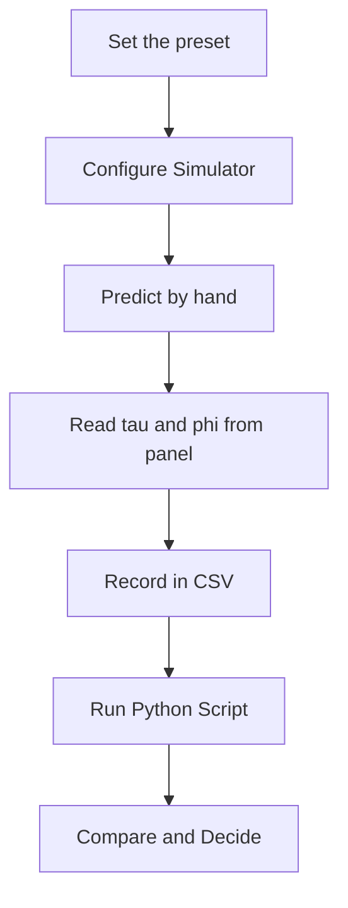

import MechanicsOfMaterialsComments from '../../../../components/mechanics-of-materials/MechanicsOfMaterialsComments.astro';
import TawkWidget from '../../../../components/TawkWidget.astro';
import UniversalContentContributors from '../../../../components/UniversalContentContributors.astro';
import InArticleAd from '../../../../components/InArticleAd.astro';
import Copyright from '../../../../components/Copyright.astro';
import BionicText from '../../../../components/BionicText.astro';
import TailwindWrapper from '../../../../components/TailwindWrapper.jsx';
import { Tabs, TabItem } from '@astrojs/starlight/components';
import { Card, CardGrid, Badge, Steps, LinkButton, FileTree } from '@astrojs/starlight/components';

<UniversalContentContributors 
  contributors={frontmatter.contributors}
/>


A shaft that survives the stress check can still fail by twisting too far: the driven mechanism goes out of phase, the coupling misaligns, or the indexing table overshoots its slot. Passing one check is not enough. These six experiments push you through both criteria on the simulator's real presets, so you finish knowing the formulas, the numbers, and which criterion actually controls the design in front of you. #ShaftTorsion #AngleOfTwist #ShaftDesign

:::tip[What you need]
The [Shaft Torsion Simulator](/product-development/shaft-torsion-simulator/), and Python 3 with NumPy and Matplotlib (`pip install numpy matplotlib`).
:::

:::note[Related resources]
The theory behind these experiments is in [Torsion of Circular Shafts](/education/mechanics-of-materials/fundamentals-of-shaft-torsion) and [Combined Bending and Torsion Loading](/education/mechanics-of-materials/combined-bending-torsion-loading). The full set of solid-mechanics tools is on the [Solid Mechanics Analyzer](/product-development/solid-mechanics-analyzer/) page.
:::

## Reference

| Term | Meaning |
|------|---------|
| **Torsional shear stress** | tau = T r / J; zero at the centre, maximum at the outer surface |
| **Polar second moment J** | J = pi d^4 / 32 for a solid shaft; J = pi (do^4 - di^4) / 32 for hollow |
| **Angle of twist phi** | phi = T L / (G J) in radians; governs precision and timing accuracy |
| **Twist per metre** | phi_deg / L_m; independent of shaft length for the same cross-section and torque |
| **Power and torque** | T = P / omega where omega = 2 pi n / 60 in rad/s |
| **Diameter sensitivity** | tau scales as 1/d^3; J scales as d^4; diameter is the most effective design variable |
| **k ratio** | k = di / do for a hollow shaft; the hollow J = (pi do^4 / 32)(1 - k^4) |
| **Safety factor** | SF = tau_allow / tau_max; less than 1 means the shaft has already yielded |

### Experiment Workflow



### Workspace Setup

<FileTree>
- shaft-torsion-experiments/
  - data/
  - plots/
  - scripts/
</FileTree>

:::tip[Instrument it]
A strain-gauge rosette bonded at 45 degrees to the shaft axis reads the principal strains produced by torsion; from those strains the shear stress and transmitted torque follow directly. An optical or magnetic encoder pair, one at each end of the shaft, measures the actual angle of twist in service. An [ESP32 or STM32](/education/sensor-actuator-interfacing-stm32/) sampling both sensors can stream torque and twist data to [siliconwit.io](https://siliconwit.io) and raise an alert before the twist budget is exceeded or the surface shear approaches the fatigue limit.
:::

---

## Experiment 1: Linear Shear Stress Distribution Across the Cross-Section

<InArticleAd />


Every torsion formula rests on one assumption: shear stress varies linearly from zero at the centre to a maximum at the outer surface. The centre carries no torque at all, which is exactly why removing it to make a hollow shaft wastes so little capacity. This experiment confirms that linear profile using the simulator's stress-distribution display and a brief Python check.

:::note[Objective]
Verify that tau = T r / J gives zero stress at r = 0 and peak stress tau_max = T ro / J at the outer surface, and that the intermediate radii fall exactly on the straight line between those two points.
:::

<Steps>
1. **Configure the simulator**
   Select the solid-steel preset (T = 200 N·m, do = 30 mm, di = 0, G = 79 GPa, tau_allow = 120 MPa). Read J and tau_max from the panel.

2. **Predict by hand**
   Compute J = pi (30)^4 / 32. Then compute tau at r = 5, 10, and 15 mm using tau = T r / J with T in N·mm. Confirm that tau scales exactly with r.

3. **Read the distribution diagram**
   On the cross-section diagram, verify that the stress is zero at the centre and peaks at the outer edge. Confirm the intermediate values match your hand calculations.

4. **Note what changes with a hollow shaft**
   Switch to the hollow-steel preset (do = 36, di = 26). The profile is still linear, but the zero-stress region from 0 to ri is physically absent. The material that was there contributed almost nothing to J.

5. **Save data**
   Create `data/exp1_distribution.csv` with columns: r_mm, tau_mpa, tau_fraction.
</Steps>

### Data Collection Table

| r (mm) | tau (MPa) hand | tau (MPa) simulator | tau / tau_max |
|---|---|---|---|
| 0 | | | |
| 5 | | | |
| 10 | | | |
| 15 (surface) | | | |

### Python Analysis

```python title="experiment_1_distribution.py"
# Shaft Torsion Experiment 1: linear shear stress distribution
import numpy as np
import matplotlib.pyplot as plt
import os

os.makedirs('plots', exist_ok=True)

# Solid-steel preset
T_Nm  = 200.0          # torque, N*m
T     = T_Nm * 1000    # N*mm
do    = 30.0           # outer diameter, mm
ro    = do / 2         # outer radius, mm

J = np.pi * do**4 / 32
print(f"J = pi * {do:.0f}^4 / 32 = {J:.2f} mm^4")

radii = np.array([0.0, 5.0, 10.0, 15.0])
for r in radii:
    tau = T * r / J
    print(f"r = {r:4.1f} mm: tau = {tau:.2f} MPa  (fraction of tau_max = {r/ro:.3f})")

tau_max = T * ro / J
print(f"tau_max (r = ro = {ro:.0f} mm) = {tau_max:.2f} MPa")

# Plot the linear profile
r_range = np.linspace(0, ro, 200)
tau_range = T * r_range / J
fig, ax = plt.subplots(figsize=(6, 5))
ax.plot(tau_range, r_range, color='#2A9D8F', lw=2, label='tau = T r / J')
ax.scatter(T * radii / J, radii, color='#E76F51', zorder=5, label='measured points')
ax.set_xlabel('shear stress tau (MPa)')
ax.set_ylabel('radial position r (mm)')
ax.set_title('Linear shear stress distribution (solid-steel preset)')
ax.grid(True, alpha=0.3)
ax.legend(fontsize=9)
plt.tight_layout()
plt.savefig('plots/exp1_distribution.png', dpi=150, bbox_inches='tight')
plt.show()
```

### Expected Results

J = pi * 30^4 / 32 = 79521.56 mm^4. The stresses are: r = 0 mm: tau = 0.00 MPa; r = 5 mm: tau = 12.58 MPa; r = 10 mm: tau = 25.15 MPa; r = 15 mm: tau = 37.73 MPa (tau_max). Each value is exactly one-third (or two-thirds) of tau_max, confirming the linear profile. The simulator's cross-section display should show the same gradient.

### Design Question

A designer proposes drilling out the central 10 mm of the 30 mm shaft (di = 10 mm) to lighten it. By how much does J change, and by how much does tau_max change? Is the strength penalty small enough to be worth the weight saving?

---

## Experiment 2: Angle of Twist Versus Shaft Length

<InArticleAd />


The formula phi = T L / (G J) says angle of twist is proportional to length: double the shaft and you double the angular deflection, for the same torque and cross-section. That matters in mechanism design because a shaft that twists too far throws off the timing of whatever is driven. This experiment sweeps length across the simulator's range to confirm the linear relationship and measure the twist per metre.

:::note[Objective]
Verify that phi grows linearly with L and that the twist per metre (phi / L) is constant for a given cross-section and torque, then use that constant to predict whether a specific shaft length meets a precision budget.
:::

<Steps>
1. **Configure the simulator**
   Select the solid-steel preset (T = 200 N·m, do = 30 mm, G = 79 GPa). Set L = 100 mm and record phi_deg and twist per metre from the panel.

2. **Predict**
   Compute phi = T L / (G J) for L = 100, 200, 300, 400, 500 mm with T in N·mm and G in MPa. Predict that all five twist-per-metre values are identical.

3. **Sweep the length**
   Step L through 100, 200, 300, 400, 500 mm. At each step record phi_deg and the simulator's twist-per-metre readout.

4. **Check linearity**
   Plot phi_deg versus L. Confirm it is a straight line through the origin.

5. **Save data**
   Create `data/exp2_twist_vs_length.csv` with columns: L_mm, phi_rad, phi_deg, twist_per_m.
</Steps>

### Data Collection Table

| L (mm) | phi (rad) predicted | phi (deg) predicted | phi (deg) simulator | twist/m (deg/m) |
|---|---|---|---|---|
| 100 | | | | |
| 200 | | | | |
| 300 | | | | |
| 400 | | | | |
| 500 | | | | |

### Python Analysis

```python title="experiment_2_twist_vs_length.py"
# Shaft Torsion Experiment 2: angle of twist vs shaft length
import numpy as np
import matplotlib.pyplot as plt
import os

os.makedirs('plots', exist_ok=True)

# Solid-steel preset
T   = 200.0 * 1000   # N*mm
do  = 30.0           # mm
G   = 79.0 * 1000    # MPa  (79 GPa = 79000 MPa)
J   = np.pi * do**4 / 32

lengths_mm = np.array([100.0, 200.0, 300.0, 400.0, 500.0])

print(f"J = {J:.2f} mm^4,  G = {G:.0f} MPa")
print(f"{'L (mm)':>8}  {'phi (rad)':>12}  {'phi (deg)':>10}  {'twist/m (deg/m)':>16}")
for L in lengths_mm:
    phi_rad = T * L / (G * J)
    phi_deg = np.degrees(phi_rad)
    tpm     = phi_deg / (L / 1000.0)
    print(f"{L:8.0f}  {phi_rad:12.6f}  {phi_deg:10.4f}  {tpm:16.4f}")

# Twist per metre is constant
tpm_const = np.degrees(T / (G * J)) * 1000
print(f"\ntwist per metre (constant) = {tpm_const:.4f} deg/m")

fig, ax = plt.subplots(figsize=(7, 5))
phi_plot = np.degrees(T * lengths_mm / (G * J))
ax.plot(lengths_mm, phi_plot, color='#2A9D8F', lw=2, marker='o', label='phi = TL / (GJ)')
ax.set_xlabel('shaft length L (mm)')
ax.set_ylabel('angle of twist phi (deg)')
ax.set_title('Angle of twist grows linearly with shaft length')
ax.grid(True, alpha=0.3)
ax.legend(fontsize=9)
plt.tight_layout()
plt.savefig('plots/exp2_twist_vs_length.png', dpi=150, bbox_inches='tight')
plt.show()
```

### Expected Results

J = 79521.56 mm^4. The five phi values are 0.1824, 0.3648, 0.5472, 0.7296, and 0.9120 degrees for L = 100 through 500 mm. The twist per metre is 1.8241 deg/m in every row, confirming it is a property of the cross-section and torque only, not of the length. The plot is a straight line through the origin with slope 1.8241/1000 deg/mm.

### Design Question

A Geneva indexing mechanism requires that the drive crankshaft twists no more than 0.5 degrees. The shaft is solid steel with do = 30 mm carrying T = 200 N·m. What is the maximum allowable shaft length, and how does that compare with the 500 mm length of the solid-steel preset?

---

## Experiment 3: Sizing a Shaft from a Motor Power Rating

<InArticleAd />


Motors and gearboxes are specified by power and speed on their nameplates, not by torque. The first step in every motor-driven shaft design is converting that nameplate data into a torque, and then applying the torsion formula to find the minimum diameter. This experiment walks through that chain and confirms the result against the precision-shaft preset.

:::note[Objective]
Convert a motor's rated power and speed to torque using T = P / omega, find the minimum shaft diameter for a given allowable shear stress, and verify the result against the precision-shaft preset (T = 80 N·m, do = 25 mm, tau_allow = 90 MPa).
:::

<Steps>
1. **Convert power to torque**
   A motor rated at 8 kW runs at 960 rpm. Compute omega = 2 pi n / 60 and T = P / omega. Compare the result with the precision-shaft preset torque of 80 N·m.

2. **Find the minimum diameter**
   From tau = 16 T / (pi d^3) (the compact form for a solid shaft), rearrange to d_min = (16 T / (pi tau_allow))^(1/3) with tau_allow = 90 MPa and T in N·mm.

3. **Configure the simulator**
   Open the precision-shaft preset (T = 80, L = 400, do = 25, G = 79, allow = 90). Read tau_max and phi from the panel and confirm they match the script output.

4. **Explore alternatives**
   In the simulator, reduce do to the minimum computed diameter (18 mm rounded up from d_min = 16.5 mm) and observe how tau_max changes. Note the safety factor at 18 mm versus 25 mm.

5. **Save data**
   Create `data/exp3_power_sizing.csv` with columns: P_W, n_rpm, omega_rads, T_Nm, d_min_mm, d_chosen_mm, tau_mpa, SF.
</Steps>

### Data Collection Table

| P (kW) | n (rpm) | omega (rad/s) | T (N·m) | d_min (mm) | d chosen (mm) | tau (MPa) | SF |
|---|---|---|---|---|---|---|---|
| 8 | 960 | | | | 18 | | |
| 8 | 960 | | | | 25 (preset) | | |

### Python Analysis

```python title="experiment_3_power_sizing.py"
# Shaft Torsion Experiment 3: power to torque, minimum diameter
import numpy as np

P     = 8000.0    # motor power, W
n_rpm = 960.0     # rotational speed, rpm
tau_allow = 90.0  # allowable shear stress, MPa  (precision-shaft preset)

omega = 2 * np.pi * n_rpm / 60          # rad/s
T_Nm  = P / omega                        # torque, N*m
T     = T_Nm * 1000                      # N*mm  (the simulator works in N*mm internally)

print(f"omega = 2 pi * {n_rpm:.0f} / 60 = {omega:.4f} rad/s")
print(f"T = P / omega = {P:.0f} / {omega:.4f} = {T_Nm:.4f} N*m  (preset uses 80 N*m)")

# Minimum diameter from tau = 16T / (pi d^3)
d_min = (16 * T / (np.pi * tau_allow)) ** (1 / 3)
print(f"\nd_min = (16 T / (pi tau_allow))^(1/3) = {d_min:.4f} mm  => round up to 18 mm")

# Check d = 18 mm
for d_try in [18.0, 25.0]:
    J_try    = np.pi * d_try**4 / 32
    tau_try  = T * (d_try / 2) / J_try
    SF_try   = tau_allow / tau_try
    print(f"\nd = {d_try:.0f} mm: J = {J_try:.4f} mm^4, tau = {tau_try:.4f} MPa, SF = {SF_try:.4f}")

# Precision-shaft preset verification (T = 80 N*m exactly)
print("\n--- precision-shaft preset (T = 80 N*m, do = 25 mm, L = 400 mm) ---")
T_prec = 80.0 * 1000   # N*mm
do_prec = 25.0
J_prec  = np.pi * do_prec**4 / 32
tau_prec = T_prec * (do_prec / 2) / J_prec
phi_prec = T_prec * 400 / (79000 * J_prec)
print(f"J = {J_prec:.4f} mm^4")
print(f"tau_max = {tau_prec:.4f} MPa  (allow = 90 MPa, SF = {tau_allow / tau_prec:.4f})")
print(f"phi = {phi_prec:.6f} rad = {np.degrees(phi_prec):.4f} deg over 400 mm")
```

### Expected Results

omega = 100.5310 rad/s; T = 79.5775 N·m (the simulator preset rounds this to 80 N·m). d_min = 16.5135 mm; the next standard size up is 18 mm. At d = 18 mm: J = 10305.99 mm^4, tau = 69.49 MPa, SF = 1.30. At d = 25 mm (precision preset): tau = 26.08 MPa, SF = 3.45, phi = 0.6052 degrees over 400 mm. Increasing the diameter from the minimum to the preset value raises the safety factor from 1.30 to 3.45 and cuts tau by 63 percent, because stress scales as 1/d^3.

### Design Question

A second motor runs at 1440 rpm but still delivers 8 kW. Does the higher speed change the minimum shaft diameter, and by how much? Explain the result using T = P / omega without doing any new stress calculation.

---

## Experiment 4: Hollow Versus Solid Shaft for the Same Torque

<InArticleAd />


Most of the torsional stiffness in a circular shaft comes from material near the outer surface, because J weights each area element by r^2. The material at the centre contributes almost nothing to J but adds its full weight. Replacing a solid shaft with a hollow one of the same outer diameter removes that low-contribution core and saves a large fraction of the cross-sectional area. This experiment quantifies that saving using the solid-steel and hollow-steel presets.

:::note[Objective]
Compare the polar moment J, peak shear stress, and cross-sectional area for the solid-steel and hollow-steel presets carrying the same torque T = 200 N·m, and express the area saving as a percentage.
:::

<Steps>
1. **Configure the solid-steel preset**
   Open the solid-steel preset (T = 200, L = 500, do = 30, di = 0, G = 79, allow = 120). Record J, tau_max, and the cross-sectional area (A = pi do^2 / 4).

2. **Switch to the hollow-steel preset**
   Open the hollow-steel preset (do = 36, di = 26). Record J, tau_max, and A = pi (do^2 - di^2) / 4.

3. **Compute k and 1 - k^4**
   k = di / do = 26 / 36. The hollow J = (pi do^4 / 32)(1 - k^4). Verify this equals the J the simulator reports.

4. **Compare**
   Both carry T = 200 N·m. The hollow shaft has a larger outer diameter but a lower peak stress and much less cross-sectional area. Quantify the area saving relative to the solid shaft.

5. **Save data**
   Create `data/exp4_hollow_vs_solid.csv` with columns: type, do_mm, di_mm, J_mm4, tau_mpa, A_mm2.
</Steps>

### Data Collection Table

| Section | do (mm) | di (mm) | J (mm^4) | tau_max (MPa) | A (mm^2) | Area saving vs solid-steel |
|---|---|---|---|---|---|---|
| solid-steel | 30 | 0 | | | | baseline |
| hollow-steel | 36 | 26 | | | | |

### Python Analysis

```python title="experiment_4_hollow_vs_solid.py"
# Shaft Torsion Experiment 4: hollow vs solid for the same torque
import numpy as np
import matplotlib.pyplot as plt
import os

os.makedirs('plots', exist_ok=True)

T = 200.0 * 1000   # N*mm  (same torque for both presets)

# Solid-steel preset: do=30, di=0
do_s = 30.0
J_s  = np.pi * do_s**4 / 32
tau_s = T * (do_s / 2) / J_s
A_s  = np.pi * do_s**2 / 4

# Hollow-steel preset: do=36, di=26
do_h = 36.0
di_h = 26.0
k    = di_h / do_h
J_h  = np.pi * (do_h**4 - di_h**4) / 32
tau_h = T * (do_h / 2) / J_h
A_h  = np.pi * (do_h**2 - di_h**2) / 4

print(f"k = di/do = {di_h:.0f}/{do_h:.0f} = {k:.6f}")
print(f"1 - k^4 = {1 - k**4:.6f}")
print()
print(f"Solid  (do={do_s:.0f} mm):  J = {J_s:.2f} mm^4,  tau = {tau_s:.4f} MPa,  A = {A_s:.2f} mm^2")
print(f"Hollow (do={do_h:.0f}, di={di_h:.0f} mm):  J = {J_h:.2f} mm^4,  tau = {tau_h:.4f} MPa,  A = {A_h:.2f} mm^2")

area_saving = (A_s - A_h) / A_s * 100
print(f"\nArea saving (hollow vs solid-steel): {area_saving:.2f}%")
print(f"Hollow J / Solid J = {J_h / J_s:.4f}  (hollow is stiffer despite lighter)")
print(f"Hollow tau / Solid tau = {tau_h / tau_s:.4f}  (hollow has lower surface stress)")

# Bar chart
labels = ['Solid (d=30)', 'Hollow (do=36/di=26)']
fig, axes = plt.subplots(1, 3, figsize=(12, 5))
for ax, values, ylabel in zip(
    axes,
    [[J_s, J_h], [tau_s, tau_h], [A_s, A_h]],
    ['J (mm^4)', 'tau_max (MPa)', 'Area (mm^2)']
):
    ax.bar(labels, values, color=['#2A9D8F', '#E76F51'])
    ax.set_ylabel(ylabel)
    ax.grid(True, axis='y', alpha=0.3)
plt.suptitle('Hollow vs solid shaft: same torque T = 200 N*m')
plt.tight_layout()
plt.savefig('plots/exp4_hollow_vs_solid.png', dpi=150, bbox_inches='tight')
plt.show()
```

### Expected Results

Solid (do = 30): J = 79521.56 mm^4, tau = 37.73 MPa, A = 706.86 mm^2. Hollow (do = 36, di = 26): J = 120032.40 mm^4, tau = 29.99 MPa, A = 486.95 mm^2. k = 0.7222, 1 - k^4 = 0.7279. The area saving is 31.11 percent. The hollow shaft is simultaneously lighter (31 percent less area), stiffer in torsion (J is 51 percent larger), and carries a lower peak stress, because the larger outer diameter adds more to J than it adds to the stress numerator.

### Design Question

The hollow shaft has di = 26 mm. If di were increased to 30 mm (keeping do = 36 mm), by what fraction would J decrease? Use the 1 - k^4 factor to argue whether removing the last few millimetres of the core is still worth the wall-thickness reduction in manufacturing terms.

---

## Experiment 5: Diameter Sensitivity of Stress and Stiffness

<InArticleAd />


Diameter is the single most powerful variable in shaft design because stress scales as 1/d^3 and J scales as d^4. Increasing the diameter by 10 percent cuts the shear stress by 25 percent and raises the stiffness by 46 percent. This experiment maps those sensitivities across a diameter sweep on the solid-steel torque (T = 200 N·m) so the scaling relationships become concrete numbers rather than exponents.

:::note[Objective]
Sweep the shaft diameter from 20 mm to 40 mm at T = 200 N·m and confirm that tau scales as (d_ref / d)^3 and J scales as (d / d_ref)^4, using d_ref = 30 mm (the solid-steel preset) as the reference.
:::

<Steps>
1. **Configure the simulator**
   Select the solid-steel preset (T = 200, G = 79, allow = 120). Set L = 500 mm and vary only do.

2. **Sweep the diameter**
   Set do to 20, 25, 30, 35, and 40 mm in turn. At each step record J and tau_max from the panel.

3. **Compute ratios**
   For each diameter, compute tau / tau_ref and compare with (30 / d)^3, and compute J / J_ref and compare with (d / 30)^4.

4. **Note the asymmetry**
   Reducing d by 10 mm raises tau much more than increasing d by 10 mm lowers it. Sketch the reason from the 1/d^3 shape.

5. **Save data**
   Create `data/exp5_diameter_sensitivity.csv` with columns: d_mm, J_mm4, tau_mpa, tau_ratio, J_ratio.
</Steps>

### Data Collection Table

| d (mm) | J (mm^4) | tau (MPa) | tau / tau_ref | (30/d)^3 | J / J_ref | (d/30)^4 |
|---|---|---|---|---|---|---|
| 20 | | | | | | |
| 25 | | | | | | |
| 30 (ref) | | | 1.000 | 1.000 | 1.000 | 1.000 |
| 35 | | | | | | |
| 40 | | | | | | |

### Python Analysis

```python title="experiment_5_diameter_sensitivity.py"
# Shaft Torsion Experiment 5: diameter sensitivity of stress and stiffness
import numpy as np
import matplotlib.pyplot as plt
import os

os.makedirs('plots', exist_ok=True)

T     = 200.0 * 1000   # N*mm  (solid-steel preset torque)
d_ref = 30.0           # mm    (solid-steel preset diameter)
J_ref = np.pi * d_ref**4 / 32
tau_ref = 16 * T / (np.pi * d_ref**3)

diameters = np.array([20.0, 25.0, 30.0, 35.0, 40.0])

print(f"Reference: d_ref = {d_ref:.0f} mm, J_ref = {J_ref:.2f} mm^4, tau_ref = {tau_ref:.4f} MPa")
print()
print(f"{'d (mm)':>8}  {'J (mm^4)':>12}  {'tau (MPa)':>10}  {'tau_ratio':>10}  {'(30/d)^3':>10}  {'J_ratio':>8}  {'(d/30)^4':>9}")
for d in diameters:
    J    = np.pi * d**4 / 32
    tau  = 16 * T / (np.pi * d**3)
    t_r  = tau / tau_ref
    j_r  = J / J_ref
    t_th = (d_ref / d)**3
    j_th = (d / d_ref)**4
    print(f"{d:8.0f}  {J:12.2f}  {tau:10.4f}  {t_r:10.4f}  {t_th:10.4f}  {j_r:8.4f}  {j_th:9.4f}")

# Plot stress and J vs diameter
d_cont = np.linspace(15, 45, 200)
tau_cont = 16 * T / (np.pi * d_cont**3)
J_cont   = np.pi * d_cont**4 / 32

fig, (ax1, ax2) = plt.subplots(1, 2, figsize=(12, 5))
ax1.plot(d_cont, tau_cont, color='#E76F51', lw=2)
ax1.scatter(diameters, 16 * T / (np.pi * diameters**3), color='#264653', zorder=5)
ax1.axhline(120, color='gray', ls='--', lw=1, label='tau_allow = 120 MPa')
ax1.set_xlabel('diameter d (mm)')
ax1.set_ylabel('tau_max (MPa)')
ax1.set_title('Stress scales as 1/d^3')
ax1.grid(True, alpha=0.3)
ax1.legend(fontsize=9)

ax2.plot(d_cont, np.pi * d_cont**4 / 32, color='#2A9D8F', lw=2)
ax2.scatter(diameters, np.pi * diameters**4 / 32, color='#264653', zorder=5)
ax2.set_xlabel('diameter d (mm)')
ax2.set_ylabel('J (mm^4)')
ax2.set_title('Stiffness J scales as d^4')
ax2.grid(True, alpha=0.3)
plt.tight_layout()
plt.savefig('plots/exp5_diameter_sensitivity.png', dpi=150, bbox_inches='tight')
plt.show()
```

### Expected Results

At d = 30 mm (reference): J = 79521.56 mm^4, tau = 37.73 MPa. The full table:

| d (mm) | J (mm^4) | tau (MPa) | tau_ratio | (30/d)^3 | J_ratio | (d/30)^4 |
|---|---|---|---|---|---|---|
| 20 | 15707.96 | 127.32 | 3.3750 | 3.3750 | 0.1975 | 0.1975 |
| 25 | 38349.52 | 65.19 | 1.7280 | 1.7280 | 0.4823 | 0.4823 |
| 30 | 79521.56 | 37.73 | 1.0000 | 1.0000 | 1.0000 | 1.0000 |
| 35 | 147323.51 | 23.76 | 0.6297 | 0.6297 | 1.8526 | 1.8526 |
| 40 | 251327.41 | 15.92 | 0.4219 | 0.4219 | 3.1605 | 3.1605 |

The computed ratios match the theoretical (30/d)^3 and (d/30)^4 columns exactly, confirming the power-law scaling. At d = 20 mm the stress of 127.32 MPa exceeds the 120 MPa allowable, showing that the solid-steel preset needs at least 21 mm to satisfy the stress criterion.

### Design Question

You need to reduce the shaft mass by 30 percent without exceeding tau_allow = 120 MPa. Mass is proportional to d^2 (for a fixed length). What is the target diameter, and does the stress check pass at that diameter for T = 200 N·m?

---

## Experiment 6: Strength Versus Stiffness, Which Criterion Governs?

<InArticleAd />


A shaft that passes the shear-stress check can still fail its design requirements if it winds up past the precision budget of the mechanism it drives. This experiment compares the precision-shaft preset (steel, small diameter) with the aluminium-shaft preset (aluminium, larger diameter) against both a stress criterion and a twist-per-metre budget. Both presets have comfortable stress margins, yet both exceed a 1.5 deg/m stiffness budget, each for a different reason.

:::note[Objective]
For the precision-shaft and aluminium-shaft presets, check the stress safety factor and the twist per metre against a budget of 1.5 deg/m. Identify which criterion governs each shaft, and compute the minimum diameter that would satisfy the stiffness budget without violating the stress criterion.
:::

<Steps>
1. **Configure the precision-shaft preset**
   Open the precision-shaft preset (T = 80, L = 400, do = 25, G = 79, allow = 90). Record tau_max, SF, phi_deg, and twist per metre.

2. **Configure the aluminium-shaft preset**
   Open the aluminium-shaft preset (T = 120, L = 600, do = 35, G = 26, allow = 70). Record the same quantities.

3. **Apply the criteria**
   For each preset, check: (a) is tau_max less than tau_allow? (b) is twist per metre less than 1.5 deg/m? Record which criterion governs.

4. **Find the stiffness-limited diameter**
   For each preset, rearrange phi_per_m = T * 180 / (pi * G_mpa * J * 1e-3) to find J_req and then d_req that meets exactly 1.5 deg/m.

5. **Save data**
   Create `data/exp6_strength_vs_stiffness.csv` with columns: preset, tau_mpa, SF, twist_per_m, stress_criterion, stiffness_criterion, governing, d_req_stiffness_mm.
</Steps>

### Data Collection Table

| Preset | tau (MPa) | tau_allow (MPa) | SF | twist/m (deg/m) | Budget (deg/m) | Stress | Stiffness | Governs |
|---|---|---|---|---|---|---|---|---|
| precision-shaft | | 90 | | | 1.5 | | | |
| aluminium-shaft | | 70 | | | 1.5 | | | |

### Python Analysis

```python title="experiment_6_strength_vs_stiffness.py"
# Shaft Torsion Experiment 6: strength vs stiffness, which criterion governs?
import numpy as np
import matplotlib.pyplot as plt
import os

os.makedirs('plots', exist_ok=True)

presets = [
    # name,               T (N*m), L (mm), do (mm), G (GPa), allow (MPa)
    ('precision-shaft',   80,      400,    25,      79,      90),
    ('aluminium-shaft',  120,      600,    35,      26,      70),
]

twist_budget = 1.5   # deg/m

print(f"{'Preset':20s}  {'tau (MPa)':>10}  {'SF':>6}  {'twist/m':>9}  {'stress':>8}  {'stiffness':>10}  {'governs':>12}")
results = []
for name, T_Nm, L_mm, do_mm, G_gpa, allow_mpa in presets:
    T_nmm = T_Nm * 1000
    G_mpa = G_gpa * 1000
    J     = np.pi * do_mm**4 / 32
    tau   = T_nmm * (do_mm / 2) / J
    SF    = allow_mpa / tau
    phi_pm = T_nmm * 1000 * 180 / (np.pi * G_mpa * J)   # deg/m
    phi_total = np.degrees(T_nmm * L_mm / (G_mpa * J))

    stress_ok  = tau < allow_mpa
    stiff_ok   = phi_pm < twist_budget

    if not stress_ok:
        governs = 'strength'
    elif not stiff_ok:
        governs = 'stiffness'
    else:
        governs = 'both pass'

    # Minimum diameter to meet stiffness budget (stress will be more than met)
    J_req = T_nmm * 1000 * 180 / (np.pi * G_mpa * twist_budget)
    d_req = (32 * J_req / np.pi) ** 0.25

    print(f"{name:20s}  {tau:10.4f}  {SF:6.4f}  {phi_pm:9.4f}  {'pass' if stress_ok else 'FAIL':>8}  {'pass' if stiff_ok else 'FAIL':>10}  {governs:>12}")
    print(f"  phi_total = {phi_total:.4f} deg over {L_mm} mm")
    print(f"  d_req for {twist_budget} deg/m budget: {d_req:.4f} mm")
    results.append((name, tau, SF, phi_pm, governs, d_req))

# Summary plot
fig, (ax1, ax2) = plt.subplots(1, 2, figsize=(12, 5))
names = [r[0] for r in results]
taus  = [r[1] for r in results]
allows = [90, 70]
twists = [r[3] for r in results]

x = np.arange(len(names))
w = 0.4
ax1.bar(x - w/2, taus,   w, color='#2A9D8F', label='tau_max (MPa)')
ax1.bar(x + w/2, allows, w, color='#E76F51', label='tau_allow (MPa)')
ax1.set_xticks(x); ax1.set_xticklabels(names, fontsize=9)
ax1.set_ylabel('stress (MPa)')
ax1.set_title('Stress check: both pass comfortably')
ax1.legend(fontsize=9); ax1.grid(True, axis='y', alpha=0.3)

ax2.bar(x, twists, color='#2A9D8F', label='twist/m (deg/m)')
ax2.axhline(twist_budget, color='#E76F51', ls='--', lw=2, label=f'budget = {twist_budget} deg/m')
ax2.set_xticks(x); ax2.set_xticklabels(names, fontsize=9)
ax2.set_ylabel('twist per metre (deg/m)')
ax2.set_title('Stiffness check: both exceed the 1.5 deg/m budget')
ax2.legend(fontsize=9); ax2.grid(True, axis='y', alpha=0.3)

plt.tight_layout()
plt.savefig('plots/exp6_strength_vs_stiffness.png', dpi=150, bbox_inches='tight')
plt.show()
```

### Expected Results

Precision-shaft: tau = 26.08 MPa (SF = 3.45 against 90 MPa, stress passes), twist/m = 1.5130 deg/m (exceeds 1.5 deg/m budget, stiffness governs). Minimum diameter to meet the 1.5 deg/m budget: 25.05 mm, barely above the current 25 mm. Aluminium-shaft: tau = 14.25 MPa (SF = 4.91 against 70 MPa, stress passes comfortably), twist/m = 1.7950 deg/m (exceeds budget, stiffness governs). Minimum diameter to meet the budget: 36.6 mm. The aluminium shaft fails the stiffness budget not because of its size or torque but because its shear modulus (G = 26 GPa) is only one-third that of steel. A 35 mm aluminium shaft twists more than a 25 mm steel shaft carrying 50 percent more torque over 50 percent more length, purely because of the material difference.

### Design Question

The aluminium shaft is 40 percent lighter per unit volume than steel. If you must meet the 1.5 deg/m stiffness budget with the same torque and length, compare the cross-sectional areas of the minimum steel shaft (d_req from the precision calculation, G = 79 GPa, T = 80 N·m) and the minimum aluminium shaft (G = 26 GPa, T = 120 N·m). Which material actually gives the lighter shaft once the stiffness requirement is enforced?

---

## What You Built

<InArticleAd />


Across the six experiments you confirmed the linear stress distribution that makes hollow shafts efficient, measured the constant twist per metre that governs timing accuracy, sized a shaft from a motor nameplate, quantified the material saving of a hollow section, mapped the power-law scaling of stress and stiffness with diameter, and found that stiffness, not strength, governs both the steel and aluminium presets against a realistic precision budget. Those six ideas cover the full decision chain in shaft design. Carry them into [Torsion of Circular Shafts](/education/mechanics-of-materials/fundamentals-of-shaft-torsion) for the theory and worked examples, and into [Combined Bending and Torsion Loading](/education/mechanics-of-materials/combined-bending-torsion-loading) where the torsional shear from these experiments combines with a bending stress and demands a Mohr's circle or von Mises check.


<InArticleAd />
<MechanicsOfMaterialsComments />
<TawkWidget />
<Copyright />
