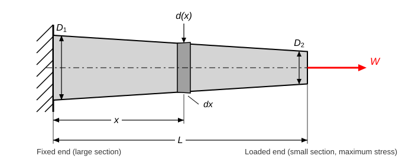
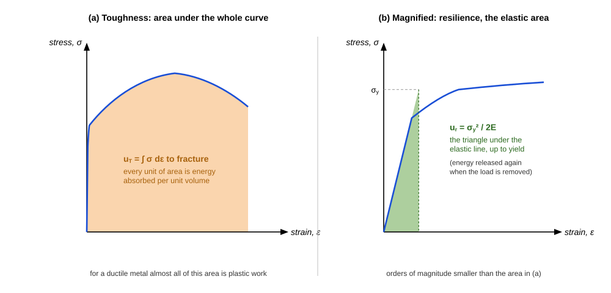

import MechanicsOfMaterialsComments from '../../../../components/mechanics-of-materials/MechanicsOfMaterialsComments.astro';
import TawkWidget from '../../../../components/TawkWidget.astro';
import UniversalContentContributors from '../../../../components/UniversalContentContributors.astro';
import InArticleAd from '../../../../components/InArticleAd.astro';
import Copyright from '../../../../components/Copyright.astro';
import BionicText from '../../../../components/BionicText.astro';
import TailwindWrapper from '../../../../components/TailwindWrapper.jsx';
import { Tabs, TabItem } from '@astrojs/starlight/components';
import { Card, CardGrid, Badge, Steps, LinkButton, FileTree } from '@astrojs/starlight/components';

<UniversalContentContributors 
  contributors={frontmatter.contributors}
/>

A CNC actuator shaft that stretches even a few micrometres under load throws off positioning accuracy, and choosing a material by cost alone risks either over-designing (heavy, expensive) or under-designing (flexible, imprecise). Selecting the right material requires comparing elastic modulus, yield strength, and elongation at failure across candidates, then computing the actual deformation under your expected loads. In this lesson you will perform that analysis on a CNC actuator shaft, extend it to members whose cross-section varies along the length (tapered pull-rods, tapered tie plates, stepped bars, bars under their own weight), read a steel tensile test curve to extract yield strength, toughness, and ductility, and compute shear deflection in a bonded elastomer mount. #AxialStress #MaterialSelection #TaperedBars #CNCDesign

## Learning Objectives

By the end of this lesson, you will be able to:

1. **Analyze** axial stress and strain in a precision actuator shaft and select between steel and aluminum based on strength and stiffness criteria
2. **Derive and apply** the extension of bars whose section varies along the length (circular tapers, flat tapers, stepped bars) and of bars loaded by their own weight, starting from $\delta = \int N\,dx/(AE)$
3. **Interpret** a tensile test stress-strain curve to identify proportional limit, 0.2% offset yield strength, UTS, fracture strain, modulus of resilience, and modulus of toughness
4. **Apply** the shear modulus relation $G = E / (2(1+\nu))$ to calculate shear stress, shear strain, and lateral deflection in an elastomer component

:::tip[Try it as you read]
This lesson pairs with the [Axial Loading Simulator](/product-development/axial-loading-simulator/): compare two materials side by side under the same axial load and watch how the stiffness, not the strength, sets the deflection. The [Axial Loading Experiments](/education/mechanics-of-materials/axial-loading-experiments) reproduce the worked examples below step by step with Python.
:::

## Real-World System Problem: CNC Z-Axis Actuator Shaft

<InArticleAd />

In a CNC machine the Z-axis actuator controls vertical tool movement. The shaft must transmit precise forces while maintaining dimensional accuracy under varying loads. A shaft that deflects too far under the cutting force moves the tool out of the programmed path, producing scrap.

### The Shaft Selection Problem

> **Engineering Question:** How do you select the right material and shaft diameter to ensure the CNC system maintains a deformation limit of 0.05 mm under a maximum axial load of 5,000 N?

Answering that requires two independent checks: a strength check (the stress must stay below the allowable strength) and a stiffness check (the elongation must stay within the positional tolerance). Either check can set the minimum diameter, and in precision systems the stiffness check almost always wins.

### Why Material Selection Matters

<CardGrid>
  <Card title="Stiffness governs precision" icon="warning">
  In positioning systems, the deformation limit is often tighter than the strength limit. A shaft sized purely for strength may deflect several times more than the tolerance allows.
  </Card>
  <Card title="Modulus sets deflection" icon="setting">
  Steel ($E = 200$ GPa) is about 2.9 times stiffer than aluminum ($E = 70$ GPa). For the same diameter and load, the steel shaft deflects less than a third as much.
  </Card>
  <Card title="Section size follows from E" icon="puzzle">
  Because $\delta = FL/(AE)$, a stiffer material needs a smaller area for the same deflection, which keeps the shaft compact.
  </Card>
  <Card title="Mass can be nearly equal" icon="rocket">
  Steel is about 2.9 times denser than aluminum, but steel's higher E lets it use a smaller cross-section, so the final shaft masses can end up similar.
  </Card>
</CardGrid>

## Fundamental Theory: Strain, Hooke's Law, and the Stress-Strain Curve

<InArticleAd />

The previous lesson defined stress. Here we build the quantities needed to predict deformation and to read a material test curve.

### Axial Strain and Deformation

<Card title="Axial Strain and Deflection" icon="document">
$$\epsilon = \frac{\delta}{L_0}, \qquad \delta = \frac{F L_0}{A E}$$

Where:
- $\epsilon$ = axial strain (dimensionless)
- $\delta$ = change in length (mm or m)
- $L_0$ = original length
- $F$ = axial force (N)
- $A$ = cross-sectional area (mm² or m²)
- $E$ = Young's modulus (GPa)

The second form is the most-used relation in this lesson: it links a known load and geometry to the actual elongation.
</Card>

### Bars of Varying Cross-Section

$\delta = FL/(AE)$ is only valid when $F$, $A$, and $E$ are the same at every section. Real members often are not uniform: a pull-rod is machined with a taper so that material is only where the stress needs it, a tie plate narrows towards the pin, a shaft is stepped for bearing seats, and a long hanging bar carries its own weight. For all of these the load or the area (or both) is a function of position, so the extension has to be built up from an element rather than read off a single formula.

<Card title="The General Rule for Any Non-Uniform Bar" icon="document">
Take a slice of thickness $dx$ at distance $x$ from the fixed end. The slice is short enough that the internal force $N(x)$ and area $A(x)$ are constant across it, so the uniform-bar result applies to the slice alone:

$$d\delta = \frac{N(x)\,dx}{A(x)\,E}$$

The total extension is the sum of all the slice extensions:

$$\boxed{\;\delta = \int_0^L \frac{N(x)\,dx}{A(x)\,E}\;}$$

Every result in this section, and every taper, step, or self-weight problem you will meet, comes from this one integral. The uniform bar is just the special case where $N$ and $A$ come out of the integral: $\delta = NL/(AE)$.
</Card>

:::note[The four-step recipe]
Work every varying-section problem the same way, and you never have to memorise the individual results:

1. **Write $A(x)$** — the geometry, as a function of distance from one end (linear taper of a diameter, linear taper of a width, etc.)
2. **Write $N(x)$** — the internal force. For an end-loaded bar it is simply the applied load $W$ everywhere; for self-weight it is the weight of the material below the cut.
3. **Integrate** $N(x)\,dx / (A(x)E)$ from $0$ to $L$.
4. **Locate the maximum stress separately** — it is at the *smallest area*, and it needs no integration at all: $\sigma_{max} = N/A_{min}$.
:::

#### Case A: Circular Bar Tapering Linearly (the standard case)

A bar of circular section tapers uniformly from diameter $D_1$ at the fixed end to $D_2$ at the loaded end over a length $L$, carrying an axial load $W$.

<Steps>

1. **Geometry.** The diameter falls off linearly with $x$:

   $$d(x) = D_1 - \frac{(D_1 - D_2)}{L}x = D_1 - kx, \qquad k = \frac{D_1 - D_2}{L}$$

   so the area at any section is $A(x) = \dfrac{\pi}{4}\left(D_1 - kx\right)^2$.

2. **Internal force.** The bar is loaded only at its end, so $N(x) = W$ at every section.

3. **Substitute into the general rule:**

   $$\delta = \int_0^L \frac{W\,dx}{\frac{\pi}{4}(D_1 - kx)^2 E} = \frac{4W}{\pi E}\int_0^L \frac{dx}{(D_1 - kx)^2}$$

4. **Do the integral.** Since $\dfrac{d}{dx}\left[\dfrac{1}{k(D_1-kx)}\right] = \dfrac{1}{(D_1-kx)^2}$:

   $$\delta = \frac{4W}{\pi E}\left[\frac{1}{k(D_1 - kx)}\right]_0^L = \frac{4W}{\pi E k}\left(\frac{1}{D_2} - \frac{1}{D_1}\right)$$

5. **Back-substitute** $k = (D_1 - D_2)/L$ and combine the fractions, $\dfrac{1}{D_2}-\dfrac{1}{D_1} = \dfrac{D_1 - D_2}{D_1 D_2}$:

   $$\delta = \frac{4WL}{\pi E (D_1 - D_2)} \cdot \frac{D_1 - D_2}{D_1 D_2}$$

   The taper difference cancels, leaving the standard result:

   $$\boxed{\;\delta = \frac{4WL}{\pi E D_1 D_2}\;}$$

</Steps>

<Card title="What the Tapered-Bar Result Tells You" icon="document">
- **Extension:** $\delta = \dfrac{4WL}{\pi E D_1 D_2}$ — symmetric in $D_1$ and $D_2$, so which end is fixed makes no difference to the total extension.
- **Maximum stress** is at the *small* end, where the area is least: $\sigma_{max} = \dfrac{4W}{\pi D_2^{\,2}}$
- **Stress at any section** uses the local diameter: $\sigma(x) = \dfrac{4W}{\pi d(x)^2}$. At mid-length the diameter is the *arithmetic* mean, $d_{mid} = \dfrac{D_1 + D_2}{2}$, giving $\sigma_{mid} = \dfrac{16W}{\pi (D_1+D_2)^2}$.
- **Equivalent uniform bar:** setting $\delta = WL/(A_{eq}E)$ gives $d_{eq} = \sqrt{D_1 D_2}$, the *geometric* mean of the end diameters. A uniform bar of that diameter stretches exactly as much as the taper.
- **Cost of tapering:** compared with a uniform bar of the large diameter, the taper stretches $D_1/D_2$ times as much. Halving the end diameter doubles the extension.
</Card>

:::caution[The most common mistake]
Do **not** compute the extension from the average area or the mid-length area. Extension depends on $\int dx/A(x)$, not on the average of $A$, and $1/A$ is not linear in $x$. Using the mid-length section underestimates the extension of a 2:1 taper by 11%, and the error grows as the taper gets steeper. Use the geometric mean $\sqrt{D_1 D_2}$ for a diameter, never the arithmetic mean.

The arithmetic mean $d_{mid} = (D_1+D_2)/2$ *is* correct for one thing only: the local diameter (and therefore the local stress) at mid-length.
:::

#### Case B: Flat Bar of Constant Thickness and Tapering Width

A plate of constant thickness $t$ tapers linearly in width from $b_1$ to $b_2$ over length $L$ under axial load $W$. Now $A(x) = t\left(b_1 - \frac{(b_1-b_2)}{L}x\right)$, and the area appears to the *first* power, so the integral is a logarithm rather than a reciprocal:

$$\delta = \frac{W}{Et}\int_0^L \frac{dx}{b_1 - \frac{(b_1-b_2)}{L}x} = \frac{WL}{Et(b_1 - b_2)}\ln\!\left(\frac{b_1}{b_2}\right)$$

The equivalent uniform width is the *logarithmic* mean, $b_{eq} = (b_1-b_2)/\ln(b_1/b_2)$. Maximum stress is again at the narrow end, $\sigma_{max} = W/(t\,b_2)$.

:::note[Why the two tapers give different-looking answers]
Both come from the same integral. A circular taper varies the diameter linearly, so the *area* varies as the square of a linear function and $\int dx/A$ produces a reciprocal. A flat taper varies the area linearly, so $\int dx/A$ produces a logarithm. Identify how $A(x)$ depends on $x$ before integrating, and the correct form follows automatically.
:::

#### Case C: Stepped Bar (a Discrete Version of the Same Idea)

If the section changes in steps rather than continuously, the integral becomes a sum, because each segment is internally uniform:

$$\delta = \sum_i \frac{N_i L_i}{A_i E_i}$$

Each segment is analysed on its own and the extensions are added. The stress is checked segment by segment, and the critical segment is the one with the largest $N_i/A_i$, which is not necessarily the longest or the most heavily loaded one. [Compound bars](/education/mechanics-of-materials/compound-bars-and-composite-systems) apply this same summation to segments of different materials.

#### Case D: When the Internal Force Varies (Self-Weight)

Self-weight problems use the identical integral, except that $N(x)$ varies and $A$ may not:

- **Uniform bar hanging under its own weight** ($\rho$ = density, $g$ = 9.81 m/s²). At a height $x$ above the free end the bar carries the weight below it, $N(x) = \rho g A x$, so

  $$\delta = \int_0^L \frac{\rho g A x\,dx}{AE} = \frac{\rho g L^2}{2E} = \frac{W_{total}L}{2AE}$$

  which is exactly half the extension the total weight would produce if it were hung at the free end.

- **Conical bar suspended from its base.** At a distance $x$ from the apex the weight below is that of a cone, $N(x) = \rho g A(x) x/3$, so the area cancels again and

  $$\delta = \int_0^L \frac{\rho g x}{3E}\,dx = \frac{\rho g L^2}{6E}$$

  one third of the uniform-bar value, because most of the material sits near the support where it carries little of the weight below it.

<Card title="Summary of Varying-Section Results" icon="document">
| Member | $A(x)$ or $N(x)$ | Extension | Maximum stress |
|--------|------------------|-----------|----------------|
| Uniform bar, end load $W$ | $A$ constant | $\delta = \dfrac{WL}{AE}$ | $W/A$ |
| Circular taper $D_1 \to D_2$ | $A \propto (D_1-kx)^2$ | $\delta = \dfrac{4WL}{\pi E D_1 D_2}$ | $\dfrac{4W}{\pi D_2^{\,2}}$ |
| Flat taper $b_1 \to b_2$, thickness $t$ | $A$ linear in $x$ | $\delta = \dfrac{WL}{Et(b_1-b_2)}\ln\dfrac{b_1}{b_2}$ | $\dfrac{W}{t\,b_2}$ |
| Stepped bar | piecewise constant | $\delta = \sum \dfrac{N_i L_i}{A_i E_i}$ | $\max(N_i/A_i)$ |
| Uniform bar, self-weight | $N = \rho g A x$ | $\delta = \dfrac{\rho g L^2}{2E}$ | $\rho g L$ (at the support) |
| Conical bar, self-weight | $N = \rho g A(x) x/3$ | $\delta = \dfrac{\rho g L^2}{6E}$ | $\rho g L/3$ (at the base) |

Equivalent uniform section: $d_{eq} = \sqrt{D_1D_2}$ for a circular taper, $b_{eq} = (b_1-b_2)/\ln(b_1/b_2)$ for a flat taper.
</Card>

### The Stress-Strain Curve

A tensile test pulls a standard coupon to fracture while recording force and extension. The resulting curve divides material behaviour into regions:

The two panels are the same curve at different scales, and the scale change is the point: the elastic behaviour that governs every deflection calculation in this lesson occupies less than 2% of the strain axis. The 0.2% offset construction can only be drawn in the magnified view.

<Card title="Key Points on the Curve" icon="document">
- **Proportional limit:** the highest stress at which stress and strain remain strictly proportional (the curve is still a straight line)
- **Yield strength (0.2% offset):** found by drawing a line with slope $E$ starting at $\epsilon = 0.002$; where it intersects the curve is the yield point
- **Ultimate tensile strength (UTS):** the peak stress the material ever carries
- **Fracture point:** where the coupon breaks; the strain here gives the percent elongation (a ductility measure)
</Card>

:::note[Strength vs Stiffness]
Young's modulus $E$ is the slope of the elastic line: it describes stiffness, how much force per unit strain. Yield strength and UTS describe strength, how much stress the material can carry. A soft rubber has a low $E$ but high elongation; a cast iron has a high $E$ but fractures with almost no plastic stretch. These are separate properties and must be checked separately.
:::

### Modulus of Resilience and Modulus of Toughness

<Card title="Energy Absorption Measures" icon="document">
$$u_r = \frac{\sigma_y^2}{2E} \quad \text{(modulus of resilience, J/m}^3\text{)}$$

$$u_T \approx \text{area under the full stress-strain curve} \quad \text{(modulus of toughness, J/m}^3\text{)}$$

Resilience measures how much elastic energy the material stores per unit volume before yielding. Toughness measures the total energy per unit volume absorbed before fracture, including all the plastic work.
</Card>

Both quantities are areas under the same curve, which is why they are so easily confused; the figure shows how different those areas are. The elastic triangle is roughly 310 times smaller than the total, so for a ductile metal the toughness is essentially all plastic work.

### Shear Modulus

<Card title="Shear Modulus and Its Relation to E and Poisson's Ratio" icon="document">
$$G = \frac{E}{2(1 + \nu)}$$

$$\tau = G \gamma, \qquad \gamma = \frac{\tau}{G}, \qquad \delta_{shear} = \gamma \, h$$

Where:
- $G$ = shear modulus (Pa or MPa)
- $\tau$ = shear stress (Pa or MPa)
- $\gamma$ = shear strain (dimensionless, in radians)
- $h$ = thickness of the sheared layer

For metals, $G$ falls between $0.38E$ and $0.40E$. For elastomers with $\nu \approx 0.49$, $G \approx E/2.98$, much smaller than for metals.
</Card>

:::tip[Material Selection Insight]
A higher $E$ means a stiffer material that deforms less under the same load. A lower $E$ means more flexibility, which is useful for vibration damping in mounts and couplings. Steel ($E \approx 200$ GPa) is about 2.9 times stiffer than aluminum ($E \approx 70$ GPa) for the same shape, but an elastomer ($E \approx 4$ MPa) is roughly 50,000 times less stiff than steel.
:::

## Application 1: CNC Actuator Shaft, Steel vs Aluminum

<InArticleAd />

The CNC Z-axis shaft must transmit a maximum axial force of 5,000 N while keeping elongation within 0.05 mm over its 400 mm length. Both a strength check and a stiffness check are required.

:::note[System Problem Statement]
- **Component:** CNC Z-axis actuator shaft, circular cross-section
- **Maximum axial force:** $F = 5{,}000$ N (tension)
- **Shaft length:** $L = 400$ mm
- **Deformation limit:** $\delta \leq 0.05$ mm
- **Safety factor:** SF = 3
- **Material Option A:** Aluminum 6061-T6, $E = 70$ GPa, $\sigma_{yield} = 270$ MPa
- **Material Option B:** Steel 1045, $E = 200$ GPa, $\sigma_{yield} = 530$ MPa
- **Task:** find the minimum shaft diameter from the strength criterion and then from the stiffness criterion for each material; identify which criterion governs

**Key Question:** Should this shaft be aluminum or steel, and what diameter is required to meet both strength and stiffness requirements?
:::

Run the steel and the aluminum shaft as the A and B states in the simulator and compare the deflection directly:

  <LinkButton href="/product-development/axial-loading-simulator/" target="_blank" variant="primary">Open the Axial Loading Simulator</LinkButton>

### Step 1: Minimum Diameter from the Strength Criterion

**Click to reveal the strength calculations**

<Steps>

1. **Allowable stress for each material** with SF = 3:

   Aluminum: $\sigma_{allow} = 270 / 3 = 90 \text{ MPa}$ ✅

   Steel: $\sigma_{allow} = 530 / 3 = 177 \text{ MPa}$ ✅

2. **Minimum area** from $A_{min} = F / \sigma_{allow}$:

   Aluminum: $A_{min} = 5{,}000 / 90 = 55.6 \text{ mm}^2$ ✅

   Steel: $A_{min} = 5{,}000 / 177 = 28.2 \text{ mm}^2$ ✅

3. **Minimum diameter** from $d_{min} = \sqrt{4 A_{min} / \pi}$:

   Aluminum: $d_{min} = \sqrt{4 \times 55.6 / \pi} = 8.41 \text{ mm}$ ✅

   Steel: $d_{min} = \sqrt{4 \times 28.2 / \pi} = 6.00 \text{ mm}$ ✅

   Strength alone would permit quite a thin shaft for either material. ✅

</Steps>

### Step 2: Minimum Diameter from the Stiffness Criterion

**Click to reveal the stiffness calculations**

<Steps>

1. **Required area** from $\delta = FL/(AE) \leq 0.05$ mm, rearranged to $A \geq FL/(\delta_{allow} \cdot E)$:

   Aluminum: $A = \frac{5{,}000 \times 400}{0.05 \times 70{,}000} = \frac{2{,}000{,}000}{3{,}500} = 571 \text{ mm}^2$ ✅

   Steel: $A = \frac{5{,}000 \times 400}{0.05 \times 200{,}000} = \frac{2{,}000{,}000}{10{,}000} = 200 \text{ mm}^2$ ✅

   (Here $E$ is in MPa = N/mm², so $\delta$ in mm and $L$ in mm are consistent.)

2. **Required diameter** from $d = \sqrt{4A/\pi}$:

   Aluminum: $d = \sqrt{4 \times 571 / \pi} = \sqrt{727.4} = 27.0 \text{ mm}$ ✅

   Steel: $d = \sqrt{4 \times 200 / \pi} = \sqrt{254.6} = 15.95 \text{ mm} \approx 16.0 \text{ mm}$ ✅

3. **Compare the two criteria:**

   For aluminum: strength needs 8.4 mm, stiffness needs 27.0 mm. Stiffness governs by a factor of 3.2. ✅

   For steel: strength needs 6.0 mm, stiffness needs 16.0 mm. Stiffness governs by a factor of 2.7. ✅

</Steps>

### Step 3: Verify the Final Design and Compare Materials

**Click to reveal the design comparison**

<Steps>

1. **Confirm deformation for the stiffness-governed diameters.** For the 27 mm aluminum shaft:

   $A = \pi (27)^2 / 4 = 572.6 \text{ mm}^2$ ✅

   $\delta = \frac{5{,}000 \times 400}{572.6 \times 70{,}000} = \frac{2{,}000{,}000}{40{,}082{,}000} = 0.0499 \text{ mm}$ (just within 0.05 mm) ✅

   For the 16 mm steel shaft:

   $A = \pi (16)^2 / 4 = 201.1 \text{ mm}^2$ ✅

   $\delta = \frac{5{,}000 \times 400}{201.1 \times 200{,}000} = \frac{2{,}000{,}000}{40{,}220{,}000} = 0.0497 \text{ mm}$ (just within 0.05 mm) ✅

2. **Estimate shaft mass** using $m = \rho A L$:

   Aluminum ($\rho = 2{,}700$ kg/m³): $m = 2{,}700 \times 572.6 \times 10^{-6} \times 0.4 = 0.618$ kg ✅

   Steel ($\rho = 7{,}850$ kg/m³): $m = 7{,}850 \times 201.1 \times 10^{-6} \times 0.4 = 0.631$ kg ✅

   The masses are nearly equal because steel's higher density is almost exactly offset by its smaller cross-section. ✅

3. **Design decision:** Steel 1045 at 16 mm diameter meets both criteria, uses a 41% smaller diameter (16 mm versus 27 mm, which fits tighter machine envelopes), and has a similar mass to the aluminum option. ✅

</Steps>

:::note[Engineering Insight]
In precision positioning systems, the stiffness criterion almost always sets the shaft size, not the strength criterion. A shaft that is well within the strength limit can still fail the job by deflecting the tool out of tolerance. Both criteria must be checked, and the larger of the two required diameters governs the design.
:::

## Application 2: Tapered Steel Pull-Rod on the Machine Spindle

<InArticleAd />

The shaft in Application 1 was uniform because it runs in bearings along its whole length. A drawbar or pull-rod is different: it is loaded in tension at one end and anchored at the other, nothing slides on it, and it moves with the axis, so every kilogram of it costs acceleration. That is exactly the case for a taper — put the metal where the stress is, and remove it where the stress is low.

:::note[System Problem Statement]
- **Component:** steel pull-rod, circular section, tapering linearly
- **Diameter at the fixed (anchor) end:** $D_1 = 50$ mm
- **Diameter at the loaded end:** $D_2 = 25$ mm
- **Length:** $L = 900$ mm
- **Axial tensile load:** $W = 25$ kN
- **Material:** Steel 1045, $E = 200$ GPa, $\sigma_{yield} = 530$ MPa
- **Task:** find the maximum stress and where it occurs, the total extension, the stress at mid-length, and the diameter of the uniform rod that would be equally stiff; then compare mass with that uniform rod

**Key Question:** How much does a rod that changes section along its length stretch, and how much material does the taper save compared with the uniform rod of the same stiffness?
:::

### Step 1: Maximum Stress and Where It Acts

**Click to reveal the maximum stress calculation**

<Steps>

1. **Locate the critical section.** The internal force is $W = 25$ kN at every section (the rod is loaded only at its ends), so the stress $\sigma = W/A(x)$ is largest where the area is smallest, which is the loaded end at $D_2 = 25$ mm. No integration is involved. ✅

2. **Area of the small end:**

   $$A_2 = \frac{\pi D_2^{\,2}}{4} = \frac{\pi (25)^2}{4} = 490.9 \text{ mm}^2$$ ✅

3. **Maximum stress:**

   $$\sigma_{max} = \frac{W}{A_2} = \frac{4W}{\pi D_2^{\,2}} = \frac{25{,}000}{490.9} = 50.93 \text{ MPa}$$ ✅

4. **Compare with the large end** for context:

   $$A_1 = \frac{\pi (50)^2}{4} = 1{,}963.5 \text{ mm}^2, \qquad \sigma_{min} = \frac{25{,}000}{1{,}963.5} = 12.73 \text{ MPa}$$

   The stress at the small end is four times the stress at the large end, because doubling the diameter quadruples the area. The factor of safety against yield is $530/50.93 = 10.4$, so this rod is stiffness-critical rather than strength-critical, exactly like the shaft in Application 1. ✅

</Steps>

### Step 2: Total Extension of the Tapered Rod

**Click to reveal the extension calculation**

<Steps>

1. **Select the relation.** The area varies, so $\delta = WL/(AE)$ does not apply. From the derivation in the theory section, a linear circular taper gives:

   $$\delta = \frac{4WL}{\pi E D_1 D_2}$$

2. **Substitute, keeping every length in mm and $E$ in MPa = N/mm²** so the answer comes out in mm:

   $$\delta = \frac{4 \times 25{,}000 \times 900}{\pi \times 200{,}000 \times 50 \times 25} = \frac{90 \times 10^6}{7.854 \times 10^8} = 0.1146 \text{ mm}$$ ✅

3. **Sanity-check the magnitude.** The rod is nowhere thinner than 25 mm, so its extension must lie between that of a uniform 50 mm rod and a uniform 25 mm rod:

   - Uniform 50 mm: $\delta = \dfrac{25{,}000 \times 900}{1{,}963.5 \times 200{,}000} = 0.0573$ mm
   - Uniform 25 mm: $\delta = \dfrac{25{,}000 \times 900}{490.9 \times 200{,}000} = 0.2292$ mm

   The taper result, 0.1146 mm, sits between the two, and is exactly $D_1/D_2 = 2$ times the uniform 50 mm value, as the formula predicts. ✅

4. **What the wrong method would have given.** Using the mid-length area $A_{mid} = \pi(37.5)^2/4 = 1{,}104.5$ mm²:

   $$\delta_{wrong} = \frac{25{,}000 \times 900}{1{,}104.5 \times 200{,}000} = 0.1019 \text{ mm}$$

   That is 11.1% below the correct value. The averaging must be done on $1/A$, not on $A$. ❌

</Steps>

### Step 3: Stress at Mid-Length

**Click to reveal the mid-length stress**

<Steps>

1. **Diameter at mid-length.** The *diameter* varies linearly, so at $x = L/2$ it is the arithmetic mean of the end diameters:

   $$d_{mid} = \frac{D_1 + D_2}{2} = \frac{50 + 25}{2} = 37.5 \text{ mm}$$ ✅

2. **Area and stress there:**

   $$A_{mid} = \frac{\pi (37.5)^2}{4} = 1{,}104.5 \text{ mm}^2, \qquad \sigma_{mid} = \frac{25{,}000}{1{,}104.5} = 22.64 \text{ MPa}$$ ✅

3. **Note the asymmetry.** The mid-length stress (22.64 MPa) is *not* the average of the end stresses ($(50.93 + 12.73)/2 = 31.83$ MPa). Stress varies as $1/d^2$, not linearly, so it stays low over most of the rod and rises sharply only near the small end. This is why the taper is efficient: the highly stressed material is a small fraction of the rod. ✅

4. **Local strain, for reference.** $\epsilon = \sigma/E$ gives $2.55 \times 10^{-4}$ at the small end and $6.37 \times 10^{-5}$ at the large end. Strain varies along the rod, which is precisely why the extension needed an integral. ✅

</Steps>

### Step 4: Equivalent Uniform Rod and the Mass Saved

**Click to reveal the equivalence and mass comparison**

<Steps>

1. **Equivalent uniform diameter.** Set the uniform-bar extension equal to the taper extension:

   $$\frac{4WL}{\pi E d_{eq}^{\,2}} = \frac{4WL}{\pi E D_1 D_2} \;\Rightarrow\; d_{eq} = \sqrt{D_1 D_2} = \sqrt{50 \times 25} = 35.36 \text{ mm}$$ ✅

   Check: $A_{eq} = \pi(35.36)^2/4 = 981.7$ mm², and $\delta = \dfrac{25{,}000 \times 900}{981.7 \times 200{,}000} = 0.1146$ mm, matching Step 2 exactly. ✅

2. **Volume of the tapered rod** (a frustum of a cone):

   $$V = \frac{\pi L}{12}\left(D_1^2 + D_1 D_2 + D_2^2\right) = \frac{\pi (900)}{12}\left(2{,}500 + 1{,}250 + 625\right) = 1.031 \times 10^6 \text{ mm}^3$$ ✅

   Mass at $\rho = 7{,}850$ kg/m³: $m = 7{,}850 \times 1.031 \times 10^{-3} = 8.09$ kg ✅

3. **Compare with the uniform 50 mm rod** (the one you would use if the anchor end sets the diameter):

   $$V_{uniform} = 1{,}963.5 \times 900 = 1.767 \times 10^6 \text{ mm}^3, \qquad m = 13.87 \text{ kg}$$

   The taper saves 41.7% of the material and 5.8 kg of moving mass, at the price of doubling the extension from 0.057 mm to 0.115 mm. ✅

4. **Design decision.** If the deflection budget for this rod is 0.15 mm, the taper passes (0.115 mm) with a strength factor of safety above 10, and is the better design because the mass is on a moving axis. If the budget were 0.10 mm, the taper would fail on stiffness and the small end would have to be increased: from $\delta = 4WL/(\pi E D_1 D_2)$, holding $D_1 = 50$ mm, $D_2 \geq 4WL/(\pi E D_1 \delta_{allow}) = 28.6$ mm, so a 30 mm small end. ✅

</Steps>

### Variation: The Same Method on a Flat Tapered Tie Plate

**Click to reveal the flat-taper worked example**

An aluminum tie plate ($E = 70$ GPa) of constant thickness $t = 10$ mm tapers in width from $b_1 = 120$ mm at the anchor to $b_2 = 60$ mm at the pin, over $L = 600$ mm, carrying $W = 40$ kN.

<Steps>

1. **Maximum stress** at the narrow end (smallest area, $A_2 = 10 \times 60 = 600$ mm²):

   $$\sigma_{max} = \frac{40{,}000}{600} = 66.67 \text{ MPa}$$ ✅

   (At the wide end, $A_1 = 1{,}200$ mm² and $\sigma = 33.33$ MPa: half, because here the area is linear in the width, not quadratic.)

2. **Extension** from the flat-taper result:

   $$\delta = \frac{WL}{Et(b_1-b_2)}\ln\!\left(\frac{b_1}{b_2}\right) = \frac{40{,}000 \times 600}{70{,}000 \times 10 \times 60}\ln\!\left(\frac{120}{60}\right)$$

   $$\delta = \frac{24 \times 10^6}{42 \times 10^6} \times 0.6931 = 0.5714 \times 0.6931 = 0.396 \text{ mm}$$ ✅

3. **Equivalent uniform width** (the logarithmic mean):

   $$b_{eq} = \frac{b_1 - b_2}{\ln(b_1/b_2)} = \frac{60}{0.6931} = 86.56 \text{ mm}, \qquad A_{eq} = 865.6 \text{ mm}^2$$

   Check: $\delta = \dfrac{40{,}000 \times 600}{865.6 \times 70{,}000} = 0.396$ mm ✅

   Note that the equivalent width (86.6 mm) is *below* the arithmetic mean (90 mm), the same bias seen in the circular taper. ✅

</Steps>

### Practice: Four Variations to Work Yourself

**Click to reveal the practice problems and their answers**

Work each one from the four-step recipe, then check against the answers.

1. **Circular taper.** A steel bar ($E = 200$ GPa) tapers from $D_1 = 80$ mm to $D_2 = 40$ mm over $L = 1{,}200$ mm under $W = 45$ kN. Find the maximum stress, the total extension, and the stress at mid-length.

   *Answers:* $\sigma_{max} = 4(45{,}000)/(\pi \times 40^2) = 35.81$ MPa at the small end; $\delta = 4(45{,}000)(1{,}200)/(\pi \times 200{,}000 \times 80 \times 40) = 0.1074$ mm; $d_{mid} = 60$ mm so $\sigma_{mid} = 45{,}000/2{,}827.4 = 15.92$ MPa. ✅

2. **Flat taper.** An aluminum plate ($E = 70$ GPa), thickness 8 mm, tapers from 100 mm to 50 mm wide over 500 mm under 30 kN. Find the maximum stress and the extension.

   *Answers:* $\sigma_{max} = 30{,}000/(8 \times 50) = 75.0$ MPa; $\delta = \dfrac{30{,}000 \times 500}{70{,}000 \times 8 \times 50}\ln 2 = 0.5357 \times 0.6931 = 0.3713$ mm. ✅

3. **Design (inverse) problem.** A steel taper ($E = 200$ GPa) has $D_1 = 60$ mm, $L = 800$ mm, and carries $W = 35$ kN. The extension must not exceed 0.15 mm. What is the smallest permissible $D_2$, and what is the resulting maximum stress?

   *Answers:* rearranging, $D_2 \geq \dfrac{4WL}{\pi E D_1 \delta_{allow}} = \dfrac{4(35{,}000)(800)}{\pi (200{,}000)(60)(0.15)} = 19.81$ mm, so use 20 mm. Then $\delta = 0.1485$ mm ✅ and $\sigma_{max} = 4(35{,}000)/(\pi \times 400) = 111.4$ MPa, a factor of safety of 4.8 against a 530 MPa yield. ✅

4. **Self-weight.** A uniform steel bar hangs vertically from its top end, $L = 12$ m, $\rho = 7{,}850$ kg/m³, $E = 200$ GPa, carrying no other load. Find the extension and the maximum stress.

   *Answers:* $\delta = \rho g L^2/(2E) = (7{,}850)(9.81)(144)/(2 \times 200 \times 10^9) = 2.77 \times 10^{-5}$ m $= 0.0277$ mm; $\sigma_{max} = \rho g L = 0.924$ MPa at the top support, where the whole weight is carried. Note the area never entered either answer. ✅

:::note[Engineering Insight]
A varying section changes nothing conceptually: the extension is still built from $d\delta = N\,dx/(AE)$, and the maximum stress is still force over the smallest area. What changes is that the two answers now come from different places in the member. The stress check is local (at the small end) and needs no calculus; the stiffness check is global (an integral over the whole length) and cannot be shortcut with an average area. Getting a taper problem right is mostly a matter of writing $A(x)$ correctly before integrating.
:::

## Application 3: Interpreting a Tensile Test of a Steel Coupon

<InArticleAd />

A tensile test is the standard way to measure the mechanical properties of a material before it goes into a design. Understanding how to read the stress-strain curve lets you extract the numbers that feed every other analysis.

:::note[System Problem Statement]
- **Component:** standard round steel coupon (ASTM E8)
- **Gauge length:** $L_0 = 50$ mm
- **Diameter:** $d = 12.5$ mm, giving $A_0 = \pi(12.5)^2/4 = 122.7$ mm²
- **Material:** medium-carbon steel, $E = 200$ GPa
- **Curve data (read from the test record):**
  - Proportional limit: approximately 280 MPa
  - 0.2% offset yield strength: $\sigma_y = 350$ MPa
  - Ultimate tensile strength: $\sigma_{UTS} = 520$ MPa
  - Fracture stress: 410 MPa (after necking)
  - Elongation at fracture: 22% of gauge length
- **Task:** confirm the 0.2% offset construction, compute modulus of resilience, estimate modulus of toughness, and compute percent elongation

**Key Question:** What are the energy-absorption characteristics of this steel, and how ductile is it?
:::

### Step 1: Confirm the 0.2% Offset Yield Construction

**Click to reveal the 0.2% offset construction**

<Steps>

1. **What "0.2% offset" means.** Draw a straight line with slope equal to $E$ (200 GPa) that starts not at the origin but at $\epsilon = 0.002$ on the strain axis. Where that line intersects the actual stress-strain curve is defined as the yield strength. The 0.002 offset accounts for the permanent set that is considered acceptable for a yield criterion.

2. **Check the elastic slope at the yield point.** At $\sigma_y = 350$ MPa the elastic strain is:

   $$\epsilon_{elastic} = \frac{\sigma_y}{E} = \frac{350 \text{ MPa}}{200{,}000 \text{ MPa}} = 0.00175$$ ✅

   The total strain at the 0.2% offset yield point is $0.00175 + 0.002 = 0.00375$, which is consistent with where the offset line meets the curve. ✅

3. **Read the other landmarks:**
   - Proportional limit $\approx 280$ MPa at strain $\approx 0.0014$ (curve is still linear)
   - UTS = 520 MPa at a strain of roughly 12% (the peak of the curve)
   - Fracture at 22% elongation and 410 MPa (necking has reduced the load-bearing area)

</Steps>

### Step 2: Modulus of Resilience

**Click to reveal the resilience calculation**

<Steps>

1. **Formula.** The modulus of resilience is the area under the elastic portion of the curve, approximated as a triangle:

   $$u_r = \frac{\sigma_y^2}{2E}$$

2. **Calculation:**

   $$u_r = \frac{(350 \times 10^6)^2}{2 \times (200 \times 10^9)} = \frac{1.225 \times 10^{17}}{4.0 \times 10^{11}} = 306{,}250 \text{ J/m}^3 \approx 306 \text{ kJ/m}^3$$ ✅

3. **Meaning.** This steel can absorb 306 kJ per cubic metre elastically before yielding. A material with higher resilience makes a better spring; higher toughness (see Step 3) makes a better crash absorber. ✅

</Steps>

### Step 3: Estimate the Modulus of Toughness

**Click to reveal the toughness estimate**

<Steps>

1. **Approach.** The modulus of toughness is the total area under the stress-strain curve. A practical estimate splits the curve into the elastic triangle plus a trapezoidal plastic region:

   $$u_T \approx u_r + \frac{(\sigma_y + \sigma_{UTS})}{2} \times (\epsilon_{fracture} - \epsilon_y^{*})$$

   where $\epsilon_y^{*}$ is the strain at yield (approximately 0.00175) and $\epsilon_{fracture} = 0.22$.

2. **Calculation:**

   Elastic contribution: $u_r = 306{,}250$ J/m³ (from Step 2) ✅

   Average stress over plastic region: $(350 + 520)/2 = 435$ MPa ✅

   Plastic strain range: $0.22 - 0.00175 = 0.2183$ ✅

   Plastic contribution: $435 \times 10^6 \times 0.2183 = 94{,}961{,}000$ J/m³ $\approx 94.96$ MJ/m³ ✅

   Total: $u_T \approx 0.31 + 94.96 \approx 95.3$ MJ/m³ ✅

3. **Interpretation.** The steel absorbs roughly 95 MJ per cubic metre before fracturing. Nearly all of that (99.7%) is plastic work during the large permanent elongation. This high toughness is what makes medium-carbon steel suitable for parts that must absorb impact without shattering. ✅

</Steps>

### Step 4: Percent Elongation (Ductility)

**Click to reveal the percent elongation**

<Steps>

1. **Percent elongation** is defined over the original gauge length:

   $$\%EL = \frac{L_f - L_0}{L_0} \times 100 = \frac{(50 \times 1.22) - 50}{50} \times 100 = 22\%$$ ✅

   (The fracture elongation of 22% was read from the curve; it means the gauge section grew from 50 mm to 61 mm before breaking.) ✅

2. **Classification.** Materials with $\%EL > 5\%$ are considered ductile. At 22%, this steel has substantial ductility: it gives visual warning (necking and elongation) well before fracture, which is the property that makes ductile metals forgiving in overload situations. ✅

</Steps>

:::note[Engineering Insight]
A stress-strain curve tells you four different things about a material: its stiffness (the slope $E$), its yield strength (where permanent deformation begins), its ultimate strength (the peak load it can ever carry), and its ductility (how much it deforms before breaking). All four numbers are needed for a complete design check, and none of them can substitute for another.
:::

## Application 4: Shear Modulus and a Bonded Elastomer Anti-Vibration Mount

<InArticleAd />

Shear modulus governs any component that is loaded across its thickness rather than along its length. Bonded elastomer mounts are a common example: the rubber layer is glued between two metal plates, and when the structure moves horizontally the rubber is sheared. The mount's compliance in shear is exactly what provides the vibration isolation.

:::note[System Problem Statement]
- **Component:** bonded natural-rubber anti-vibration mount
- **Bonded pad dimensions:** 80 mm x 80 mm (shear area $A = 6{,}400$ mm²)
- **Rubber layer thickness:** $h = 20$ mm
- **Material:** natural rubber, $E = 4$ MPa, $\nu = 0.49$
- **Applied horizontal shear force:** $F = 800$ N
- **Task:** compute $G$ from $E$ and $\nu$, then find shear stress $\tau$, shear strain $\gamma$, and the lateral shear deflection $\delta_{shear}$

**Key Question:** By how much does the mount deflect laterally under an 800 N horizontal load, and is that deflection in the expected design range for vibration isolation?
:::

### Step 1: Shear Modulus from E and Poisson's Ratio

**Click to reveal the shear modulus calculation**

<Steps>

1. **Apply the elastic relation** between $G$, $E$, and $\nu$:

   $$G = \frac{E}{2(1 + \nu)} = \frac{4 \text{ MPa}}{2(1 + 0.49)} = \frac{4}{2 \times 1.49} = \frac{4}{2.98} = 1.342 \text{ MPa}$$ ✅

2. **Context.** For nearly incompressible materials such as rubber ($\nu \approx 0.49$ to $0.50$), the denominator $2(1+\nu)$ approaches $3.0$, so $G \approx E/3$. This is why rubber is much easier to shear than to compress: its shear modulus is only a third of its tensile modulus, while for steel the ratio is about $0.385$. ✅

</Steps>

### Step 2: Shear Stress in the Rubber Layer

**Click to reveal the shear stress calculation**

<Steps>

1. **Shear stress** is force over the area parallel to the load:

   $$\tau = \frac{F}{A} = \frac{800 \text{ N}}{6{,}400 \text{ mm}^2} = 0.125 \text{ MPa}$$ ✅

2. **Check against the rubber's short-term shear strength.** Natural rubber typically carries shear stresses up to 1 to 2 MPa before tearing. At 0.125 MPa the mount is well within its elastic range. ✅

</Steps>

### Step 3: Shear Strain and Lateral Deflection

**Click to reveal the shear strain and deflection**

<Steps>

1. **Shear strain** from $\tau = G\gamma$:

   $$\gamma = \frac{\tau}{G} = \frac{0.125 \text{ MPa}}{1.342 \text{ MPa}} = 0.0931 \text{ rad}$$ ✅

2. **Lateral shear deflection.** Shear strain is the tangent of the shear angle, which for small angles equals $\delta_{shear}/h$:

   $$\delta_{shear} = \gamma \times h = 0.0931 \times 20 \text{ mm} = 1.86 \text{ mm}$$ ✅

3. **Interpret the result.** A lateral deflection of about 1.9 mm under 800 N gives a lateral stiffness of $k = F/\delta = 800/1.86 = 430$ N/mm. Anti-vibration mounts for light machinery typically target lateral stiffnesses in the range of 200 to 800 N/mm, so this mount is in the right design region. ✅

</Steps>

:::note[Engineering Insight]
The shear modulus is not an independent material property: it follows directly from Young's modulus and Poisson's ratio through $G = E/(2(1+\nu))$. For metals, $G \approx 0.38E$; for rubbers, $G \approx E/3$. Whenever a component is loaded in shear (a lap joint, an elastomer mount, a keyed shaft), the calculation uses $\tau = F/A$ and $\gamma = \tau/G$, in exactly the same pattern as the axial case but with the shear quantities throughout.
:::

## Design Guidelines for Strain and Material Properties

<InArticleAd />

<CardGrid>
  <Card title="Check stiffness and strength separately" icon="rocket">
  In precision systems, the deformation limit almost always sets a larger minimum cross-section than the strength criterion. Run both calculations and take the larger diameter.
  </Card>
  <Card title="Read the full stress-strain curve" icon="warning">
  Yield strength and UTS are on the same curve, but they mean different things. Yield is where permanent deformation begins; UTS is the peak load. Using UTS for a yield-based design check is unsafe.
  </Card>
  <Card title="Know G for shear-loaded parts" icon="setting">
  Any component carrying shear (a pin, an adhesive joint, a rubber mount, a splined coupling) requires the shear modulus, not Young's modulus. Compute it from $G = E/(2(1+\nu))$ if you only have $E$ and $\nu$.
  </Card>
  <Card title="Ductility provides failure warning" icon="puzzle">
  A material with more than 5% elongation at fracture deforms visibly before it breaks. This gives warning time. Brittle materials fracture suddenly, with no prior deformation, which is why ductility matters in safety-critical parts.
  </Card>
</CardGrid>

:::tip[Instrument it]
The stiffness criterion that sized the actuator shaft is something you can measure directly. Mount an LVDT or a dial indicator at the loaded end and read the real deflection under a known load; its slope is the actual axial stiffness, which is rarely exactly what the handbook modulus predicts (fits, surface condition, and bearing compliance all add compliance). An [ESP32 or STM32](/education/sensor-actuator-interfacing-stm32/) logging the LVDT output lets you [trend the measured stiffness on siliconwit.io](https://siliconwit.io) and verify the shaft meets the tolerance before you trust the part in production.
:::

## Summary and Next Steps

<InArticleAd />

### Key Concepts Mastered

1. **Axial deflection** follows $\delta = FL/(AE)$. In precision systems the stiffness criterion (deformation limit) almost always sets a larger minimum section than the strength criterion, and both must be checked.
2. **Non-uniform members** are all handled by one relation, $\delta = \int_0^L N(x)\,dx/(A(x)E)$: a linear circular taper gives $\delta = 4WL/(\pi E D_1 D_2)$, a flat taper gives $\delta = WL\ln(b_1/b_2)/(Et(b_1-b_2))$, a stepped bar gives $\sum N_iL_i/(A_iE_i)$, and self-weight gives $\rho gL^2/(2E)$ for a uniform bar. The maximum stress is always $N/A_{min}$ at the smallest section and needs no integration; the extension can never be found from an average area.
3. **The tensile test curve** captures stiffness ($E$, the slope), yield strength (0.2% offset construction), UTS (peak), fracture strain (ductility), and the energy per unit volume the material can absorb (resilience and toughness).
4. **Shear modulus** is related to Young's modulus and Poisson's ratio by $G = E/(2(1+\nu))$. Shear-loaded parts (elastomer mounts, pins, adhesive joints) use $\tau = F/A$ and $\gamma = \tau/G$ to find the shear deflection $\delta_{shear} = \gamma h$.

### Results at a Glance

| Application | Key result | Governing criterion |
|------------|-----------|---------------------|
| CNC shaft: aluminum 27 mm, steel 16 mm | Al: $\delta = 0.050$ mm, mass 0.62 kg; steel: $\delta = 0.050$ mm, mass 0.63 kg | Stiffness governs both |
| Tapered pull-rod (50 mm → 25 mm, 900 mm, 25 kN) | $\sigma_{max} = 50.9$ MPa at the small end, $\delta = 0.115$ mm, $\sigma_{mid} = 22.6$ MPa, $d_{eq} = 35.4$ mm, 41.7% less material | Stiffness governs (SF = 10.4 on strength) |
| Steel tensile coupon | $u_r = 306$ kJ/m³, $u_T \approx 95.3$ MJ/m³, ductility 22% | Yield at 350 MPa, UTS 520 MPa |
| Elastomer mount (80 mm x 80 mm, 20 mm thick) | $G = 1.34$ MPa, $\tau = 0.125$ MPa, $\gamma = 0.093$ rad, $\delta_{shear} = 1.86$ mm | Shear governs deflection |

### A Note on Tools

Every number in this lesson came from four relations ($\delta = FL/(AE)$, its non-uniform form $\delta = \int N\,dx/(AE)$, $u_r = \sigma_y^2/(2E)$, and $G = E/(2(1+\nu))$) and a calculator. Finite-element software is not needed for axial or shear members, tapered ones included; the hand calculation is the design, and simulation is for validating complex geometry after the sizing is done.

Next, [Compound Bars and Composite Systems](/education/mechanics-of-materials/compound-bars-and-composite-systems) extends the axial analysis to members made of two different materials in series or parallel, which is the situation in every bolted joint, press fit, and bi-material actuator.

<InArticleAd />
<MechanicsOfMaterialsComments />
<TawkWidget />
<Copyright />