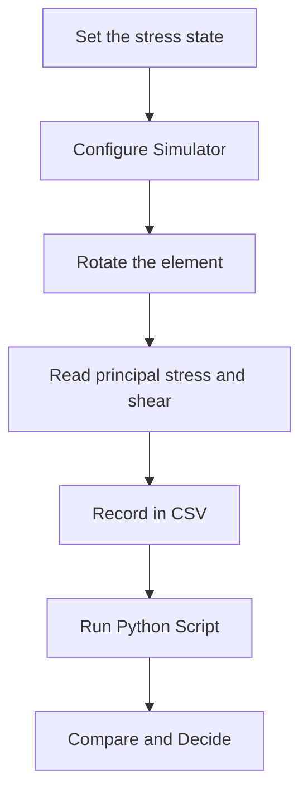

import MechanicsOfMaterialsComments from '../../../../components/mechanics-of-materials/MechanicsOfMaterialsComments.astro';
import TawkWidget from '../../../../components/TawkWidget.astro';
import UniversalContentContributors from '../../../../components/UniversalContentContributors.astro';
import InArticleAd from '../../../../components/InArticleAd.astro';
import Copyright from '../../../../components/Copyright.astro';
import BionicText from '../../../../components/BionicText.astro';
import TailwindWrapper from '../../../../components/TailwindWrapper.jsx';
import { Tabs, TabItem } from '@astrojs/starlight/components';
import { Card, CardGrid, Badge, Steps, LinkButton, FileTree } from '@astrojs/starlight/components';

<UniversalContentContributors 
  contributors={frontmatter.contributors}
/>


A stress element is a bookkeeping choice, not a physical fact. The same point in a loaded part has tension on one pair of faces if you draw it one way and pure shear if you turn the element forty-five degrees, and the plane that actually cracks is set by the stress, not by the axes you happened to pick. Mohr's circle is the device that makes every one of those orientations a single point on one circle, so instead of re-deriving the algebra for each angle you just read the point off. These six experiments turn that idea into a habit: build the circle from a state, rotate the element and watch the point move, find the orientations that matter, and let the failure criteria decide whether the part survives. #MohrsCircle #StressTransformation #FailureAnalysis

:::tip[What you need]
The [Mohr's Circle Simulator](/product-development/mohrs-circle-simulator/), and Python 3 with NumPy and Matplotlib for the analysis scripts (`pip install numpy matplotlib`).
:::

:::note[Related resources]
The theory behind these experiments lives in [Principal Stresses and Failure Criteria](/education/mechanics-of-materials/principal-stresses-failure-analysis). The combined state in Experiment 5 comes straight out of [Torsion of Circular Shafts](/education/mechanics-of-materials/fundamentals-of-shaft-torsion) and [Combined Bending and Torsion](/education/mechanics-of-materials/combined-bending-torsion-loading). See the full tool set on the [Solid Mechanics Analyzer](/product-development/solid-mechanics-analyzer/) page.
:::

## Reference

| Term | Meaning |
|------|---------|
| **Plane stress** | A two-dimensional stress state (σx, σy, τxy) with the out-of-plane stresses zero, true on any free surface |
| **Stress transformation** | The face stresses (σx', σy', τx'y') on an element rotated by angle θ from the reference axes |
| **Principal stresses** | The maximum and minimum normal stresses σ1, σ2, acting on planes where the shear is zero |
| **Principal angle (θp)** | The rotation from the x-axis to the plane carrying σ1 |
| **Maximum in-plane shear** | τmax, the radius of the circle, acting on planes forty-five degrees from the principal planes |
| **Mohr's circle** | A circle of centre (σavg, 0) and radius R whose every point is the (σ, τ) on one plane through the point |
| **von Mises / Tresca** | Two yield criteria that collapse a multiaxial state into one equivalent stress to compare with the yield strength |

### Experiment Workflow



### Workspace Setup

<FileTree>
- stress-transformation-experiments/
  - data/
  - plots/
  - scripts/
</FileTree>

:::tip[Instrument it]
You cannot read a stress directly, but you can read the strain that goes with it, and the right instrument is a strain-gauge rosette bonded to the free surface at the critical point. A rectangular 0/45/90 rosette (for example a Micro-Measurements CEA-series or an HBM RY series) gives three surface strains, and from them you compute the principal strains, the principal direction, and through Hooke's law the principal stresses, exactly the quantities this simulator reports. Wire each gauge into a Wheatstone bridge, amplify with an instrumentation amplifier or an HX711-class bridge ADC, and have an [ESP32 or STM32](/education/sensor-actuator-interfacing-stm32/) sample the three channels. On a running machine that board can [log the principal stress and its direction](/education/iot-systems/) and [warn when either drifts toward the yield envelope](https://siliconwit.io) before a crack starts.
:::

---

## Experiment 1: Build Mohr's Circle from a Stress State

<InArticleAd />


Every Mohr's analysis starts the same way: turn three numbers (σx, σy, τxy) into a circle, and read the principal stresses off where it crosses the axis. Doing it once by hand fixes the construction in memory; doing it next to the simulator shows you that the circle is not an analogy but the actual locus of every stress state at the point.

:::note[Objective]
For a general plane-stress state, compute the circle centre and radius, the principal stresses σ1 and σ2, and the principal angle θp, and confirm them against the simulator's diagram and readouts.
:::

<Steps>
1. **Configure the simulator**
   Open the simulator and select the General plane stress preset (σx = 80, σy = -20, τxy = 40 MPa). Leave the element angle θ at 0.

2. **Predict**
   Before reading the panel, compute by hand: σavg = (σx + σy)/2, R = sqrt(((σx - σy)/2)² + τxy²), then σ1,2 = σavg ± R and θp from tan(2θp) = 2τxy/(σx - σy).

3. **Read the circle**
   On the diagram, confirm the circle centre sits at σavg on the horizontal axis and that the circle crosses the axis at your σ1 and σ2. Read σ1, σ2, and θp from the panel.

4. **Change the state**
   Switch to Custom and try two more states of your own. Each time, predict first, then check.

5. **Save data**
   Create `data/exp1_circle.csv` with columns: sx, sy, txy, sigma_avg, R, sigma_1, sigma_2, theta_p_deg.
</Steps>

### Data Collection Table

| σx (MPa) | σy (MPa) | τxy (MPa) | σavg (MPa) | R (MPa) | σ1 (MPa) | σ2 (MPa) | θp (deg) |
|---|---|---|---|---|---|---|---|
| 80 | -20 | 40 | | | | | |
| | | | | | | | |

### Python Analysis

```python title="experiment_1_circle.py"
# Stress Transformation Experiment 1: build Mohr's circle from a state
import numpy as np
import matplotlib.pyplot as plt
import os

os.makedirs('plots', exist_ok=True)

def mohr(sx, sy, txy):
    avg = (sx + sy) / 2.0
    R = np.hypot((sx - sy) / 2.0, txy)
    s1, s2 = avg + R, avg - R
    theta_p = 0.5 * np.degrees(np.arctan2(2 * txy, sx - sy))
    return avg, R, s1, s2, theta_p

sx, sy, txy = 80.0, -20.0, 40.0
avg, R, s1, s2, theta_p = mohr(sx, sy, txy)
print(f"centre sigma_avg = {avg:.2f} MPa, radius R = {R:.2f} MPa")
print(f"sigma_1 = {s1:.2f} MPa, sigma_2 = {s2:.2f} MPa, theta_p = {theta_p:.2f} deg")

# Draw the circle and mark the two reference faces (x-face and y-face).
phi = np.linspace(0, 2 * np.pi, 400)
fig, ax = plt.subplots(figsize=(7, 7))
ax.plot(avg + R * np.cos(phi), R * np.sin(phi), color='#2A9D8F', lw=2)
ax.plot([sx, sy], [-txy, txy], 'o-', color='#E76F51', lw=1.5, label='x-face / y-face (diameter)')
ax.plot([s1, s2], [0, 0], 's', color='#264653', label='principal stresses')
ax.axhline(0, color='gray', lw=0.8); ax.axvline(0, color='gray', lw=0.8)
ax.set_aspect('equal'); ax.grid(True, alpha=0.3)
ax.set_xlabel('normal stress sigma (MPa)'); ax.set_ylabel('shear stress tau (MPa)')
ax.set_title("Mohr's circle for the stress state"); ax.legend(fontsize=8)
plt.tight_layout(); plt.savefig('plots/exp1_circle.png', dpi=150, bbox_inches='tight'); plt.show()
```

### Expected Results

For (80, -20, 40): σavg = 30.0 MPa, R = 64.0 MPa, σ1 = 94.0 MPa, σ2 = -34.0 MPa, θp = 19.33 deg. The x-face point (80, -40) and the y-face point (-20, +40) sit at opposite ends of a diameter, and the circle crosses the axis exactly at σ1 and σ2.

### Design Question

If you doubled only τxy, would σ1 grow faster or slower than the increase in τxy? Use the R expression to argue why a state already dominated by shear is less sensitive to extra shear than a state dominated by normal stress.

---

## Experiment 2: Stress on an Inclined Plane

<InArticleAd />


The whole reason the circle exists is to answer one question quickly: given the stresses on the reference faces, what are the stresses on a face turned to some other angle? This experiment sweeps the element through a half-turn and confirms that the transformed face stress traces the circle exactly, never leaving it.

:::note[Objective]
Rotate the stress element and verify that the pair (σx', τx'y') for every angle θ lies on the Mohr circle, and that σx'(θ) and τx'y'(θ) are the sinusoids the transformation equations predict.
:::

<Steps>
1. **Configure the simulator**
   Keep the General plane stress preset. Open the Normal stress vs angle and Shear stress vs angle charts.

2. **Predict**
   The normal stress should peak at θ = θp and the shear should cross zero there. The shear should peak forty-five degrees later. Predict the angle at which σx' equals σavg.

3. **Sweep the angle**
   Drag θ from 0 to 90 degrees in steps of 15. At each step record σx' and τx'y' from the readout.

4. **Check the circle**
   For each recorded pair, the distance from (σavg, 0) should equal R. Confirm a few by hand.

5. **Save data**
   Create `data/exp2_incline.csv` with columns: theta_deg, sigma_xprime, tau_xprime.
</Steps>

### Data Collection Table

| θ (deg) | σx' (MPa) | τx'y' (MPa) | Distance from centre (MPa) |
|---|---|---|---|
| 0 | | | |
| 15 | | | |
| 30 | | | |
| 45 | | | |
| 60 | | | |
| 75 | | | |
| 90 | | | |

### Python Analysis

```python title="experiment_2_incline.py"
# Stress Transformation Experiment 2: stress on an inclined plane
import numpy as np
import matplotlib.pyplot as plt
import os

os.makedirs('plots', exist_ok=True)

sx, sy, txy = 80.0, -20.0, 40.0
avg = (sx + sy) / 2.0
d = (sx - sy) / 2.0
R = np.hypot(d, txy)

theta = np.linspace(0, 180, 361)
t = np.radians(theta)
sxp = avg + d * np.cos(2 * t) + txy * np.sin(2 * t)
txp = -d * np.sin(2 * t) + txy * np.cos(2 * t)

# Every point must lie on the circle: distance from (avg, 0) equals R.
dist = np.hypot(sxp - avg, txp)
print(f"R = {R:.3f} MPa; max deviation of points from the circle = {np.max(np.abs(dist - R)):.2e} MPa")

fig, ax = plt.subplots(1, 2, figsize=(13, 5))
ax[0].plot(theta, sxp, color='#2A9D8F', lw=2, label="sigma_x'")
ax[0].plot(theta, txp, color='#E76F51', lw=2, label="tau_x'y'")
ax[0].axhline(avg, color='gray', ls='--', lw=1, label='sigma_avg')
ax[0].set_xlabel('element angle theta (deg)'); ax[0].set_ylabel('stress (MPa)')
ax[0].grid(True, alpha=0.3); ax[0].legend(fontsize=8); ax[0].set_title('Face stresses vs rotation')

ax[1].plot(avg + R * np.cos(np.linspace(0, 2*np.pi, 400)),
           R * np.sin(np.linspace(0, 2*np.pi, 400)), color='#999', lw=1)
ax[1].scatter(sxp[::20], txp[::20], c=theta[::20], cmap='viridis', s=30)
ax[1].set_aspect('equal'); ax[1].grid(True, alpha=0.3)
ax[1].set_xlabel('sigma (MPa)'); ax[1].set_ylabel('tau (MPa)'); ax[1].set_title('The points ride the circle')
plt.tight_layout(); plt.savefig('plots/exp2_incline.png', dpi=150, bbox_inches='tight'); plt.show()
```

### Expected Results

The deviation of every transformed point from the circle is zero to machine precision (around 1e-13 MPa). σx'(θ) is a sinusoid centred on σavg = 30 MPa with amplitude R = 64 MPa; it peaks at θp = 19.33 deg, exactly where τx'y' crosses zero. A rotation of θ on the element corresponds to a rotation of 2θ around the circle.

### Design Question

A rosette is bonded with its reference axis 30 degrees off the principal direction. By how many degrees does the measured σx' differ from the true σ1, and why does a small misalignment in angle cause only a second-order error in the peak normal stress?

---

## Experiment 3: Maximum Shear and Its Plane

<InArticleAd />


Ductile parts yield in shear, so the plane of maximum shear is often the plane that matters most, and it is never the plane of maximum normal stress. This experiment finds τmax, the orientation it acts on, and the normal stress that rides along with it.

:::note[Objective]
Locate the maximum in-plane shear stress and the angle θs at which it acts, and show that the normal stress on the maximum-shear planes equals σavg, not zero.
:::

<Steps>
1. **Configure the simulator**
   Keep the General plane stress preset. Read θp from the panel, then set the element angle to θs = θp - 45 degrees.

2. **Predict**
   Predict that the shear readout reaches its largest magnitude here, equal to R, and that the normal stress on this plane equals σavg rather than zero.

3. **Confirm**
   Read τx'y' and σx' at θs. Compare τmax with R from Experiment 1.

4. **Contrast**
   Note that at the principal planes the shear is zero but the normal stress is extreme, while at θs the shear is extreme but the normal stress is the average. The two critical orientations are forty-five degrees apart.

5. **Save data**
   Create `data/exp3_maxshear.csv` with columns: theta_s_deg, tau_max, sigma_on_maxshear_plane.
</Steps>

### Data Collection Table

| Quantity | Hand value | Simulator |
|---|---|---|
| θs = θp - 45 (deg) | | |
| τmax (MPa) | | |
| Normal stress on that plane (MPa) | | |

### Python Analysis

```python title="experiment_3_maxshear.py"
# Stress Transformation Experiment 3: maximum shear and its plane
import numpy as np

sx, sy, txy = 80.0, -20.0, 40.0
avg = (sx + sy) / 2.0
d = (sx - sy) / 2.0
R = np.hypot(d, txy)
theta_p = 0.5 * np.degrees(np.arctan2(2 * txy, sx - sy))
theta_s = theta_p - 45.0

t = np.radians(theta_s)
sxp = avg + d * np.cos(2 * t) + txy * np.sin(2 * t)
txp = -d * np.sin(2 * t) + txy * np.cos(2 * t)

print(f"theta_p = {theta_p:.2f} deg, theta_s = {theta_s:.2f} deg")
print(f"tau_max (= R) = {R:.2f} MPa, measured shear at theta_s = {txp:.2f} MPa")
print(f"normal stress on the max-shear plane = {sxp:.2f} MPa (should equal sigma_avg = {avg:.2f})")
```

### Expected Results

θp = 19.33 deg, θs = -25.67 deg. The shear magnitude at θs equals R = 64.0 MPa, and the normal stress on that plane is 30.0 MPa, exactly σavg. This is why a maximum-shear (Tresca) check uses τmax = R and why the average stress, not zero, accompanies the worst shear.

### Design Question

For a shaft in pure torsion the normal stresses σx and σy are both zero. Where do the maximum-shear planes lie relative to the shaft axis, and how does that explain a ductile shaft failing on a flat transverse face?

---

## Experiment 4: Pure Shear and the Forty-Five-Degree Failure

<InArticleAd />


A bar of chalk twisted in your fingers breaks on a clean helical surface at forty-five degrees, while a steel shaft of the same shape shears off flat. Both are in pure shear; the difference is which stress each material fears. This experiment uses the circle to explain a failure you can see with your own eyes.

:::note[Objective]
Set a pure-shear state and show that its principal stresses are equal and opposite at forty-five degrees, then connect that to why brittle materials in torsion fail on a forty-five-degree helix while ductile ones shear transversely.
:::

<Steps>
1. **Configure the simulator**
   Select the Pure shear preset (σx = 0, σy = 0, τxy = 80 MPa).

2. **Predict**
   With σx = σy = 0 the circle is centred at the origin. Predict σ1 = +τ, σ2 = -τ and θp = 45 degrees.

3. **Read the principal state**
   Confirm σ1 = +80, σ2 = -80, and that the principal planes sit at 45 degrees. Note that the maximum tensile stress and maximum shear are equal in magnitude here.

4. **Reason about failure**
   A brittle material fails when σ1 reaches its tensile limit, so it cracks on the plane normal to σ1: the forty-five-degree helix. A ductile material yields when τmax reaches its shear limit, so it fails on the transverse plane of maximum shear.

5. **Save data**
   Create `data/exp4_pureshear.csv` with columns: txy, sigma_1, sigma_2, theta_p_deg.
</Steps>

### Data Collection Table

| τxy (MPa) | σ1 (MPa) | σ2 (MPa) | θp (deg) | Brittle crack plane | Ductile shear plane |
|---|---|---|---|---|---|
| 80 | | | | | |

### Python Analysis

```python title="experiment_4_pureshear.py"
# Stress Transformation Experiment 4: pure shear and the 45-degree failure
import numpy as np
import matplotlib.pyplot as plt
import os

os.makedirs('plots', exist_ok=True)

txy = 80.0
sx = sy = 0.0
avg = (sx + sy) / 2.0
R = np.hypot((sx - sy) / 2.0, txy)
s1, s2 = avg + R, avg - R
theta_p = 0.5 * np.degrees(np.arctan2(2 * txy, sx - sy))
print(f"sigma_1 = {s1:.1f} MPa, sigma_2 = {s2:.1f} MPa, theta_p = {theta_p:.1f} deg")
print("Brittle: cracks normal to sigma_1 (a 45-degree helix in torsion).")
print("Ductile: shears on the transverse plane of maximum shear.")

phi = np.linspace(0, 2 * np.pi, 400)
fig, ax = plt.subplots(figsize=(6.5, 6.5))
ax.plot(avg + R * np.cos(phi), R * np.sin(phi), color='#2A9D8F', lw=2)
ax.plot([0, 0], [-txy, txy], 'o-', color='#E76F51', label='x / y faces (pure shear)')
ax.plot([s1, s2], [0, 0], 's', color='#264653', label='principal: +/- tau')
ax.axhline(0, color='gray', lw=0.8); ax.axvline(0, color='gray', lw=0.8)
ax.set_aspect('equal'); ax.grid(True, alpha=0.3); ax.legend(fontsize=8)
ax.set_xlabel('sigma (MPa)'); ax.set_ylabel('tau (MPa)'); ax.set_title('Pure shear: a circle centred on the origin')
plt.tight_layout(); plt.savefig('plots/exp4_pureshear.png', dpi=150, bbox_inches='tight'); plt.show()
```

### Expected Results

σ1 = +80 MPa, σ2 = -80 MPa, θp = 45 deg. The circle is centred on the origin with radius 80 MPa, so the largest tensile, compressive, and shear stresses are all 80 MPa. The orientation of σ1 at 45 degrees is the helix on which brittle torsion specimens crack.

### Design Question

Cast iron is roughly four times stronger in compression than in tension. Using the principal stresses of pure shear, predict which forty-five-degree surface (the one normal to σ1 or the one normal to σ2) a cast-iron shaft cracks on, and sketch the helix direction.

---

## Experiment 5: Combined Bending and Torsion on a Shaft Surface

<InArticleAd />


The state that sends most engineers to Mohr's circle for real is a rotating shaft: bending from the load gives a normal stress along the axis, torque gives a shear, and the surface of the shaft carries both at once. This experiment builds that state from the shaft loads and finds the principal stresses that govern the design.

:::note[Objective]
Compute the surface stress state of a solid circular shaft under a bending moment M and torque T, build its Mohr's circle, and find the principal stresses and maximum shear that a failure check will use.
:::

<Steps>
1. **Compute the state**
   For a solid shaft of diameter d, the surface bending stress is σx = 32M/(πd³) and the torsional shear is τxy = 16T/(πd³), with σy = 0. Work these out for M = 200 N·m, T = 350 N·m, d = 25 mm.

2. **Configure the simulator**
   Select the Bending + torsion preset, then switch to Custom and enter your computed σx and τxy with σy = 0.

3. **Read the principal state**
   Record σ1, σ2, θp, and τmax from the panel.

4. **Sanity check**
   σ2 should be negative even though there is no applied compression: the shear pulls one principal stress below zero. Confirm the sign.

5. **Save data**
   Create `data/exp5_shaft.csv` with columns: M_Nm, T_Nm, d_mm, sigma_x, tau_xy, sigma_1, sigma_2, tau_max.
</Steps>

### Data Collection Table

| M (N·m) | T (N·m) | d (mm) | σx (MPa) | τxy (MPa) | σ1 (MPa) | σ2 (MPa) | τmax (MPa) |
|---|---|---|---|---|---|---|---|
| 200 | 350 | 25 | | | | | |

### Python Analysis

```python title="experiment_5_shaft.py"
# Stress Transformation Experiment 5: combined bending and torsion on a shaft
import numpy as np

M = 200.0      # bending moment, N*m
T = 350.0      # torque, N*m
d = 25.0e-3    # shaft diameter, m

sx = 32 * M / (np.pi * d**3) / 1e6   # surface bending stress, MPa
txy = 16 * T / (np.pi * d**3) / 1e6  # torsional shear, MPa
sy = 0.0

avg = (sx + sy) / 2.0
R = np.hypot((sx - sy) / 2.0, txy)
s1, s2 = avg + R, avg - R
tau_max = R
theta_p = 0.5 * np.degrees(np.arctan2(2 * txy, sx - sy))

print(f"surface bending stress sigma_x = {sx:.1f} MPa")
print(f"torsional shear tau_xy = {txy:.1f} MPa")
print(f"sigma_1 = {s1:.1f} MPa, sigma_2 = {s2:.1f} MPa")
print(f"tau_max = {tau_max:.1f} MPa, theta_p = {theta_p:.1f} deg")

# Equivalent (combined) bending and torque, a shorthand many shaft codes use:
M_eq = 0.5 * (M + np.hypot(M, T))   # equivalent bending moment
T_eq = np.hypot(M, T)               # equivalent torque
print(f"equivalent bending moment M_eq = {M_eq:.1f} N*m, equivalent torque T_eq = {T_eq:.1f} N*m")
```

### Expected Results

σx = 130.4 MPa, τxy = 114.1 MPa. The principal stresses are σ1 = 196.6 MPa and σ2 = -66.2 MPa, with τmax = 131.4 MPa at θp = 30.2 deg. The negative σ2 is the key lesson: torsion drags a principal stress into compression even though nothing pushes on the shaft, so a normal-stress-only check would miss it.

### Design Question

Hold T fixed and increase M. As bending grows, does θp move toward the shaft axis or away from it, and what does that say about where a fatigue crack will start to point as a shaft becomes bending-dominated?

---

## Experiment 6: von Mises versus Tresca and the Safety Factor

<InArticleAd />


Two engineers analyze the same shaft and quote two different safety factors, and neither is wrong: one used von Mises and the other Tresca. This experiment maps the gap between the two criteria so you know when the choice is harmless and when it decides whether a part passes.

:::note[Objective]
For a sweep of stress states, compute the von Mises and Tresca equivalent stresses and their safety factors against a fixed yield strength, and quantify how much more conservative Tresca is across the range.
:::

<Steps>
1. **Configure the simulator**
   Use the Bending + torsion preset. Set the yield strength to 250 MPa. Toggle the criterion between von Mises and Tresca and read the equivalent stress and safety factor for each.

2. **Predict**
   Tresca uses σ1 - σ2 (the full diameter of the circle) while von Mises uses a quadratic combination. Predict that Tresca always reports the lower safety factor.

3. **Sweep the shear**
   Hold σx at 140 MPa and σy at 0, and step τxy from 0 to 120 MPa. At each step record both safety factors.

4. **Quantify the gap**
   Find the state in your sweep where the two criteria disagree most as a percentage. Note whether the difference ever crosses the safe/unsafe line for your yield.

5. **Save data**
   Create `data/exp6_criteria.csv` with columns: txy, sigma_vm, sigma_tresca, SF_vm, SF_tresca.
</Steps>

### Data Collection Table

| τxy (MPa) | σ_vm (MPa) | σ_tresca (MPa) | SF (von Mises) | SF (Tresca) |
|---|---|---|---|---|
| 0 | | | | |
| 40 | | | | |
| 80 | | | | |
| 120 | | | | |

### Python Analysis

```python title="experiment_6_criteria.py"
# Stress Transformation Experiment 6: von Mises vs Tresca
import numpy as np
import matplotlib.pyplot as plt
import os

os.makedirs('plots', exist_ok=True)

def principals(sx, sy, txy):
    avg = (sx + sy) / 2.0
    R = np.hypot((sx - sy) / 2.0, txy)
    return avg + R, avg - R

def von_mises(s1, s2):           # plane stress, third principal is zero
    return np.sqrt(s1**2 - s1 * s2 + s2**2)

def tresca(s1, s2):              # max(|s1-s2|, |s1|, |s2|) with s3 = 0
    return np.maximum.reduce([np.abs(s1 - s2), np.abs(s1), np.abs(s2)])

sx, sy, Y = 140.0, 0.0, 250.0
txy = np.linspace(0, 120, 25)
s1, s2 = principals(sx, sy, txy)
vm, tr = von_mises(s1, s2), tresca(s1, s2)
sf_vm, sf_tr = Y / vm, Y / tr
gap = 100 * (tr - vm) / vm

for q, q_vm, q_tr in zip(txy[::8], sf_vm[::8], sf_tr[::8]):
    print(f"txy = {q:5.0f} MPa: SF_vm = {q_vm:.2f}, SF_tresca = {q_tr:.2f}")
print(f"max conservatism of Tresca over von Mises in this sweep = {gap.max():.1f}%")

fig, ax = plt.subplots(figsize=(8, 5))
ax.plot(txy, sf_vm, color='#2A9D8F', lw=2, label='von Mises')
ax.plot(txy, sf_tr, color='#E76F51', lw=2, label='Tresca')
ax.axhline(1.0, color='gray', ls='--', lw=1, label='yield (SF = 1)')
ax.set_xlabel('shear stress tau_xy (MPa)'); ax.set_ylabel('safety factor')
ax.grid(True, alpha=0.3); ax.legend(); ax.set_title('Tresca is always the more conservative of the two')
plt.tight_layout(); plt.savefig('plots/exp6_criteria.png', dpi=150, bbox_inches='tight'); plt.show()
```

### Expected Results

Tresca always reports the lower (more conservative) safety factor. The gap is zero at τxy = 0 (uniaxial tension) and widens as shear grows, reaching about 11 percent at τxy = 120 MPa in this sweep; the theoretical maximum, at pure shear, is about 15.5 percent (the classic 1/sqrt(3) versus 1/2 shear-yield difference). The criterion you pick can move a marginal design across the line: at τxy = 120 MPa, von Mises gives SF = 1.00 while Tresca gives 0.90, so Tresca already calls the part a failure where von Mises calls it exactly marginal.

### Design Question

Your shaft has a von Mises safety factor of 1.30 and a Tresca safety factor of 1.15. The design code you must follow specifies Tresca. Is the part acceptable for a required safety factor of 1.25, and what is the cheapest single change (material, diameter, or load path) to bring it into compliance?

---

## What You Built

<InArticleAd />


Across the six experiments you turned a stress state into a circle, read the stress on any plane off that circle, found the orientations that govern yielding and fracture, and watched two failure criteria diverge. The same chain (state, transform, principal stresses, criterion) is what every combined-loading check in the rest of the course reduces to. Carry it into [combined bending and torsion](/education/mechanics-of-materials/combined-bending-torsion-loading) and the [principal-stress and failure lesson](/education/mechanics-of-materials/principal-stresses-failure-analysis), where the same circle decides whether a real part survives.


<InArticleAd />
<MechanicsOfMaterialsComments />
<TawkWidget />
<Copyright />