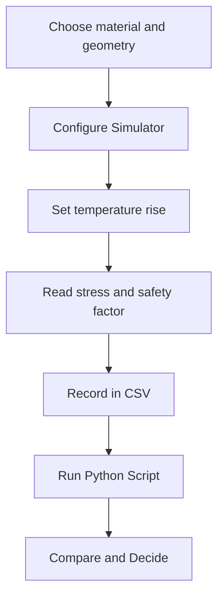

import MechanicsOfMaterialsComments from '../../../../components/mechanics-of-materials/MechanicsOfMaterialsComments.astro';
import TawkWidget from '../../../../components/TawkWidget.astro';
import UniversalContentContributors from '../../../../components/UniversalContentContributors.astro';
import InArticleAd from '../../../../components/InArticleAd.astro';
import Copyright from '../../../../components/Copyright.astro';
import BionicText from '../../../../components/BionicText.astro';
import TailwindWrapper from '../../../../components/TailwindWrapper.jsx';
import { Tabs, TabItem } from '@astrojs/starlight/components';
import { Card, CardGrid, Badge, Steps, LinkButton, FileTree } from '@astrojs/starlight/components';

<UniversalContentContributors 
  contributors={frontmatter.contributors}
/>


Free expansion is harmless. A rail that can slide expands by alpha times L times the temperature rise, develops no stress, and causes no damage. The moment you bolt both ends to a rigid frame the story changes: the same temperature rise becomes a compressive force that can buckle the rail or shear the bolts, and the stress depends only on the material, not on how long the member is. A gap between the member and the wall delays that contact, buying a range of temperature rise over which the member is still stress-free, but once the free expansion closes the gap every additional degree pushes the stress up fast. These six experiments turn those three ideas into habits you can carry into any constrained thermal design. #ThermalStress #ThermalExpansion #SolidMechanics

:::tip[What you need]
The [Thermal Stress Simulator](/product-development/thermal-stress-simulator/), and Python 3 with NumPy and Matplotlib for the analysis scripts (`pip install numpy matplotlib`).
:::

:::note[Related resources]
The theory behind these experiments lives in [Thermal Stresses and Strains](/education/mechanics-of-materials/thermal-stresses-and-strains). See the full tool set on the [Solid Mechanics Analyzer](/product-development/solid-mechanics-analyzer/) page.
:::

## Reference

| Term | Meaning |
|------|---------|
| **Free thermal expansion** | delta = alpha L deltaT; the elongation a member undergoes when unconstrained; no stress develops |
| **Thermal strain** | epsilon = alpha deltaT; dimensionless, independent of length |
| **Fully constrained stress** | sigma = E alpha deltaT (compressive for heating); independent of member length |
| **Coefficient of linear thermal expansion (alpha)** | Material property in units of 1/degC (or 1e-6/degC as tabulated); governs how much a member wants to expand per degree |
| **Gap (g)** | Clearance between the free end of the member and the rigid wall; the member expands freely until delta_free = g, then contact begins |
| **Contact threshold** | deltaT_c = g / (alpha L); the temperature rise at which free expansion exactly closes the gap |
| **Post-contact stress** | sigma = -E (alpha deltaT - g/L); compressive, valid only when alpha L deltaT is greater than g |
| **Safe temperature rise (deltaT_safe)** | The deltaT at which stress first reaches yield: deltaT_safe = (yield/E + g/L) / alpha |

### Experiment Workflow



### Workspace Setup

<FileTree>
- thermal-stress-experiments/
  - data/
  - plots/
  - scripts/
</FileTree>

:::tip[Instrument it]
You cannot read a thermal stress directly, but you can measure the two quantities that together tell you whether stress is building: the temperature of the member and the gap remaining before contact. Bond a K-type thermocouple (with a MAX31855 breakout) to the member surface and mount a dial gauge or LVDT across the expansion gap. With an [ESP32 or STM32](/education/sensor-actuator-interfacing-stm32/) reading both channels, you can log temperature and displacement in real time and [watch the gap close on siliconwit.io](https://siliconwit.io) before contact stress reaches a dangerous level.
:::

---

## Experiment 1: Free Thermal Expansion

<InArticleAd />


A free member always expands when heated and never develops a stress, no matter how large the temperature rise. That statement is obvious in theory but easy to forget in practice: it is the constraint, not the heating, that causes damage. This experiment measures the free expansion of each material in the simulator's library and confirms that sigma stays at zero throughout.

:::note[Objective]
For five materials at a common length and temperature rise, calculate the free expansion delta = alpha L deltaT, confirm that the simulator reports zero stress in every case, and observe how alpha alone controls the expansion magnitude when L and deltaT are fixed.
:::

<Steps>
1. **Configure the simulator**
   Open the simulator. For each material (Steel, Aluminium, Copper, Brass, Titanium) set L = 1000 mm, deltaT = 80 degC, and gap = 999 (or any value large enough that free expansion never reaches it, effectively unconstrained). Alternatively, set gap = 0 but confirm that no contact indicator lights up; the simulator treats gap = 0 as a fully constrained wall, so to model a truly free member either use a very large gap or verify that the "contact" flag is off.

2. **Predict**
   For each material, compute delta_free = alpha times 1000 times 80 by hand. Use the alpha values: steel 12, aluminium 23, copper 17, brass 19, titanium 8.6 (all in units of 1e-6/degC). Predict sigma = 0 for all.

3. **Read the simulator**
   Confirm the stress readout is 0.00 MPa for each material. Record the displayed free expansion alongside your hand result.

4. **Change the temperature rise**
   Try deltaT = 40 and deltaT = 160 for steel. Confirm that delta_free scales linearly with deltaT and sigma remains 0.

5. **Save data**
   Create `data/exp1_free_expansion.csv` with columns: material, alpha_per_C, L_mm, dT_degC, delta_free_mm, sigma_MPa.
</Steps>

### Data Collection Table

| Material | alpha (1e-6/degC) | L (mm) | deltaT (degC) | delta_free (mm) | sigma (MPa) |
|---|---|---|---|---|---|
| Steel | 12 | 1000 | 80 | | |
| Aluminium | 23 | 1000 | 80 | | |
| Copper | 17 | 1000 | 80 | | |
| Brass | 19 | 1000 | 80 | | |
| Titanium | 8.6 | 1000 | 80 | | |

### Python Analysis

```python title="experiment_1_free_expansion.py"
# Thermal Stress Experiment 1: free thermal expansion, no stress
import numpy as np
import matplotlib.pyplot as plt
import os

os.makedirs('plots', exist_ok=True)

# Material data from the simulator: alpha in 1e-6/degC, E in GPa, yield in MPa
materials = {
    'Steel':     {'alpha': 12.0,  'E': 200, 'yield': 250},
    'Aluminium': {'alpha': 23.0,  'E': 69,  'yield': 240},
    'Copper':    {'alpha': 17.0,  'E': 117, 'yield': 210},
    'Brass':     {'alpha': 19.0,  'E': 100, 'yield': 200},
    'Titanium':  {'alpha': 8.6,   'E': 114, 'yield': 880},
}

L = 1000.0    # mm
dT = 80.0     # degC

print(f"Free thermal expansion: L = {L} mm, dT = {dT} degC")
print(f"{'Material':12s}  {'alpha (1e-6/C)':16s}  {'delta_free (mm)':18s}  {'sigma (MPa)':12s}")
alphas, deltas = [], []
for name, mat in materials.items():
    a = mat['alpha'] * 1e-6
    delta = a * L * dT
    sigma = 0.0   # free member: no constraint, no stress
    print(f"  {name:10s}  {mat['alpha']:>14.1f}    {delta:>16.4f}    {sigma:>10.2f}  (free)")
    alphas.append(mat['alpha'])
    deltas.append(delta)

# Plot: expansion vs alpha
fig, ax = plt.subplots(figsize=(7, 5))
ax.bar(list(materials.keys()), deltas, color='#2A9D8F', alpha=0.8)
ax.set_xlabel('Material')
ax.set_ylabel('Free expansion delta (mm)')
ax.set_title(f'Free thermal expansion, L={L} mm, dT={dT} degC')
ax.grid(True, axis='y', alpha=0.3)
plt.tight_layout()
plt.savefig('plots/exp1_free_expansion.png', dpi=150, bbox_inches='tight')
plt.show()
```

### Expected Results

For L = 1000 mm and deltaT = 80 degC, the free expansions are: Steel 0.9600 mm, Aluminium 1.8400 mm, Copper 1.3600 mm, Brass 1.5200 mm, Titanium 0.6880 mm. Sigma is 0.00 MPa for every material. The expansions are proportional to alpha: aluminium expands 1.92 times as much as titanium because its alpha is 23/8.6 = 2.67 times larger, but neither develops any stress.

### Design Question

A machine has an aluminium column and a steel frame, both L = 400 mm, heated by 60 degC. If the ends are free, how much does each part grow, and which direction does the relative motion go? If the parts were then bolted together at both ends, which one would end up in compression?

---

## Experiment 2: Fully Constrained Member

<InArticleAd />


Once both ends of a member are fixed to a rigid wall, any attempt to expand becomes a compressive load. The result is a thermal stress sigma = E alpha deltaT that can easily exceed yield, and the disturbing feature is that it is the same at every length. A long pipe and a short bolt made of the same steel develop identical stress for the same temperature rise; the pipe just stores more elastic energy.

:::note[Objective]
Using the steam-pipe preset (steel, L = 3000 mm, deltaT = 150 degC, gap = 0), measure the compressive thermal stress, compare it with the yield strength, and then show length independence by repeating the calculation at three other lengths.
:::

<Steps>
1. **Configure the simulator**
   Load the steam-pipe preset: Steel, L = 3000 mm, deltaT = 150 degC, gap = 0.

2. **Predict**
   Compute sigma = E alpha deltaT = 200 000 MPa times 12e-6/degC times 150 degC. Then compare with the steel yield strength of 250 MPa and predict whether the member yields.

3. **Read the readout**
   Record sigma and the safety factor from the simulator panel. Confirm the sign is compressive.

4. **Test length independence**
   Change L to 500, 1000, and 2000 mm while keeping deltaT = 150 and gap = 0. Record sigma at each length.

5. **Save data**
   Create `data/exp2_constrained.csv` with columns: L_mm, dT_degC, sigma_MPa, yield_MPa, SF.
</Steps>

### Data Collection Table

| L (mm) | deltaT (degC) | sigma (MPa) | Yield (MPa) | Safety factor |
|---|---|---|---|---|
| 500 | 150 | | 250 | |
| 1000 | 150 | | 250 | |
| 2000 | 150 | | 250 | |
| 3000 | 150 | | 250 | |

### Python Analysis

```python title="experiment_2_constrained.py"
# Thermal Stress Experiment 2: fully constrained member, steam-pipe preset
import numpy as np
import matplotlib.pyplot as plt
import os

os.makedirs('plots', exist_ok=True)

# Steel from the simulator material table
alpha = 12.0e-6   # 1/degC
E = 200e3         # MPa  (200 GPa)
yield_s = 250.0   # MPa

dT = 150.0        # degC, steam-pipe preset

# Sigma is independent of L (gap = 0)
sigma = -E * alpha * dT    # compressive for heating
dTsafe = yield_s / (E * alpha)

print(f"steam-pipe preset: steel, dT = {dT} degC, gap = 0 mm (fully constrained)")
print(f"sigma = -E * alpha * dT = -{E:.0f} * {alpha} * {dT} = {sigma:.4f} MPa")
print(f"yield = {yield_s} MPa  =>  SF = {yield_s / abs(sigma):.4f}  (YIELDS: {abs(sigma) >= yield_s})")
print(f"Safe limit without gap: dT_safe = yield / (E * alpha) = {dTsafe:.4f} degC")
print()

# Length independence
print("Length independence (all give the same sigma):")
lengths = [500, 1000, 2000, 3000]
sigmas = []
for L in lengths:
    dFree = alpha * L * dT
    sig = -E * (dFree - 0) / L   # gap = 0
    sigmas.append(sig)
    print(f"  L = {L:5d} mm: dFree = {dFree:.4f} mm, sigma = {sig:.2f} MPa")

fig, ax = plt.subplots(figsize=(7, 5))
ax.plot(lengths, sigmas, 'o-', color='#E76F51', lw=2, label='sigma (constrained)')
ax.axhline(-yield_s, color='#264653', ls='--', lw=1.5, label=f'yield = -{yield_s} MPa')
ax.set_xlabel('Member length L (mm)')
ax.set_ylabel('Thermal stress sigma (MPa)')
ax.set_title(f'Fully constrained steel, dT = {dT} degC: stress is independent of length')
ax.grid(True, alpha=0.3); ax.legend()
plt.tight_layout()
plt.savefig('plots/exp2_constrained.png', dpi=150, bbox_inches='tight')
plt.show()
```

### Expected Results

Sigma = -360.00 MPa for every length. The steel yield strength is 250 MPa, so the safety factor is 0.6944 and the member yields at this temperature rise. The safe temperature limit without a gap is dT_safe = 250 / (200 000 times 12e-6) = 104.17 degC. The length-independence is exact: free expansion grows with L but the ratio (dFree - 0) / L cancels L completely, leaving sigma = -E alpha dT regardless.

### Design Question

A steam pipe runs at 250 degC and is installed at 20 degC, giving deltaT = 230 degC. If the pipe material is steel (yield 250 MPa), what is the thermal stress under full constraint, and what is the minimum gap per metre of pipe length that would keep the stress below yield?

---

## Experiment 3: Gap Then Contact

<InArticleAd />


A gap between the free end of a member and the wall allows the member to expand harmlessly until the gap closes. After contact, every additional degree of temperature rise adds compressive stress at the rate E alpha per degree, less the relief the gap already provided. The transition from zero stress to rapid stress build-up is sharp and easy to miss in a design that only checks at the maximum expected temperature.

:::note[Objective]
Using the copper-gap preset (Copper, L = 800 mm, gap = 5 mm), sweep deltaT across the contact threshold at 367.65 degC and measure how sigma jumps from zero to compressive as soon as free expansion exceeds the gap.
:::

<Steps>
1. **Configure the simulator**
   Load the copper-gap preset: Copper, L = 800 mm, gap = 5 mm.

2. **Predict the contact threshold**
   The member makes first contact when alpha L deltaT = gap. Compute deltaT_c = gap / (alpha L) = 5 / (17e-6 times 800) and write it down.

3. **Sweep deltaT below threshold**
   Set deltaT to 100, 200, and 300 degC. At each step confirm sigma = 0 and record delta_free.

4. **Cross the threshold**
   Set deltaT = 370 degC (just above threshold). Record the small compressive stress that appears. Then increase to 400 and 450 degC and record the growing stress.

5. **Save data**
   Create `data/exp3_gap_contact.csv` with columns: dT_degC, dFree_mm, contact, sigma_MPa.
</Steps>

### Data Collection Table

| deltaT (degC) | delta_free (mm) | Gap closed? | sigma (MPa) |
|---|---|---|---|
| 100 | | | |
| 200 | | | |
| 300 | | | |
| 370 | | | |
| 400 | | | |
| 450 | | | |

### Python Analysis

```python title="experiment_3_gap_contact.py"
# Thermal Stress Experiment 3: gap then contact, copper-gap preset
import numpy as np
import matplotlib.pyplot as plt
import os

os.makedirs('plots', exist_ok=True)

# Copper from the simulator material table
alpha = 17.0e-6   # 1/degC
E = 117e3         # MPa  (117 GPa)
yield_cu = 210.0  # MPa
L = 800.0         # mm
gap = 5.0         # mm

# Contact threshold
dT_contact = gap / (alpha * L)
print(f"copper-gap preset: L = {L} mm, gap = {gap} mm")
print(f"Contact threshold: dT_c = gap/(alpha*L) = {gap}/({alpha}*{L}) = {dT_contact:.2f} degC")
print()

# Sweep deltaT
dT_vals = np.array([100, 200, 300, 370, 400, 450])
print(f"{'dT (degC)':12s}  {'dFree (mm)':12s}  {'contact':10s}  {'sigma (MPa)':12s}")
sigmas_plot, dFrees_plot = [], []
for dT in dT_vals:
    dFree = alpha * L * dT
    if dFree <= gap:
        sigma = 0.0
        contact = False
    else:
        sigma = -E * (dFree - gap) / L
        contact = True
    sigmas_plot.append(sigma)
    dFrees_plot.append(dFree)
    print(f"  {dT:8.0f}    {dFree:10.4f}    {str(contact):8s}    {sigma:10.4f}")

# Smooth curve for the plot
dT_smooth = np.linspace(0, 500, 1000)
dFree_s = alpha * L * dT_smooth
sigma_s = np.where(dFree_s <= gap, 0.0, -E * (dFree_s - gap) / L)

fig, ax = plt.subplots(figsize=(8, 5))
ax.plot(dT_smooth, sigma_s, color='#2A9D8F', lw=2, label='thermal stress')
ax.axvline(dT_contact, color='#E76F51', ls='--', lw=1.5, label=f'contact threshold {dT_contact:.1f} degC')
ax.axhline(-yield_cu, color='#264653', ls=':', lw=1.5, label=f'yield = -{yield_cu} MPa')
ax.scatter(dT_vals, sigmas_plot, color='#264653', zorder=5, label='measured points')
ax.set_xlabel('Temperature rise deltaT (degC)')
ax.set_ylabel('Thermal stress sigma (MPa)')
ax.set_title('Copper-gap preset: zero stress until gap closes, then rapid build-up')
ax.grid(True, alpha=0.3); ax.legend(fontsize=8)
plt.tight_layout()
plt.savefig('plots/exp3_gap_contact.png', dpi=150, bbox_inches='tight')
plt.show()
```

### Expected Results

Contact threshold: dT_c = 5 / (17e-6 times 800) = 367.65 degC. Below that threshold sigma = 0.00 MPa for all deltaT values tested. At dT = 370 degC the free expansion is 5.0320 mm, just 0.032 mm past the gap, and sigma = -4.68 MPa. At dT = 400: sigma = -64.35 MPa. At dT = 450: sigma = -163.80 MPa. The copper yield strength is 210 MPa; first yield occurs at dTsafe = (210 / 117 000 + 5/800) / 17e-6 = 519.7 degC.

### Design Question

The same copper member operates at a maximum deltaT of 450 degC. With the current gap of 5 mm the stress reaches 163.80 MPa. What gap (to the nearest 0.5 mm) would keep the stress below 100 MPa at deltaT = 450 degC, and what would the new contact threshold be?

---

## Experiment 4: Material Comparison

<InArticleAd />


Two things together set the constrained thermal stress: how much the material wants to expand (alpha) and how stiffly it resists being held back (E). The product E times alpha is the stress per degree of temperature rise. Steel has a relatively low alpha but a very high E; aluminium has the highest alpha in the simulator's library but a much lower E; titanium has the lowest alpha of the five and a moderate E. The ranking is not obvious from either property alone.

:::note[Objective]
With all five materials fully constrained (gap = 0) at deltaT = 100 degC and L = 1000 mm, compute and rank the compressive thermal stress and the safety factor against yield.
:::

<Steps>
1. **Configure the simulator**
   Select Steel, L = 1000 mm, deltaT = 100 degC, gap = 0. Record sigma and SF. Repeat for Aluminium, Copper, Brass, and Titanium.

2. **Predict**
   For each material, compute sigma = -E times alpha times 100 by hand (E in MPa, alpha in 1/degC). Predict which material will have the highest stress and which will have the highest safety factor.

3. **Compare**
   Build the table below and rank by stress magnitude (most severe first).

4. **Observe the counterintuitive result**
   Aluminium has the highest alpha but the lowest E, so it ranks fourth in stress. Steel has only the second-highest alpha but its high E pushes it to the top. Titanium sits last in stress despite a moderate E because its alpha is the smallest.

5. **Save data**
   Create `data/exp4_material_comparison.csv` with columns: material, alpha, E_GPa, sigma_MPa, yield_MPa, SF.
</Steps>

### Data Collection Table

| Material | alpha (1e-6/degC) | E (GPa) | sigma (MPa) | Yield (MPa) | SF |
|---|---|---|---|---|---|
| Steel | 12 | 200 | | 250 | |
| Aluminium | 23 | 69 | | 240 | |
| Copper | 17 | 117 | | 210 | |
| Brass | 19 | 100 | | 200 | |
| Titanium | 8.6 | 114 | | 880 | |

### Python Analysis

```python title="experiment_4_material_comparison.py"
# Thermal Stress Experiment 4: material comparison at fixed dT
import numpy as np
import matplotlib.pyplot as plt
import os

os.makedirs('plots', exist_ok=True)

# Material data from the simulator
materials = {
    'Steel':     {'alpha': 12.0,  'E': 200, 'yield': 250},
    'Aluminium': {'alpha': 23.0,  'E': 69,  'yield': 240},
    'Copper':    {'alpha': 17.0,  'E': 117, 'yield': 210},
    'Brass':     {'alpha': 19.0,  'E': 100, 'yield': 200},
    'Titanium':  {'alpha': 8.6,   'E': 114, 'yield': 880},
}

dT = 100.0   # degC

print(f"Fully constrained, gap = 0, deltaT = {dT} degC")
print(f"{'Material':12s}  {'alpha':8s}  {'E (GPa)':10s}  {'sigma (MPa)':12s}  {'yield':8s}  {'SF':6s}")
results = []
for name, mat in materials.items():
    a = mat['alpha'] * 1e-6
    E = mat['E'] * 1e3    # MPa
    sigma = -E * a * dT
    sf = mat['yield'] / abs(sigma)
    results.append((name, mat['alpha'], mat['E'], sigma, mat['yield'], sf))
    print(f"  {name:10s}  {mat['alpha']:>6.1f}    {mat['E']:>8d}    {sigma:>10.2f}    {mat['yield']:>6d}  {sf:>6.3f}")

# Rank by stress magnitude
results.sort(key=lambda x: abs(x[3]), reverse=True)
print()
print("Ranked by compressive stress magnitude (most severe first):")
for i, (name, alpha, E, sigma, yld, sf) in enumerate(results, 1):
    print(f"  {i}. {name:10s}: sigma = {sigma:.2f} MPa  (alpha={alpha}, E={E} GPa, SF={sf:.3f})")

# Bar chart
names = [r[0] for r in results]
stresses = [abs(r[3]) for r in results]
sfs = [r[5] for r in results]
x = np.arange(len(names))
fig, (ax1, ax2) = plt.subplots(1, 2, figsize=(12, 5))
ax1.bar(x, stresses, color='#E76F51', alpha=0.85)
ax1.set_xticks(x); ax1.set_xticklabels(names)
ax1.set_ylabel('|sigma| (MPa)'); ax1.set_title('Compressive stress by material')
ax1.grid(True, axis='y', alpha=0.3)
ax2.bar(x, sfs, color='#2A9D8F', alpha=0.85)
ax2.axhline(1.0, color='gray', ls='--', lw=1, label='yield (SF=1)')
ax2.set_xticks(x); ax2.set_xticklabels(names)
ax2.set_ylabel('Safety factor'); ax2.set_title('Safety factor by material')
ax2.grid(True, axis='y', alpha=0.3); ax2.legend(fontsize=8)
plt.tight_layout()
plt.savefig('plots/exp4_material_comparison.png', dpi=150, bbox_inches='tight')
plt.show()
```

### Expected Results

Ranked by compressive stress magnitude at deltaT = 100 degC: Steel -240.00 MPa (SF = 1.042), Copper -198.90 MPa (SF = 1.056), Brass -190.00 MPa (SF = 1.053), Aluminium -158.70 MPa (SF = 1.512), Titanium -98.04 MPa (SF = 8.976). Steel tops the list despite having only the second-highest alpha because its E of 200 GPa is nearly three times that of aluminium. Titanium, with the lowest alpha and a moderate E, develops the least stress and sits far from yield even though its product E times alpha (8.6e-6 times 114 000 = 0.980 MPa/degC) is still substantial in absolute terms.

### Design Question

You need a constrained structural tie that can survive a full 200 degC temperature rise without yielding. Using only the simulator's five materials, which one gives the largest safety factor at that temperature rise, and what is the SF? Explain why titanium's very high yield strength dominates the answer.

---

## Experiment 5: Safe Temperature Rise

<InArticleAd />


Every constrained member has a maximum temperature rise it can sustain before the thermal stress reaches yield. Without a gap that limit is dTsafe = yield / (E alpha). With a gap of g millimetres on a member of length L, the gap acts as a stored allowance: dTsafe = (yield/E + g/L) / alpha. Each millimetre of gap buys additional safe temperature range, and the gain depends on alpha and L rather than on the material strength.

:::note[Objective]
For steel (L = 1000 mm) compare dTsafe at gap = 0 against gap = 3 mm (the rail-track preset gap), then sweep gap from 0 to 6 mm and plot how the safe temperature rise grows with the gap allowance.
:::

<Steps>
1. **Configure the simulator**
   Load the alu-strut preset: Aluminium, L = 500 mm, gap = 0. Note the dTsafe shown in the panel. Then switch to Steel, L = 1000 mm, gap = 0 (the no-gap baseline).

2. **Predict dTsafe for steel, gap = 0**
   Compute dTsafe = yield / (E times alpha) = 250 / (200 000 times 12e-6).

3. **Add a gap**
   Set gap = 3 mm (matching the rail-track preset gap, same L = 1000 mm). Compute the new dTsafe = (yield/E + g/L) / alpha = (250/200 000 + 3/1000) / 12e-6.

4. **Read the panel**
   Confirm both values against the simulator's dTsafe display.

5. **Save data**
   Create `data/exp5_safe_temperature.csv` with columns: material, L_mm, gap_mm, dTsafe_degC.
</Steps>

### Data Collection Table

| Material | L (mm) | gap (mm) | dTsafe formula | dTsafe (degC) |
|---|---|---|---|---|
| Steel | 1000 | 0 | yield / (E alpha) | |
| Steel | 1000 | 3 | (yield/E + g/L) / alpha | |
| Steel | 1000 | 6 | (yield/E + g/L) / alpha | |
| Aluminium | 500 | 0 | yield / (E alpha) | |

### Python Analysis

```python title="experiment_5_safe_temperature.py"
# Thermal Stress Experiment 5: safe temperature rise with and without gap
import numpy as np
import matplotlib.pyplot as plt
import os

os.makedirs('plots', exist_ok=True)

# Steel
alpha_s = 12.0e-6   # 1/degC
E_s = 200e3         # MPa
yield_s = 250.0     # MPa
L_s = 1000.0        # mm

# Aluminium (alu-strut preset)
alpha_a = 23.0e-6
E_a = 69e3
yield_a = 240.0
L_a = 500.0

# Steel: no gap vs gap = 3 mm (rail-track preset)
dTsafe_s0 = yield_s / (E_s * alpha_s)
dTsafe_s3 = (yield_s / E_s + 3.0 / L_s) / alpha_s
dTsafe_alu = yield_a / (E_a * alpha_a)

print("Safe temperature rise (dTsafe):")
print(f"  Steel,     L={L_s:.0f} mm, gap=0 mm: dTsafe = {dTsafe_s0:.4f} degC")
print(f"  Steel,     L={L_s:.0f} mm, gap=3 mm: dTsafe = {dTsafe_s3:.4f} degC  (rail-track gap)")
print(f"  Aluminium, L={L_a:.0f} mm,  gap=0 mm: dTsafe = {dTsafe_alu:.4f} degC  (alu-strut preset)")
print()

# Sweep gap for steel, L=1000
gaps = np.arange(0, 7)
dTsafe_arr = np.array([(yield_s / E_s + g / L_s) / alpha_s for g in gaps])
print("Gap sweep (steel, L=1000 mm):")
for g, dTs in zip(gaps, dTsafe_arr):
    print(f"  gap = {g} mm: dTsafe = {dTs:.2f} degC")

fig, ax = plt.subplots(figsize=(7, 5))
ax.plot(gaps, dTsafe_arr, 'o-', color='#2A9D8F', lw=2)
ax.set_xlabel('Gap g (mm)')
ax.set_ylabel('Safe temperature rise dTsafe (degC)')
ax.set_title('How the gap extends the safe temperature range (steel, L=1000 mm)')
ax.grid(True, alpha=0.3)
plt.tight_layout()
plt.savefig('plots/exp5_safe_temperature.png', dpi=150, bbox_inches='tight')
plt.show()
```

### Expected Results

Steel, L = 1000 mm, gap = 0: dTsafe = 104.17 degC. Steel, gap = 3 mm: dTsafe = 354.17 degC, a 3.40-fold increase from a 3 mm gap. Aluminium, L = 500 mm, gap = 0: dTsafe = 151.23 degC (higher than steel because the lower E partially offsets the higher alpha in the quotient yield / (E alpha)). The gap sweep shows that each additional millimetre of gap adds 83.33 degC to the safe limit for this geometry (1000 mm steel), which follows directly from deltaT_per_mm = 1 / (alpha L) = 1 / (12e-6 times 1000).

### Design Question

A steel pipe (yield 250 MPa, alpha 12e-6/degC, E 200 GPa) is 1500 mm long and experiences a maximum temperature rise of 200 degC during operation. The current design has no gap and the pipe yields. What is the minimum gap (to the nearest 0.5 mm) that keeps the pipe in the elastic range, and what safety factor does that gap give at deltaT = 200 degC?

---

## Experiment 6: Expansion Joint Sizing for a Rail Segment

<InArticleAd />


Railway rails and bridge girders are designed with deliberate gaps at their joints so that summer heating does not buckle the structure. The gap must be large enough that the free expansion at the maximum expected temperature rise stays below the gap (no stress) or, if the gap is smaller than the maximum free expansion, that the resulting stress stays within an acceptable fraction of yield. This experiment works through that sizing calculation for a steel rail segment.

:::note[Objective]
For a steel rail segment L = 1000 mm installed at the ambient temperature, determine the minimum gap that keeps the thermal stress below yield at deltaT = 120 degC, then find the gap that achieves a safety factor of at least 1.5 at that temperature rise.
:::

<Steps>
1. **Assess the unconstrained risk**
   Set the simulator to Steel, L = 1000 mm, deltaT = 120 degC, gap = 0. Read sigma and confirm it exceeds yield.

2. **Compute the minimum gap for no yield**
   From sigma = -E (alpha deltaT - g/L) = -yield, rearrange: g_min = L (alpha deltaT - yield/E). Calculate this value.

3. **Target SF = 1.5**
   Replace yield with yield/1.5 in the formula above to get the gap needed for a safety factor of 1.5: g_sf = L (alpha deltaT - yield/(1.5 E)). Round up to the nearest 0.5 mm for a practical value.

4. **Verify in the simulator**
   Enter the practical gap. Read sigma and SF. Confirm the safety factor is at least 1.5.

5. **Save data**
   Create `data/exp6_expansion_joint.csv` with columns: L_mm, dT_degC, gap_mm, sigma_MPa, SF.
</Steps>

### Data Collection Table

| L (mm) | deltaT (degC) | gap (mm) | sigma (MPa) | Safety factor |
|---|---|---|---|---|
| 1000 | 120 | 0 | | |
| 1000 | 120 | g_min | | ~1.0 |
| 1000 | 120 | g_sf (practical) | | >= 1.5 |

### Python Analysis

```python title="experiment_6_expansion_joint.py"
# Thermal Stress Experiment 6: expansion joint sizing for a steel rail segment
import numpy as np
import math
import matplotlib.pyplot as plt
import os

os.makedirs('plots', exist_ok=True)

# Steel from the simulator material table
alpha = 12.0e-6   # 1/degC
E = 200e3         # MPa  (200 GPa)
yield_s = 250.0   # MPa

L = 1000.0        # mm, one rail segment
dT_hot = 120.0    # degC, worst-case heating (e.g. cold winter installation to hot summer rail)

# Step 1: no gap
sigma_no_gap = -E * alpha * dT_hot
print(f"Rail segment: steel, L = {L} mm, dT_hot = {dT_hot} degC")
print(f"No gap: sigma = {sigma_no_gap:.2f} MPa, yield = {yield_s} MPa, YIELDS = {abs(sigma_no_gap) >= yield_s}")

# Step 2: minimum gap for no yield
g_min = L * (alpha * dT_hot - yield_s / E)
print(f"Min gap for no yield: g_min = L*(alpha*dT - yield/E) = {g_min:.4f} mm")

# Step 3: gap for SF = 1.5
target_stress = yield_s / 1.5
g_sf = L * (alpha * dT_hot - target_stress / E)
g_practical = math.ceil(g_sf * 2) / 2   # round up to nearest 0.5 mm
print(f"Gap for SF=1.5 (target stress = {target_stress:.2f} MPa): g_sf = {g_sf:.4f} mm => practical g = {g_practical} mm")

# Verify
dFree = alpha * L * dT_hot
sigma_design = -E * (dFree - g_practical) / L
sf_design = yield_s / abs(sigma_design)
print(f"With g = {g_practical} mm: sigma = {sigma_design:.2f} MPa, SF = {sf_design:.4f}")

# Sweep gap to visualise
gaps = np.linspace(0, 2.0, 400)
sigmas = np.where(alpha * L * dT_hot <= gaps, 0.0,
                  -E * (alpha * L * dT_hot - gaps) / L)
sfs = np.where(np.abs(sigmas) > 1e-9, yield_s / np.abs(sigmas), np.inf)

fig, (ax1, ax2) = plt.subplots(1, 2, figsize=(12, 5))
ax1.plot(gaps, sigmas, color='#E76F51', lw=2)
ax1.axhline(-yield_s, color='#264653', ls='--', lw=1.5, label='yield')
ax1.axvline(g_min, color='#999', ls=':', lw=1, label=f'g_min = {g_min:.2f} mm')
ax1.axvline(g_practical, color='#2A9D8F', ls='--', lw=1.5, label=f'g_practical = {g_practical} mm')
ax1.set_xlabel('Gap g (mm)'); ax1.set_ylabel('sigma (MPa)')
ax1.set_title(f'Stress vs gap, steel L={L} mm, dT={dT_hot} degC')
ax1.grid(True, alpha=0.3); ax1.legend(fontsize=8)
ax2.plot(gaps[sfs < 20], sfs[sfs < 20], color='#2A9D8F', lw=2)
ax2.axhline(1.5, color='#E76F51', ls='--', lw=1.5, label='SF = 1.5 target')
ax2.axvline(g_practical, color='#264653', ls='--', lw=1.5, label=f'g_practical = {g_practical} mm')
ax2.set_xlabel('Gap g (mm)'); ax2.set_ylabel('Safety factor')
ax2.set_title('Safety factor vs gap'); ax2.grid(True, alpha=0.3); ax2.legend(fontsize=8)
plt.tight_layout()
plt.savefig('plots/exp6_expansion_joint.png', dpi=150, bbox_inches='tight')
plt.show()
```

### Expected Results

No gap: sigma = -288.00 MPa, which exceeds the steel yield of 250 MPa (YIELDS = True). Minimum gap for no yield: g_min = 1000 times (12e-6 times 120 - 250/200 000) = 1000 times (0.001440 - 0.001250) = 0.1900 mm. Gap for SF = 1.5 (target stress 166.67 MPa): g_sf = 1000 times (0.001440 - 166.67/200 000) = 0.6067 mm, rounded up to g_practical = 1.0 mm. With a 1.0 mm gap: sigma = -88.00 MPa, SF = 2.84. The two-panel plot shows the kink at g_min (stress first drops to -yield) and how the safety factor climbs steeply once the gap exceeds g_min.

### Design Question

The same rail segment must now survive a service temperature range from -30 degC (cold installation) to +90 degC (hot summer rail surface), giving deltaT = 120 degC. If the track has a segment-to-segment spacing that means you can only accommodate a total gap of 0.8 mm per metre of rail, what material from the simulator's library would give the highest safety factor at that gap allocation, and why?

---

## What You Built

<InArticleAd />


Across the six experiments you confirmed that free expansion is always harmless and that constraint, not heating, is the source of thermal stress. You measured the length independence of constrained stress, watched the gap-then-contact transition sharpen the stress response from zero to compressive in a narrow temperature band, and ranked five materials by the product E times alpha rather than by either property alone. The safe-temperature-rise formula and the expansion-joint sizing procedure complete the toolkit: together they let you screen any constrained thermal design before building a prototype, using nothing more than the material table and the two relations sigma = E alpha deltaT and dTsafe = (yield/E + g/L) / alpha. Carry them forward into the fuller structural analyses in [Thermal Stresses and Strains](/education/mechanics-of-materials/thermal-stresses-and-strains) and the rest of the [Solid Mechanics Analyzer](/product-development/solid-mechanics-analyzer/) set.


<InArticleAd />
<MechanicsOfMaterialsComments />
<TawkWidget />
<Copyright />
